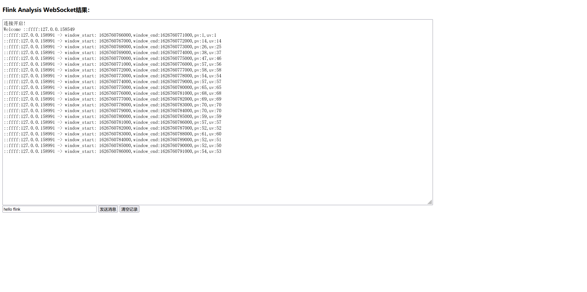
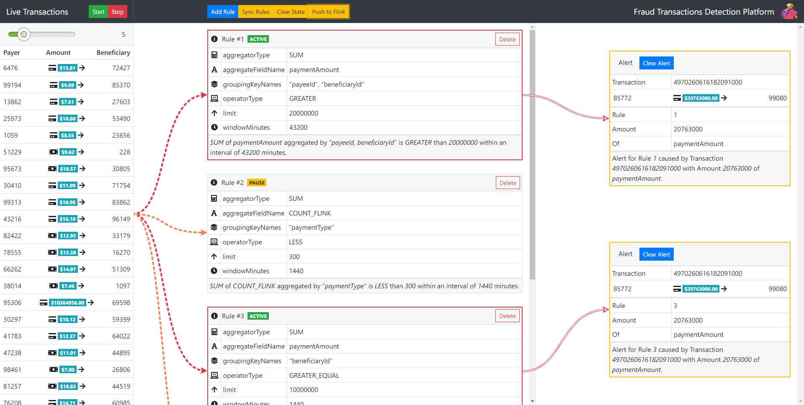

# 个人大数据学习项目

### 简介
这是个人大数据学习项目，主要记录学习过程中所写的代码，仅供参靠。

### 模块及说明
- hadoop-study-docs： 各个组件学习过程中的重要笔记。
- hadoop-study-datas：学习过程中的测试数据。
- hadoop-study-kafka： kafka 学习相关的代码。
- hadoop-study-scala： scala 语言学习的代码，这里面的代码包含书籍<<Scala编程 第三版>> 的源代码。
- hadoop-study-hdfs： hdfs 学习相关的代码。
- hadoop-study-reactor：reactor响应式编程。
- hadoop-study-zookeeper：Zookeeper编程实践。
- hadoop-study-mapreduce：MapReduce模块的学习代码。
- hadoop-study-flink：Flink学习代码。
- hadoop-study-hbase：HBase学习代码。
- hadoop-study-hive：Hive学习代码。
- hadoop-study-spark：Spark学习代码。
- hadoop-study-flink-project-pv-analysis：基于Flink的PV、UV分析实战项目。
- hadoop-study-flink-project-fraud-detecting：基于Flink的交易欺诈检测项目。
- hadoop-study-flink-project-recommend：基于Flink和Spark的推荐系统。

### 项目结构

```xml
[INFO] Scanning for projects...
[INFO] ------------------------------------------------------------------------
[INFO] Reactor Build Order:
[INFO] 
[INFO] hadoop-study                                                       [pom]
[INFO] hadoop-study-kafka                                                 [jar]
[INFO] hadoop-study-scala                                                 [jar]
[INFO] hadoop-study-hdfs                                                  [jar]
[INFO] hadoop-study-reactor                                               [jar]
[INFO] hadoop-study-zookeeper                                             [jar]
[INFO] hadoop-study-mapreduce                                             [jar]
[INFO] hadoop-study-hbase                                                 [jar]
[INFO] hadoop-study-spark                                                 [jar]
[INFO] hadoop-study-hive                                                  [jar]
[INFO] hadoop-study-flink                                                 [jar]
[INFO] hadoop-study-flink-project-pv-analysis                             [jar]
[INFO] hadoop-study-flink-project-fraud-detecting                         [pom]
[INFO] fraud-detecting-app                                                [jar]
[INFO] fraud-detecting-job                                                [jar]
[INFO] hadoop-study-flink-project-recommend                               [pom]
[INFO] recommend-app                                                      [jar]
[INFO] recommend-flink-job                                                [jar]
[INFO] recommend-spark-job                                                [jar]
```

### 依赖工具
要运行本项目首先要保证安装以下工具，基础工具安装步骤请自行百度。
- JDK 1.8+
- Maven 3+
- Kafka
- scala 2.13
- Hadoop 2.9.2
- Reactor 3.3.8
- Zookeeper 3.6.1
- Spark 3.1.1
- Flink 1.12.4
- Hive 2.3.7

### 编译列表

```xml
[INFO] Reactor Summary:
[INFO] 
[INFO] hadoop-study 1.0-SNAPSHOT .......................... SUCCESS [  0.003 s]
[INFO] hadoop-study-kafka ................................. SUCCESS [ 11.086 s]
[INFO] hadoop-study-scala ................................. SUCCESS [  0.209 s]
[INFO] hadoop-study-hdfs .................................. SUCCESS [  5.937 s]
[INFO] hadoop-study-reactor ............................... SUCCESS [  5.257 s]
[INFO] hadoop-study-zookeeper ............................. SUCCESS [  3.592 s]
[INFO] hadoop-study-mapreduce ............................. SUCCESS [ 43.117 s]
[INFO] hadoop-study-hbase ................................. SUCCESS [  9.078 s]
[INFO] hadoop-study-spark ................................. SUCCESS [01:36 min]
[INFO] hadoop-study-hive .................................. SUCCESS [ 30.532 s]
[INFO] hadoop-study-flink ................................. SUCCESS [ 13.489 s]
[INFO] hadoop-study-flink-project-pv-analysis ............. SUCCESS [  0.787 s]
[INFO] hadoop-study-flink-project-fraud-detecting ......... SUCCESS [  0.003 s]
[INFO] fraud-detecting-app ................................ SUCCESS [ 14.219 s]
[INFO] fraud-detecting-job ................................ SUCCESS [  7.763 s]
[INFO] hadoop-study-flink-project-recommend ............... SUCCESS [  0.004 s]
[INFO] recommend-app ...................................... SUCCESS [  6.772 s]
[INFO] recommend-flink-job ................................ SUCCESS [  1.332 s]
[INFO] recommend-spark-job 1.0-SNAPSHOT ................... SUCCESS [  3.315 s]
[INFO] ------------------------------------------------------------------------
[INFO] BUILD SUCCESS
[INFO] ------------------------------------------------------------------------
[INFO] Total time: 04:15 min
[INFO] Finished at: 2021-07-20T17:30:04+08:00
[INFO] ------------------------------------------------------------------------
```

### 项目运行截图

#### 一、PV/UV数据分析



#### 二、欺诈交易检测




#### 三、推荐系统


### 持续更新...

根据学习进度，持续更新....

### 纠错
欢迎大家指出不足，如有任何疑问，请邮件联系 wuzguo@gmail.com 或者直接修复并提交 Pull Request。
