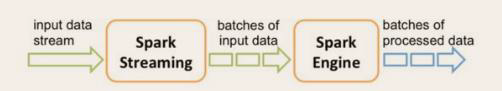
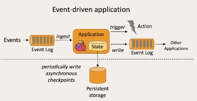
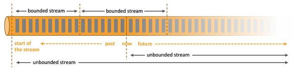

### 一、Flink简介

#### 1.1 初识 Flink

Apache Flink是一个框架和分布式处理引擎，用于对无界和有界数据流进行有状态计算。 Flink 被设计 在所有常见的集群环境中运行，以内存执行速度和任意规模来执行计算。

#### 1.2 Flink的重要特点

##### 事件驱动型(Event driven)

事件驱动型应用是一类具有状态的应用，它从一个或多个事件流提取数据，并根据到来的事件触发计算、状态更新或其他外部动作。比较典型的就是以 kafka 为代表的消息队列几乎都是事件驱动型应用。

与之不同的就是SparkStreaming 微批次，如图：

事件驱动型：

##### 流与批的世界观

- 批处理
    批处理的特点是有界、持久、大量，非常适合需要访问全套记录才能完 成的计算工作，一般用于离线统计。

- 流处理
    流处理的特点是无界、实时，无需针对整个数据集执行操作，而是对通过系统传输的每个数据项执行操作，一般用于实时统计。

在Spark的世界中，一切都是由批次组成的，离线数据是一个大批次，而实时数据是由一个一个无限的小批次组成的。

在Flink 的世界中，一切都是由流组成的，离线数据是有界限的流，实时数据是一个没有界限的流，这就是所谓的有界流和无界流。

- 无界数据流
    无界数据流有一个开始但是没有结束，它们不会在生成时终止并提供数据，必须连续处理无界流，也就是说必须在获取后立即 处理Event。对于无界数据流我们无法等待所有数据都到达，因为输入是无界的，并且在任何时间点都不会完成。处理无界数据通常要求以特定顺序（例如事件发生的顺序）获取Event，以便能够推断结果完整性。
- 有界数据流
    有界数据流有明确定义的开始和结束，可以在执行任何计算之前通过获取所有数据来处理有界流，处理有界流不需要有序获取，因为可以始终对有界数据集进行排序，有界流的处理也称为批处理。

