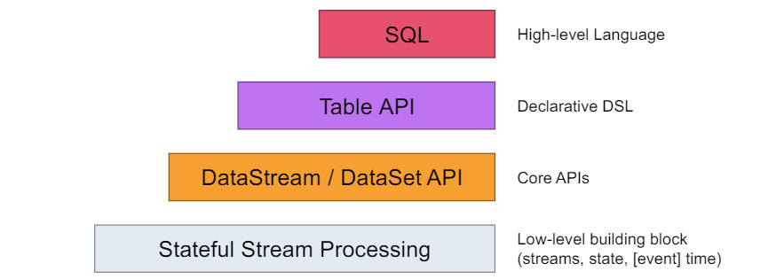

### 一、Flink简介

#### 1.1 初识 Flink

Apache Flink是一个框架和分布式处理引擎，用于对无界和有界数据流进行有状态计算。 Flink 被设计 在所有常见的集群环境中运行，以内存执行速度和任意规模来执行计算。

#### 1.2 Flink的重要特点

##### 事件驱动型(Event driven)

事件驱动型应用是一类具有状态的应用，它从一个或多个事件流提取数据，并根据到来的事件触发计算、状态更新或其他外部动作。比较典型的就是以 kafka 为代表的消息队列几乎都是事件驱动型应用。

与之不同的就是SparkStreaming 微批次，如图：


事件驱动型：


##### 流与批的世界观

- 批处理
    批处理的特点是有界、持久、大量，非常适合需要访问全套记录才能完 成的计算工作，一般用于离线统计。

- 流处理
    流处理的特点是无界、实时，无需针对整个数据集执行操作，而是对通过系统传输的每个数据项执行操作，一般用于实时统计。

在Spark的世界中，一切都是由批次组成的，离线数据是一个大批次，而实时数据是由一个一个无限的小批次组成的。

在Flink 的世界中，一切都是由流组成的，离线数据是有界限的流，实时数据是一个没有界限的流，这就是所谓的有界流和无界流。

- 无界数据流
    无界数据流有一个开始但是没有结束，它们不会在生成时终止并提供数据，必须连续处理无界流，也就是说必须在获取后立即 处理Event。对于无界数据流我们无法等待所有数据都到达，因为输入是无界的，并且在任何时间点都不会完成。处理无界数据通常要求以特定顺序（例如事件发生的顺序）获取Event，以便能够推断结果完整性。
- 有界数据流
    有界数据流有明确定义的开始和结束，可以在执行任何计算之前通过获取所有数据来处理有界流，处理有界流不需要有序获取，因为可以始终对有界数据集进行排序，有界流的处理也称为批处理。


这种以流为世界观的架构，获得的最大好处就是具有极低的延迟。

##### 分层 api



最底层级的抽象仅仅提供了有状态流，它将通过过程函数（Process Function）被嵌入到 DataStream API 中。

底层过程函数（Process Function) 与 DataStream API 相集成，使其可以对某些特定的操作进行底层的抽象，它允许用户可以自由地处理来自一个或多个数据流的事件，并使用一致的容错的状态。

实际上，大多数应用并不需要上述的底层抽象，而是针对核心 API Core APIs 进行编程，比如 DataStream API（有界或无界流数据）以及 DataSet API（有界数据
集） 。这些 API 为数据处理提供了通用的构建模块，比如由用户定义的多种形式的转换（transformations），连接（joins），聚合（aggregations ），窗口操作 windows等等。

DataSet API 为有界数据集提供了额外的支持，例如循环与迭代。这些 API 处理的数据类型以类（classes）的形式由各自的编程语言所表示。

Table API是以表为中心的声明式编程，其中表可能会动态变化。Table API 遵循（扩展的）关系模型：表有二维数据结构（schema），同时 API 提供可比较的操作，例如 select、project、join、group by、aggregate 等。

Table API 程序声明式地定义了什么逻辑操作应该执行，而不是准确地确定这些操作代码的看上去如何。

尽管 Table API 可以通过多种类型的用户自定义函数（UDF）进行扩展，其仍不如核心 API 更具表达能力，但是使用起来却更加简洁（代码量更少）。

除此之外，Table API 程序 在执行之前会经过内置优化器进行优化。你可以在表与DataStream/DataSet 之间无缝切换，以允许程序将 Table API 与 DataStream 以及 DataSet 混合使用 。

Flink提供的最高层级的抽象是 SQL。这一层抽象在语法与表达能力上与Table API 类似，但是是以 SQL 查询表达式的形式表现程序。SQL 抽象与 Table API 交互密切，同时 SQL 查询可以直接在 Table API 定义的表上执行。


### 二、快速上手

#### 2.1 Word Count

##### 批处理

```scala
def main(args: Array[String]): Unit = {
    // 1. 获取执行环境
    val env: ExecutionEnvironment = ExecutionEnvironment.getExecutionEnvironment
    // 2. 读取文件
    val lines: DataSet[String] = env.readTextFile("./hadoop-study-datas/flink/core/1.txt")

    // 3. 集合
    val ds: DataSet[(String, Int)] = lines.flatMap(new WordSplitter).groupBy(0).sum(1)

    // 4. 打印
    ds.print()
}

class WordSplitter extends FlatMapFunction[String, (String, Int)] {

    override def flatMap(value: String, out: Collector[(String, Int)]): Unit = {
        // 按空格分词
        val words = value.split(" ")
        // 遍历所有word，包成二元组输出
        words.foreach(word => out.collect((word, 1)))
    }
}
```

##### 流处理

```scala
def main(args: Array[String]): Unit = {
    // 1. 获取环境配置
    val env: StreamExecutionEnvironment = StreamExecutionEnvironment.getExecutionEnvironment
    // 2. 从Socket读取文件
    val dss: DataStream[String] = env.readTextFile("./hadoop-study-datas/flink/core/1.txt")

    val windowCounts = dss.flatMap { line => line.split(" ") }
    .map { word => WordWithCount(word, 1) }
    .keyBy(_.word)
    .sum("count")

    // 打印
    windowCounts.print("count ")

    // 3. 执行
    env.execute("Streaming WordCount")
}

case class WordWithCount(word: String, count: Long)
```

