### 三、Flink 部署与应用

#### 3.1 Flink 集群架构

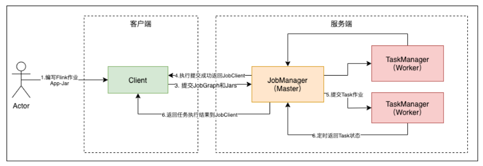

- JobManager: 管理节点，每个集群至少一个，管理整个集群计算资源，Job管理与调度执行，以及Checkpoint协调。
- TaskManager: 每个集群有多个，负责计算资源提供。
- Client: 本地执行main()方法解析JobGraph对象，并最终将JobGraph提交到JobManager运行，同时监控Job执行状态。

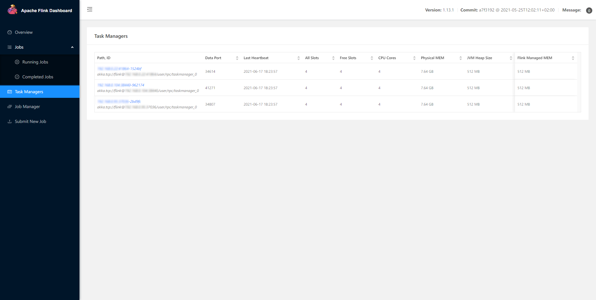

#### 3.2 Flink 部署模式

Flink根据集群的生命周期和资源隔离状态，以及main()方法运行的位置将集群部署模式分为三种：

- Session Mode: 共享JobManager和TaskManager，所有提交的Job都在一个Runtime中运行。

- Pre-Job Mode: 独享JobManager和TaskManager，相当于每个Job单独启动一个Runtime。

- Application Mode: 

    - Application的main()运行在Cluster上，而不是在客户端。
    - 每个Application对应一个Runtime，Application中可以含有多个Job。

##### Session Mode

1. JobManager与TaskManager共享。
2. 客户端通过RPC或RestAPI连接集群的管理节点。
3. Deployer需要上传依赖的Dependerces Jar。
4. Deployer需要生成JobGraph，并提交到管理节点。
5. JobManager的生命周期不受提交的Job影响，会长期运行。

Session Mode 的优点：

1. 资源充分共享，提升资源利用率。
2. Job在Flink Session集群中管理，运维简单。

Session Mode 的缺点：

1. 资源隔离相等较差。
2. 非Native类型部署，TaskManager不易拓展，Slot计算资源伸缩性较差。

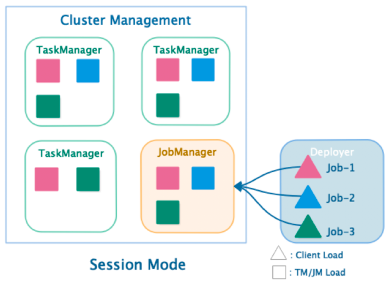

##### Per-Job Mode

1. 单个Job独享JobManager与TaskManager。
2. TaskManager中的Slot资源根据Job指定。
3. Deployer需要上传依赖的Dependerces Jar。
4. 客户端生成JobGraph，并提交到管理节点。
5. JobManager的生命周期和Job生命周期绑定。

Per-Job Mode 的优点：

1. Job和Job之间资源隔离充分。
2. 资源根据Job需要进行申请，TaskManager Slots数量可以不同。

Per-Job Mode 的缺点：

1. 资源相对比较浪费，JobManager需要消耗资源。
2. Job管理完全交给ClusterManagement，管理复杂。

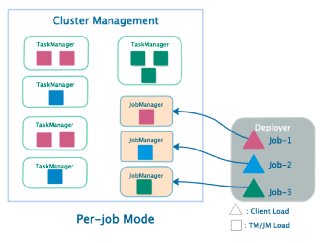

Session Mode 和Per-Job Mode 的问题：

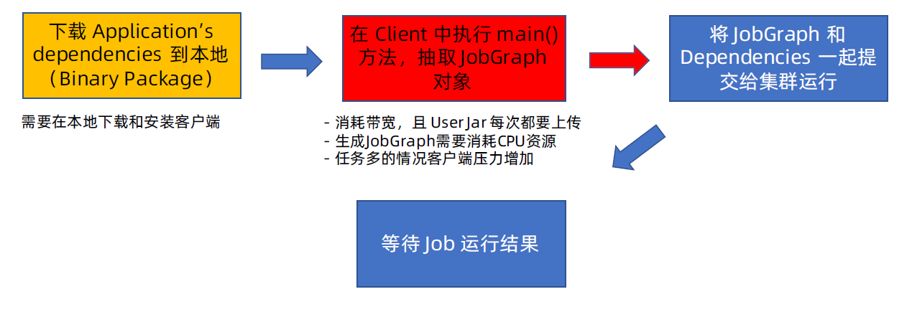

##### Application Mode

1. 每个Application对应一个JobManager，且可以运行多个Job。
2. 客户端无需将依赖的Dependerces Jar上传到JobManager，仅负责管理Job的提交与管理。
3. main()方法运行在JobManager中，将JobGraph的生成放在集群中运行，客户端压力降低。

Application Mode 的优点：

1. 有效降低宽带消耗和客户端负载。
2. Application实现资源隔离，Application中实现资源共享。

Application Mode 的缺点：

1. 仅支持Yarn和K8s。

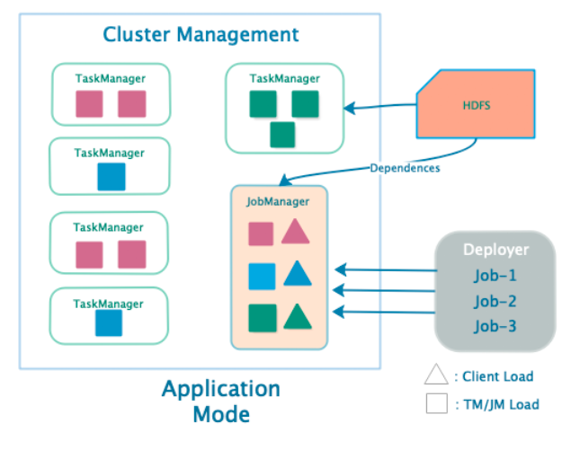

#### 3.3 ClusterManagement

| 集群管理器 | Session Mode | Pre-Job Mode | Application Mode | Native 部署模式 | 是否生产可用 | 是否支持高可用 | 国内接受度 |
| ---------- | ------------ | ------------ | ---------------- | --------------- | ------------ | -------------- | ---------- |
| Local      | 支持         | 不支持       | 不支持           | 不支持          | 否           | 不支持         | 低         |
| Standalone | 支持         | 不支持       | 不支持           | 不支持          | 是           | 支持           | 低         |
| Yarn       | 支持         | 支持         | 支持             | 支持            | 是           | 支持           | 高         |
| Mesos      | 支持         | 支持         | 不支持           | 支持            | 是           | 支持           | 中         |
| Kubernetes | 支持         | 支持         | 支持             | 支持            | 是           | 支持           | 高         |
| Docker     | 支持         | 支持         | 不支持           | 不支持          | 是           | 不支持         | 低         |

##### Native 集群部署

1. 当在ClusterManagement上启动Session集群时，只启动JobManager实例，不启动TaskManager。

2. 提交Job-1后根据Job的资源申请，动态启动TaskManager满足计算需求。

3. 提交Job-2，Job-3后，再次向ClusterManagement中申请TaskManager资源。

4. Session集群根据实际提交的Job资源动态申请和启动TaskManager计算资源。支持Native部署模式的有Yarn，Kubernetes，Mesos资源管理器。Standalone不支持Native部署。

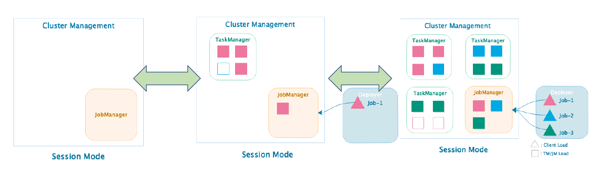

##### Standalone 集群

1. 分布式多台物理主机部署
2. 仅支持Session模式提交Job
3. 支持高可用配置

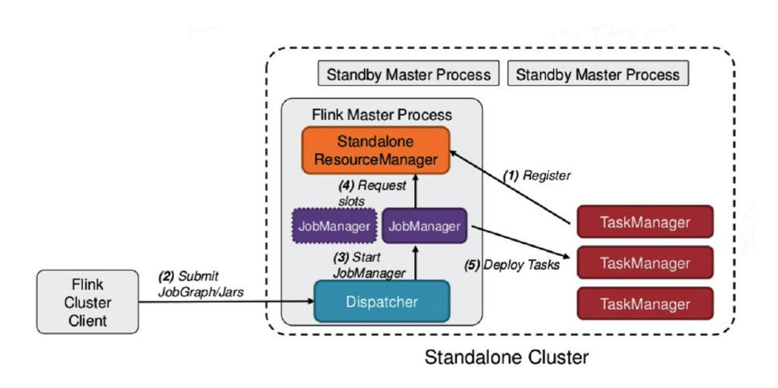

##### Yarn 集群

ResourceManager:

1. 负责处理客户端请求
2. 监控NodeManager
3. 启动和监控ApplicationMaster
4. 资源的分配和调度

NodeManager:

1. 管理单个Worker节点上的资源
2. 处理来自ResourceManager 的命令
3. 处理来自ApplicationMaster 的命令
4. 汇报资源状态

ApplicationMaster:

1. 负责数据的切分
2. 为应用申请计算资源，并分配给Task
3. 任务的监控与容错
4. 运行在Worker节点上

Container:

1. 资源抽象，封装了节点上的多维度资源，如CPU，内存，网络资源等。

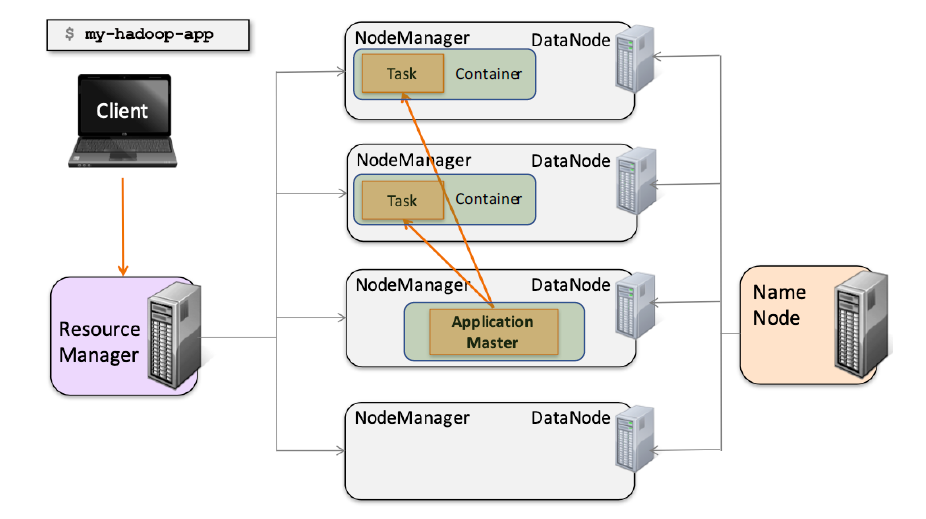

##### Yarn 集群 - Session Mode

1. 多JobManager共享Dispather和YarnResourceManager。
2. 支持Native模式，TaskManager动态申请。

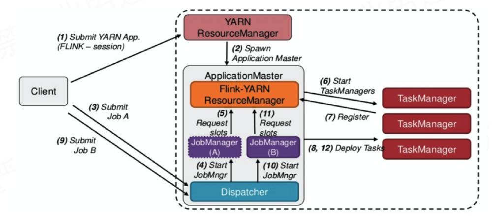

##### Yarn 集群 - Per-Job Mode

1. 单个JobManager独享Dispather和YarnResourceManager。
2. Application Master与Flink Master节点处于同一个Container。

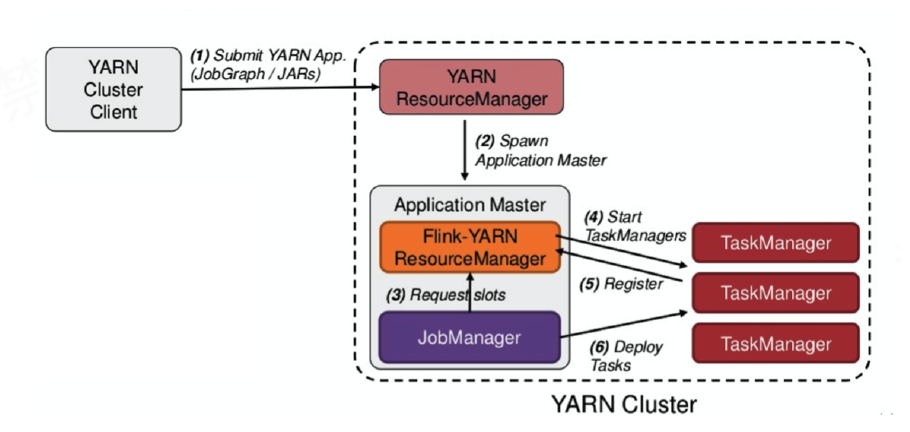

