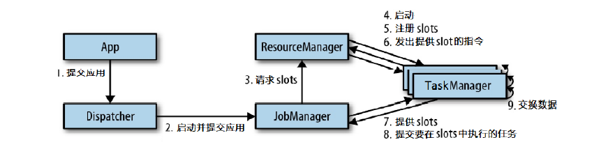
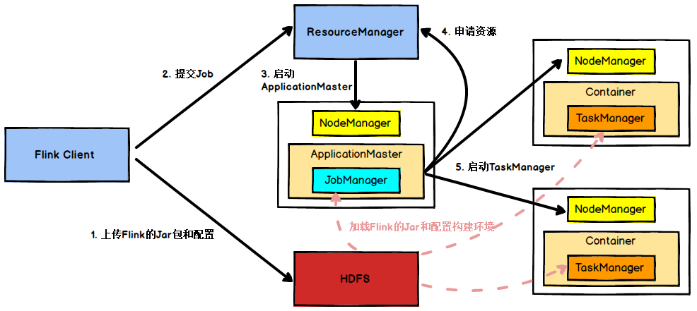
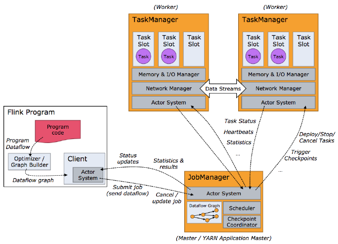
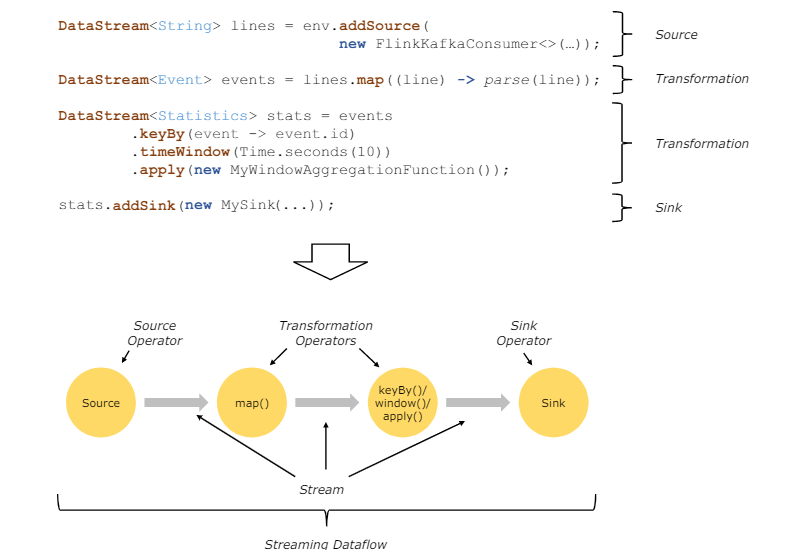
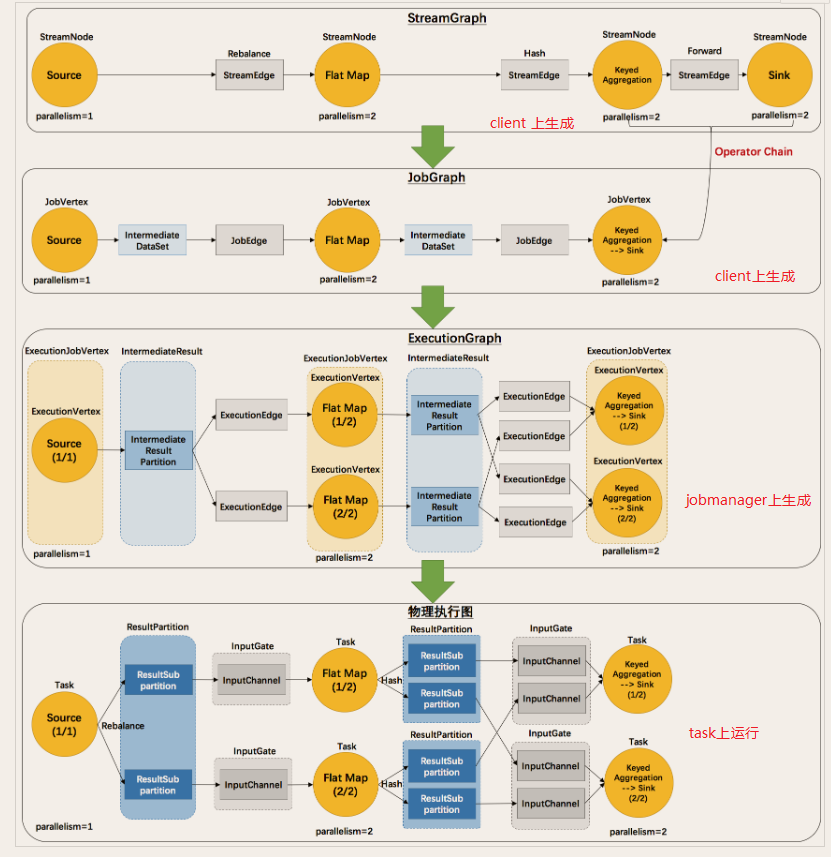
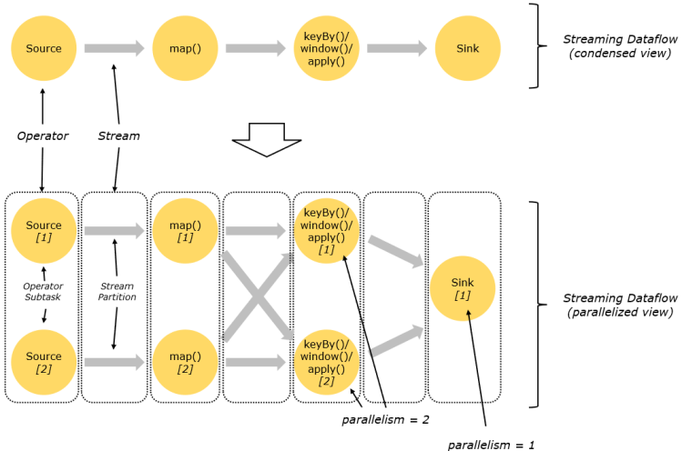
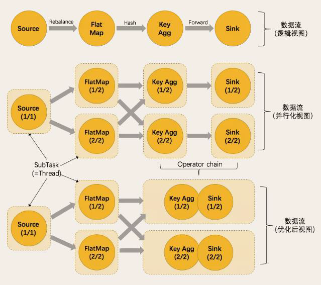

### 四、Flink运行架构

#### 4.1 Flink 运行时的组件

Flink运行时架构主要包括四个不同的组件，它们会在运行流处理应用程序时协同工作：作业管理器（JobManager）、资源管理器（ResourceManager）、任务管理器（TaskManager）以及分发器（Dispatcher）。

每个组件的职责如下：

##### 作业管理器（JobManager）

控制一个应用程序执行的主进程，也就是说，每个应用程序都会被一个不同的 JobManager 所控制执行。

JobManager 会先接收到要执行的应用程序，这个应用程序会包括：作业图（JobGraph）、逻辑数据流图（logical dataflow graph）和打包了所有的类、库和其它资源的 Jar 包。

JobManager 会把 JobGraph 转换成一个物理层面的数据流图，这个图被叫做"执行图（ExecutionGraph）"，包含了所有可以并发执行的任务。 

JobManager 会向资源管理器（ResourceManager）请求执行任务必要的资源，也就是任务管理器（TaskManager）上的插槽（slot）。

一旦它获取到了足够的资源，就会将执行图分发到真正运行它们的TaskManager上。而在运行过程中，JobManager会负责所有需要中央协调的操作，比如说检查点（checkpoints）的协调。

##### 资源管理器（ResourceManager）

主要负责管理任务管理器（TaskManager）的插槽 slot TaskManger 插槽是 Flink 中定义的处理资源单元。

Flink 为不同的环境和资源管理工具提供了不同资源管理器，比如YARN、Mesos、Kubernetes，以及 standalone 部署。当 JobManager 申请插槽资源时，ResourceManager会将有空闲插槽的 TaskManager 分配给 JobManager。

如果 ResourceManager 没有足够的插槽来满足 JobManager 的请求，它还可以向资源提供平台发起会话，以提供启动 TaskManager进程的容器。另外，ResourceManager 还负责终止空闲的 TaskManager，释放计算资源。

##### 任务管理器（TaskManager）

Flink中的工作进程。通常在 Flink 中会有多个 TaskManager 运行，每一个 TaskManager 都包含了一定数量的插槽（slots）。插槽的数量限制了 TaskManager 能够执行的任务数量。

启动之后，TaskManager 会向资源管理器注册它的插槽。收到资源管理器的指令后，TaskManager 就会将一个或者多个插槽提供给 JobManager 调用。JobManager 就可以向插槽分配任务（tasks）来执行了。在执行过程中，一个 TaskManager 可以跟其它运行同一应 用程序的 TaskManager 交换数据。

##### 分发器（Dispatcher）

可以跨作业运行，它为应用提交提供了REST 接口。当一个应用被提交执行时，分发器就会启动并将应用移交给一个 JobManager。由于是 REST 接口，所以 Dispatcher 可以作为集群的一个 HTTP 接入点，这样就能够不受防火墙阻挡。

Dispatcher 也会启动一个 Web UI，用来方便地展示和监控作业执行的信息。 Dispatcher 在架构中可能并不是必需的，这取决于应用提交运行的方式。

#### 4.2 任务提交流程

上图是从一个较为高层级的视角，来看应用中各组件的交互协作。如果部署的集群环境不同（例如 YARN、Mesos、Kubernetes、standalone 等），其中一些步骤可以被省略，或是有些组件会运行在同一个 JVM 进程中。

具体地，如果我们将Flink 集群部署到 YARN 上，那么就会有如下的提交流程：

Flink任务提交后， Client 向 HDFS 上传 Flink 的 Jar 包和配置，之后向 Yarn Resource ourceManager 提交任务，ResourceManager 分配 Container 资源并通知对应的 NodeManager 启动 ApplicationMaster ApplicationMaster 启动后加载 Flink 的 Jar 包。

和配置构建环境，然后启动 JobManager，之后 ApplicationMaster 向 ResourceManager 申请资源启动 TaskManager，ResourceManager 分配 Container 资源后，由ApplicationMaster 通知资源所在节点的 NodeManager 启动 TaskManager，NodeManager 加载 Flink 的 Jar 包和配置构建环境并启动 TaskManager 。

TaskManager启动后向 JobManager 发送心跳包，并等待 JobManager 向其分配任务。

#### 4.3 任务调度原理

客户端不是运行时和程序执行的一部分，但它用于准备并发送dataflow(JobGraph) 给 Master(JobManager) JobManager)，然后，客户端断开连接或者维持连接以
等待接收计算结果。

当Flink 集群启动后，首先会启动一个 JobManger 和一个或多个的TaskManager。由 Client 提交任务给 JobManager JobManager 再调度任务到各个 TaskManager 去执行，然后 TaskManager 将心跳和统计信息汇报给 JobManager。TaskManager 之间以流的形式进行数据的传输。

Client为提交 Job 的客户端，可以是运行在任何机器上（与 JobManager 环境连通即可）。提交 Job 后，Client 可以结束进程（Streaming 的任务），也可以不
结束并等待结果返回。

JobManager主要负责调度 Job 并协调 Task 做 checkpoint，职责上很像 Storm 的 Nimbus。从 Client 处接收到 Job 和 JAR 包等资源后，会生成优化后的
执行计划，并以 Task 的单元调度到各个 TaskMa nager 去执行。

TaskManager在启动的时候就设置好了槽位数（Slot），每个 slot 能启动一个Task，Task为线程。从 JobManager 处接收需要部署的 Task，部署启动后，与自
己的上游建立 Netty 连接，接收数据并处理。

##### 程序与数据流（DataFlow）

所有的Flink 程序都是由三部分组成的： Source、Transformation 和 Sink 。
Source负责读取数据源，Transformation 利用各种算子进行处理加工， Sink 负责输出。

在运行时，Flink 上运行的程序会被映射成 "逻辑数据流"（dataflows），它包含了这三部分。

每一个 dataflow 以一个或多个 sources 开始以一个或多个 sinks 结束。 

dataflow 类似于任意的有向无环图（DAG）。在大部分情况下，程序中的 转换运算（transformations）跟 dataflow 中的 算子（operator）是一一对应的关系，但有时候，一个 transformation 可能对应多个 operator。

##### 执行图 ExecutionGraph

由 Flink 程序直接映射成的数据流图是 StreamGraph，也被称为逻辑流图，因为它们表示的是计算逻辑的高级视图。为了执行一个流处理程序， Flink 需要将逻辑流图转换为物理数据流图（也叫执行图 ），详细说明程序的执行方式。

Flink中的执行图可以分成四层： **StreamGraph --> JobGraph --> ExecutionGraph --> 物理执行图。**

**StreamGraph**：是根据用户通过 Stream API 编写的代码生成的最初的图。用来表示程序的拓扑结构。

**JobGraph**：StreamGraph 经过优化后生成了 JobGraph ，提交给 JobManager 的数据结构。主要的优化为，将多个符合条件的节点 chain 在一起作为一个节点，这
样可以减少数据在节点之间流动所需要的序列化 反序列化 传输消耗。

**ExecutionGraph**：JobManager 根据 JobGraph 生成 ExecutionGraph 。ExecutionGraph 是 JobGraph 的并行化版本，是调度层最核心的数据结构。

**物理执行图**：JobManager 根据 ExecutionGraph 对 Job 进行调度后，在各个TaskManager 上部署 Task 后形成的，并不是一个具体的数据结构。

##### 并行度 Parallelism

Flink程序的执行具有并行、分布式的特性。

在执行过程中，一个流（stream）包含一个或多个分区（stream partition），而每一个 算子（operator）可以 包含一个或多个子任务（operator subtask），这些 子任务在不同的线程、不同的物理机或不同的容器中彼此互不依赖地执行。

一个特定算子的子任务（subtask）的个数被称之为其并行度 parallelism。

一般情况下，一个流程序的并行度 ，可以认为就是其所有算子中最大的并行度。一个程序中，不同的算子可能具有不同的并行度。

Stream 在算子之间传输数据的形式可以是 **one to one(forwarding)** 的模式也可以是 **redistributing** 的模式，具体是哪一种形式，取决于算子的种类。

- **One to one**：stream（比如在 source 和 map operator 之间）维护着分区以及元素的顺序。那意味着 map 算子的子任务看到的元素的个数以及顺序跟 source 算子的子任务生产的元素的个数、顺序相同，map、fliter、flatMap 等算子都是 **one to one** 的对应关系。

    **类似于 spark 中的 窄依赖**

- **Redistributing**：stream（map() 跟 keyBy/window 之间或者 keyBy/window 跟 sink之间）的分区会发生改变。每一个算子的子任务依据所选择的 transformation发送数据到不同的目标任务。

    例如，keyBy() 基于 hashCode 重分区、broadcast 和 rebalance会随机重新分区，这些算子都会引起 redistribute 过程，而 redistribute 过程就类似于Spark 中的 shuffle 过程。

    **类似于 spark 中的 宽依赖**

##### 任务链（Operator Chains）

相同并行度的 **one to one** 操作 Flink 这样相连的算子链接在一起形成一个 task 原来的算子成为里面的 一部分 。将算子链接成 task 是非常有效的优化：它能减少线程之间的切换和基于缓存区的数据交换，在减少时延的同时提升吞吐量。链接的行为可以在编程 API 中进行指定。

