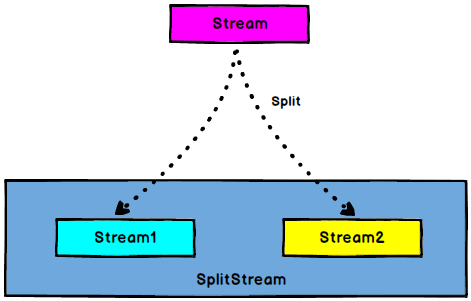

### 五、Flink 流处理API


#### 5.1 Environment
##### getExecutionEnvironment

创建一个执行环境，表示当前执行程序的上下文。
如果程序是独立调用的，则此方法返回本地执行环境；如果从命令行客户端调用程序以提交到集群，则此方法返回此集群的执行环境 ，也就是 getExecutionEnvironment 会根据查询运行的方式决定返回什么样的运行环境，是最常用的一种创建执行环境的方式。

```scala
val env: StreamExecutionEnvironment = StreamExecutionEnvironment.getExecutionEnvironment
```

如果没有设置并行度，会以flink-conf.yaml 中的配置为准，默认是 1 。

```yaml
# The parallelism used for programs that did not specify and other parallelism.

parallelism.default: 1
```

##### createLocalEnvironment

返回本地执行环境，需要在调用时指定默认的并行度。

```scala
 val env: StreamExecutionEnvironment = StreamExecutionEnvironment.createLocalEnvironment(1)
```

##### createRemoteEnvironment

返回集群执行环境，将Jar 提交到远程服务器。需要在调用时指定 JobManager的 IP 和端口号，并指定要在集群中运行的 Jar 包。

```scala
val env: StreamExecutionEnvironment = StreamExecutionEnvironment.createRemoteEnvironment("hadoop003", 9999, "/opt/module/flink/WordCount.jar")
```

#### 5.2 Source

##### 从集合读取数据

```scala
val env = StreamExecutionEnvironment.getExecutionEnvironment

// 从集合中读取数据
val sensorStream: DataStream[Sensor] = env.fromCollection(List(
    Sensor("sensor_1", 1547718199L, 35.8),
    Sensor("sensor_6", 1547718201L, 15.4),
    Sensor("sensor_7", 1547718202L, 6.7),
    Sensor("sensor_10", 1547718205L, 38.1)
))

// 打印数据
sensorStream.print("sensor ")

// 执行
env.execute("Streaming Source Collection")
```

##### 从文件读取数据

```scala
val env = StreamExecutionEnvironment.getExecutionEnvironment

// 从文件读取数据
val fileStream = env.readTextFile("./hadoop-study-datas/flink/core/sensor.txt")

// 打印输出
fileStream.print()

// 执行
env.execute("Streaming Source File")
```

##### 从Kafka队列读取数据

```scala
val env = StreamExecutionEnvironment.getExecutionEnvironment

val properties = new Properties
properties.setProperty(ConsumerConfig.BOOTSTRAP_SERVERS_CONFIG, "hadoop002:9092")
properties.setProperty(ConsumerConfig.GROUP_ID_CONFIG, "sparkStreaming")
properties.setProperty(ConsumerConfig.KEY_DESERIALIZER_CLASS_CONFIG, "org.apache.kafka.common.serialization.StringDeserializer")
properties.setProperty(ConsumerConfig.VALUE_DESERIALIZER_CLASS_CONFIG, "org.apache.kafka.common.serialization.StringDeserializer")
properties.setProperty(ConsumerConfig.AUTO_OFFSET_RESET_CONFIG, "latest")

// 读取数据
val strStream = env.addSource(new FlinkKafkaConsumer("topic_streaming", new SimpleStringSchema(), properties))
strStream.print("kafka ")

// 执行
env.execute("Streaming Source Kafka")
```

##### 自定义数据源

```scala
def main(args: Array[String]): Unit = {
    val env = StreamExecutionEnvironment.getExecutionEnvironment
    // 设置并行度
    env.setParallelism(1)

    // 读取数据
    val udfStream = env.addSource(new CustomSourceFunction)
    udfStream.print("udf ")

    // 执行
    env.execute("Streaming Source UDF")
}

class CustomSourceFunction extends SourceFunction[Sensor] {

    val running = true

    override def run(ctx: SourceFunction.SourceContext[Sensor]): Unit = {
        val random = new Random()

        while (running) {
            val sensor = Sensor("sensor_" + random.nextInt(10), System.currentTimeMillis(), 30 + random.nextGaussian() * 20)
            ctx.collect(sensor)

            // 睡眠
            Thread.sleep(1000)
        }
    }

    override def cancel(): Unit = running
}
```

#### 5.3 Transform

##### 1. map


```scala
// 从文件读取数据
val fileStream = env.readTextFile("./hadoop-study-datas/flink/core/sensor.txt")

// 1. map
val mapStream = fileStream.map(line => line)
```

##### 2. flatMap

```scala
val flatStream = fileStream.flatMap(line => line.split(","))
```

##### 3. filter


```scala
val filterStream = fileStream.filter(line => line.split(",")(2).trim.toDouble > 32.0)
```

##### 4. keyBy


DataStream -> KeyedStream ：逻辑地将一个流拆分成不相交的分区，每个分区包含具有相同 key 的元素，在内部以 hash 的形式实现的。

```scala
// 从文件读取数据
val fileStream = env.readTextFile("./hadoop-study-datas/flink/core/sensor.txt")

// 构造Stream
val sensorStream = fileStream.map(line => {
    val values = line.split(",")
    Sensor(values(0), values(1).toLong, values(2).toDouble)
})

// 2. keyBy
sensorStream.keyBy(_.id).print("keyBy")
```

##### 5. 滚动聚合算子（Rolling Aggregation）

这些算子可以针对 KeyedStream 的每一个支流做聚合。

- sum()
- min()
- max()
- minBy()
- maxBy()

```scala
// 从文件读取数据
val fileStream = env.readTextFile("./hadoop-study-datas/flink/core/sensor.txt")

// 构造Stream
val sensorStream = fileStream.map(line => {
    val values = line.split(",")
    Sensor(values(0), values(1).trim.toLong, values(2).trim.toDouble)
})

// 分组
val keyStream = sensorStream.keyBy(_.id)
keyStream.print("key ")

// 滚动聚合，取当前最大的温度值
val maxStream = keyStream.maxBy("temp")
maxStream.print("max ")
```

##### 6. reduce

KeyedStream -> DataStream：一个分组数据流的聚合操作，合并当前的元素和上次聚合的结果，产生一个新的值，返回的流中包含每一次聚合的结果，而不是只返回最后一次聚合的最终结果。

```scala
// 从文件读取数据
val fileStream = env.readTextFile("./hadoop-study-datas/flink/core/sensor.txt")

// 构造Stream
val sensorStream = fileStream.map(line => {
    val values = line.split(",")
    Sensor(values(0), values(1).trim.toLong, values(2).trim.toDouble)
})

// 分组
val keyStream = sensorStream.keyBy(_.id)
val reduceStream = keyStream.reduce(new ReduceFunction[Sensor] {
    override def reduce(value1: Sensor, value2: Sensor): Sensor = {
        Sensor(value1.id, value2.timestamp, Math.max(value1.temp, value2.temp))
    }
})
reduceStream.print("reduce ")

val reduceStream2 = keyStream.reduce((sensor, _) => sensor)
reduceStream2.print("reduce2 ")

env.execute("Streaming Transform Reduce")
```

##### 7. split、select

- split

DataStream -> SplitStream：根据某些特征把一个 DataStream 拆分成两个或者多个 DataStream。



- select

SplitStream -> DataStream：从一个 SplitStream 中获取一个或者多个DataStream。


```scala
// 从文件读取数据
val fileStream = env.readTextFile("./hadoop-study-datas/flink/core/sensor.txt")

// 构造Stream
val sensorStream = fileStream.map(line => {
    val values = line.split(",")
    Sensor(values(0), values(1).trim.toLong, values(2).trim.toDouble)
})

// 1. 分流，按照温度值30度分值分为两条流
val highOutput = OutputTag[Sensor]("side-output-high")
val lowOutput = OutputTag[Sensor]("side-output-low")

val mainStream = sensorStream.process((value: Sensor, ctx: ProcessFunction[Sensor, Sensor]#Context, out: Collector[Sensor]) => {
    // 发送数据到主要的输出
    out.collect(value)

    // 发送数据到旁路输出
    if (value.temp > 30.0) {
        ctx.output(highOutput, value)
    } else {
        ctx.output(lowOutput, value)
    }
})


val highStream = mainStream.getSideOutput(highOutput)
highStream.print("high side ")
```

##### 8. connect、coMap

- connect

DataStream,DataStream -> ConnectedStreams ：连接两个保持他们类型的数据流，两个数据流被 Connect 之后，只是被放在了一个同一个流中，内部依然保持
各自的数据和形式不发生任何变化，两个流相互独立。


- coMap、coFlatMap

ConnectedStreams -> DataStream：作用于 ConnectedStreams 上，功能与 map和 flatMap 一样，对 ConnectedSt reams 中的每一个 Stream 分别进行 map 和 flatMap
处理。


```scala
val connectStreams = highTupleStream.connect(lowStream)
val resultStream = connectStreams.map(new CoMapFunction[(String, Double), Sensor, (String, Double, String)] {
    override def map1(value: (String, Double)): (String, Double, String) = (value._1, value._2, "high temp warning")

    override def map2(value: Sensor): (String, Double, String) = (value.id, value.temp, "normal temp")
})
```

##### 9. union

DataStream -> DataStream ：对两个或者两个以上的 DataStream 进行 union 操作，产生一个包含所有 DataStream 元素的新 DataStream 。


```scala
val unionStream = highStream.union(lowStream, sensorStream)
```

- connect与 union 区别：

1. Union 之前两个流的类型必须是一样， Connect 可以不一样，在之后的 coMap 中再去调整成为一样的。
2. Connect 只能操作两个流， Union 可以操作多个 。

#### 5.4 Sink

Flink没有类似于 Spark 中 foreach 方法，让用户进行迭代的操作。虽有对外的输出操作都要利用 Sink 完成。最后通过类似如下方式完成整个任务最终输出操作。

```scala
stream.addSink(new CustomSink(xxxx))
```

##### 1. Kafka

```scala
val env = StreamExecutionEnvironment.getExecutionEnvironment

val properties = new Properties
properties.setProperty(ConsumerConfig.BOOTSTRAP_SERVERS_CONFIG, "hadop002:9092")
properties.setProperty(ConsumerConfig.GROUP_ID_CONFIG, "sparkStreaming")
properties.setProperty(ConsumerConfig.KEY_DESERIALIZER_CLASS_CONFIG, "org.apache.kafka.common.serialization.StringDeserializer")
properties.setProperty(ConsumerConfig.VALUE_DESERIALIZER_CLASS_CONFIG, "org.apache.kafka.common.serialization.StringDeserializer")
properties.setProperty(ConsumerConfig.AUTO_OFFSET_RESET_CONFIG, "latest")

// 读取数据
val inputStream = env.addSource(new FlinkKafkaConsumer("topic_streaming", new SimpleStringSchema, properties))
inputStream.print("kafka ")

val sinkValues = inputStream.map(line => {
    line.split(" ").mkString(", ")
})
// 发送到Kafka
sinkValues.addSink(new FlinkKafkaProducer("topic_streaming_sink", new SimpleStringSchema, properties))

// 执行
env.execute("Streaming Sink Kafka")
```

##### 2. Redis

```scala
val env = StreamExecutionEnvironment.getExecutionEnvironment

// 从文件读取数据
val fileStream = env.readTextFile("./hadoop-study-datas/flink/core/sensor.txt")

// 构造Stream
val sensorStream = fileStream.map(line => {
    val values = line.split(",")
    Sensor(values(0), values(1).trim.toLong, values(2).trim.toDouble)
})

// 配置文件
val config = new FlinkJedisPoolConfig.Builder()
.setHost("hadoop002")
.setDatabase(0)
.setPort(6379)
.build()

sensorStream.addSink(new RedisSink(config, new CustomRedisMapper))
// 执行
env.execute("Streaming Sink Redis")
}

// 自定义Mapper
class CustomRedisMapper extends RedisMapper[Sensor] {
    override def getCommandDescription: RedisCommandDescription = new RedisCommandDescription(RedisCommand.HSET,
                                                                                              "sink:sensor:")

    override def getKeyFromData(data: Sensor): String = data.id

    override def getValueFromData(data: Sensor): String = data.toString
}
```

##### 3. Elasticsearch

```scala
def main(args: Array[String]): Unit = {
    // 环境变量
    val env = StreamExecutionEnvironment.getExecutionEnvironment

    // 从文件读取数据
    val fileStream = env.readTextFile("./hadoop-study-datas/flink/core/sensor.txt")

    // 构造Stream
    val sensorStream = fileStream.map(line => {
        val values = line.split(",")
        Sensor(values(0), values(1).trim.toLong, values(2).trim.toDouble)
    })

    val httpHosts = new util.ArrayList[HttpHost]
    httpHosts.add(new HttpHost("hadoop001", 9200))

    val esSink = new ElasticsearchSink.Builder[Sensor](httpHosts, new CustomSinkFunction).build()
    sensorStream.addSink(esSink)

    // 执行
    env.execute("Streaming Sink ElasticSearch")
}

// 定义 Sink
class CustomSinkFunction extends ElasticsearchSinkFunction[Sensor] {
    override def process(element: Sensor, ctx: RuntimeContext, indexer: RequestIndexer): Unit = {
        // 定义写入的数据source
        val dataSource = Map("id" -> element.id, "temp" -> element.temp.toString, "timestamp" -> element.timestamp.toString)
        // 创建请求，作为向es发起的写入命令
        val request = Requests.indexRequest().index("sink-sensor").source(dataSource)
        // 用index发送请求
        indexer.add(request)
    }
}
```

##### 4. JDBC

```scala
def main(args: Array[String]): Unit = {
    // 环境变量
    val env = StreamExecutionEnvironment.getExecutionEnvironment

    // 从文件读取数据
    val fileStream = env.readTextFile("./hadoop-study-datas/flink/core/sensor.txt")

    // 构造Stream
    val sensorStream = fileStream.map(line => {
        val values = line.split(",")
        Sensor(values(0), values(1).trim.toLong, values(2).trim.toDouble)
    })

    sensorStream.addSink(new JDBCSinkFunction)

    // 执行
    env.execute("Streaming Sink JDBC")
}

class JDBCSinkFunction extends RichSinkFunction[Sensor] {

    var connection: Connection = _
    var updateStmt: PreparedStatement = _
    var insertStmt: PreparedStatement = _

    override def open(parameters: Configuration): Unit = {
        connection = DriverManager.getConnection("jdbc:mysql://hadoop003:3306/flink-sink", "root", "123456")
        updateStmt = connection.prepareStatement("update sink_sensor set temp = ? where id = ?")
        insertStmt = connection.prepareStatement("insert into sink_sensor (id,temp,timestamp) values (?, ?, ?)")
    }

    override def invoke(value: Sensor, context: SinkFunction.Context): Unit = {
        updateStmt.setDouble(1, value.temp)
        updateStmt.setString(2, value.id)
        updateStmt.execute()
        if (updateStmt.getUpdateCount == 0) {
            insertStmt.setString(1, value.id)
            insertStmt.setDouble(2, value.temp)
            insertStmt.setLong(3, value.timestamp)
            insertStmt.execute()
        }
    }

    override def close(): Unit = {
        updateStmt.close()
        insertStmt.close()
        connection.close()
    }
}
```

