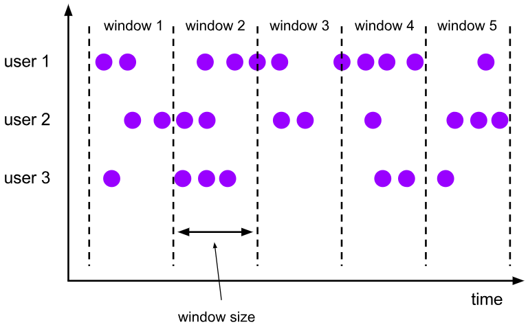
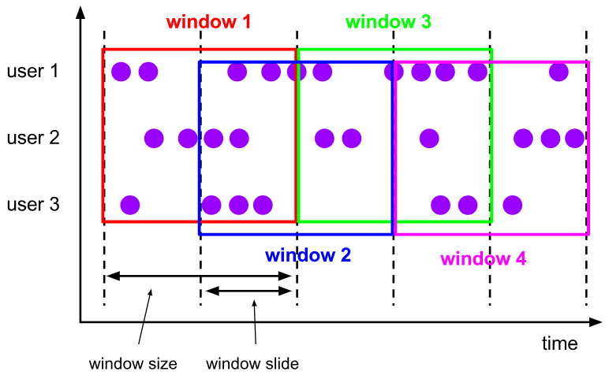
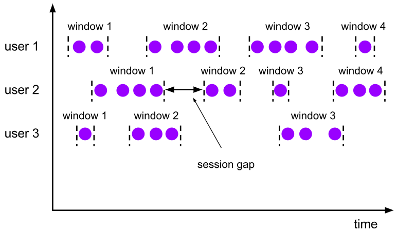

### 六、Window

#### 6.1 Window 概述

streaming 流式计算是一种被设计用于处理无限数据集的数据处理引擎，而无限数据集是指一种不断增长的本质上无限的数据集，而 window 是一种 切割无限数据
为有限块进行处理 的手段。

Window是无限数据流处理的核心， Window 将一个无限的 stream 拆分成有限大小的 "buckets" 桶，我们可以在这些桶上做计算操作。

#### 6.2 Window 类型

Window 可以分成两类：

- CountWindow：按照指定的数据条数生成一个 Window，与时间无关。
- TimeWindow：按照时间生成 Window 。

对于TimeWindow，可以根据窗口实现原理的不同分成三类：滚动窗口（Tumbling Window）、滑动窗口（Sliding Window）和会话窗口（Session Window）。

##### 滚动窗口（Tumbling Windows）

将数据依据固定的窗口长度对数据进行切片。

特点：时间对齐，窗口长度固定，没有重叠。

滚动窗口分配器将每个元素分配到一个指定窗口大小的窗口中，滚动窗口有一个固定的大小，并且不会出现重叠。例如：如果你指定了一个 5 分钟大小的滚动窗口，窗口的创建如下图所示：



适用场景：适合做 BI 统计 等（做每个时间段的聚合计算）。

##### 滑动窗口（Sliding Windows）

滑动窗口是固定窗口的更广义的一种形式，滑动窗口由固定的窗口长度和滑动间隔组成。

特点：时间对齐，窗口长度固定，可以 有重叠。

滑动窗口分配器将元素分配到固定长度的窗口中，与滚动窗口类似，窗口的大小由窗口大小参数来配置，另一个窗口滑动参数控制滑动窗口开始的频率。因此，滑动窗口如果滑动参数小于窗口大小的话，窗口是可以重叠的，在这种情况下元素会被分配到多个窗口中。



适用场景：对最近一个时间段内的统计（求某接口最近 5min 的失败率来决定是否要报警）。

##### 会话窗口（Session Windows）

由一系列事件组合一个指定时间长度的 timeout 间隙组成，类似于 web 应用的 session，也就是一段时间没有接收到新数据就会生成新的窗口。

特点：时间无对齐。

session 窗口分配器通过 session 活动来对元素进行分组， session 窗口跟滚动窗口和滑动窗口相比，不会有重叠和固定的开始时间和结束时间的情况，相反，当它
在一个固定的时间周期内不再收到元素，即非活动间隔产生，那个这个窗口就会关闭。一个 session 窗口通过一个 session 间隔来配置，这个 session 间隔定义了非活跃周期的长度，当这个非活跃周期产生，那么当前的 session 将关闭并且后续的元素将被分配到新的 session 窗口中去。



#### 6.3 Window API

##### 1. TimeWindow

TimeWindow 是将指定时间范围内的所有数据组成一个 window，一次对一个 window 里面的所有数据进行计算。

- 滚动窗口（TumblingEventTimeWindows）

Flink 默认的时间窗口根据 Processing Time 进行窗口的划分，将 Flink 获取到的数据根据进入 Flink 的时间划分到不同的窗口中。

```scala
// 2. 从Socket读取文件
val dss: DataStream[String] = env.readTextFile("./hadoop-study-datas/flink/core/sensor.txt")

// 3. 转换成Sensor类型，分配时间戳和watermark
val dataStream: DataStream[Sensor] = dss.map(line => {
    val values = line.split(",")
    Sensor(values(0), values(1).trim.toLong, values(2).trim.toDouble)
}).assignTimestampsAndWatermarks(
    WatermarkStrategy.forBoundedOutOfOrderness[Sensor](Duration.ofSeconds(1))
      .withTimestampAssigner(new SerializableTimestampAssigner[Sensor] {
          override def extractTimestamp(element: Sensor, recordTimestamp: Long): Long = element.timestamp * 1000
      }))

val sensors: DataStream[Integer] = dataStream.keyBy(_.id)
// 滚动窗口15秒
.window(TumblingEventTimeWindows.of(Time.seconds(15)))
.aggregate(new IncrementFunction)

sensors.print("incr")
```

- 滑动窗口（SlidingEventTimeWindows）

滑动窗口和滚动窗口的函数名是完全一致的，只是在传参数时需要传入两个参数，一个是 window size，一个是 sliding size。

```scala
val sensors: DataStream[Integer] = dataStream.keyBy(_.id)
// 滚动窗口15秒
.window(SlidingEventTimeWindows.of(Time.seconds(15), Time.seconds(10)))
.aggregate(new IncrementFunction)
```


##### 2. CountWindow

CountWindow 根据窗口中相同 key 元素的数量来触发执行，执行时只计算元素数量达到窗口大小的 key 对应的结果。

注意：CountWindow 的 window size 指的是相同 Key 的元素的个数，不是输入的所有元素的总数。

- 滚动窗口

默认的 CountWindow 是一个滚动窗口，只需要指定窗口大小即可，当元素数量达到窗口大小时，就会触发窗口的执行。

```scala
// 2. 从Socket读取文件
val dss: DataStream[String] = env.readTextFile("./hadoop-study-datas/flink/core/sensor.txt")

// 3. 转换成Sensor类型，分配时间戳和watermark
val sensors = dss.map(line => {
    val values = line.split(",")
    Sensor(values(0), values(1).trim.toLong, values(2).trim.toDouble)
}).keyBy(_.id)
.countWindow(10)
.aggregate(new AvgTempFunction)
```

- 滑动窗口

滑动窗口和滚动窗口的函数名是完全一致的，只是在传参数时需要传入两个参数，一个是 window size，一个是 sliding size 。

```scala
val sensors = dss.map(line => {
    val values = line.split(",")
    Sensor(values(0), values(1).trim.toLong, values(2).trim.toDouble)
}).keyBy(_.id)
.countWindow(10, 2)
.aggregate(new AvgTempFunction)
```

##### 3. Window Function

Window Function 定义了要对窗口 中收集的数据做的计算操作，主要可以分为两类：

- 增量聚合函数（incremental aggregation functions）

    每条数据到来就进行计算，保持一个简单的状态。典型的增量聚合函数有 ReduceFunction, AggregateFunction。

- 全窗口函数（full window functions）

    先把窗口所有数据收集起来，等到计算的时候会遍历所有数据。ProcessWindowFunction 就是一个全窗口函数。

##### 4. 其它可选 API

- trigger() 触发器
    定义 window 什么时候关闭，触发计算并输出结果
- evitor() 移除器
    定义移除某些数据的逻辑
- allowedLateness() 允许处理迟到的数据
- sideOutputLateData() 将迟到的数据放入侧输出流
- getSideOutput() 获取侧输出流

**Keyed Windows**

```shell
stream
       .keyBy(...)               <-  keyed versus non-keyed windows
       .window(...)              <-  required: "assigner"
      [.trigger(...)]            <-  optional: "trigger" (else default trigger)
      [.evictor(...)]            <-  optional: "evictor" (else no evictor)
      [.allowedLateness(...)]    <-  optional: "lateness" (else zero)
      [.sideOutputLateData(...)] <-  optional: "output tag" (else no side output for late data)
       .reduce/aggregate/apply()      <-  required: "function"
      [.getSideOutput(...)]      <-  optional: "output tag"
```

**Non-Keyed Windows**

```shell
stream
       .windowAll(...)           <-  required: "assigner"
      [.trigger(...)]            <-  optional: "trigger" (else default trigger)
      [.evictor(...)]            <-  optional: "evictor" (else no evictor)
      [.allowedLateness(...)]    <-  optional: "lateness" (else zero)
      [.sideOutputLateData(...)] <-  optional: "output tag" (else no side output for late data)
       .reduce/aggregate/apply()      <-  required: "function"
      [.getSideOutput(...)]      <-  optional: "output tag"
```

