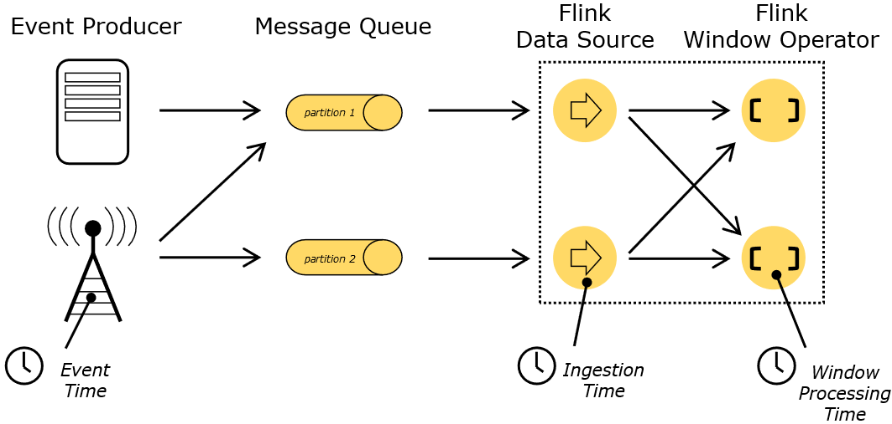
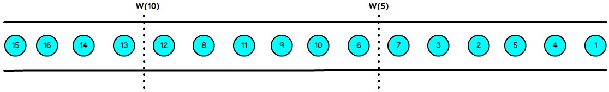

### 七、时间语义与Wartermark

#### 7.1 时间语义

在Flink 的流式处理中，会涉及到时间的不同概念，如下图所示：



- Event Time：是事件创建的时间。它通常由事件中的时间戳描述，例如采集的日志数据中，每一条日志都会记录自己的生成时间， Flink 通过时间戳分配器访问事件时间戳。

- Ingestion Time：是数据进入 Flink 的时间。
- Processing Time：是每一个执行基于时间操作的算子的本地系统时间，与机器相关，默认的时间属性就是 Processing Time 。

一个例子电影《星球大战》：


#### 7.2 EventTime 引入

在Flink 的流式处理中，绝大部分的业务都会使用 eventTime ，一般只在 eventTime 无法使用时，才会被迫使用 ProcessingTime 或者 Ing estionTime 。

在 Flink 1.12 以后，默认流时间特性已更改为EventTime，因此您不需要为不再启用事件时间支持。

#### 7.3 Watermark

##### 1. 基本概念

我们知道，流处理从事件产生，到流经source，再到 operator，中间是有一个过程和时间的，虽然大部分情况下，流到 operator 的数据都是按照事件产生的时间顺序来的，但是也不排除由于网络、分布式等原因，导致乱序的产生，所谓乱序，就是指 Flink 接收到的事件的先后顺序不是严格按照事件的 EventTime 顺序排列的。


那么此时出现一个问题，一旦出现乱序，如果只根据eventTime 决定 window 的运行，我们不能明确数据是否全部到位，但又不能无限期的等下去，此时必须要有个机制来保证一个特定的时间后，必须触发 window 去 进行计算了，这个特别的机制，就是 Watermark 。

- Watermark 是一种衡量 Event Time 进展的机制 。
- Watermark 是用于处理乱序事件的 ，而正确的处理乱序事件，通常用Watermark 机制结合 window 来实现。
- 数据流中的 Watermark 用于表示 timestamp 小于 Watermark 的数据，都已经到达了，因此，window 的执行也是由 Watermark 触发的。
- Watermark 可以理解成一个延迟触发机制，我们可以设置 Watermark 的延时时长 t ，每次系统会校验已经到达的数据中最大 的 maxEventTime，然后认定 eventTime小于 maxEventTime - t 的所有数据都已经到达，如果有窗口的停止时间等于maxEventTime - t，那么这个窗口被触发执行。

有序流的 Watermarker 如下图所示：（Watermark 设置为 0）


乱序流的Watermarker 如下图所示：（ Watermark 设置为 2）



当 Flink 接收到数据时， 会按照一定的规则去生成 Watermark，这条 Watermark 就等于当前所有到达数据中的 maxEventTime 延迟时长，也就是说， Watermark 是基于数据携带的时间戳生成的，一旦 Watermark 比当前未触发的窗口的停止时间要晚，那么就会触发相应窗口的执行。由于 event time 是由数据携带的，因此，如果运行过程中无法获取新的数据，那么没有被触发的窗口将永远都不被触发。

##### 2. Watermark 的引入

```scala
val dsSensor: DataStream[Sensor] = dss.map(line => {
    val values = line.split(",")
    Sensor(values(0), values(1).trim.toLong, values(2).trim.toDouble)
}).assignTimestampsAndWatermarks(new CustomAssigner)
```

CustomAssigner 有两种类型，都继承自TimestampAssigner。

- AssignerWithPeriodicWatermarks

周期性的生成 watermark ：系统会周期性的将 watermark 插入到流中（水位线 也是一种特殊的事件）。默认周期是 200 毫秒。

可以使用ExecutionConfig.setAutoWatermarkInterval() 方法进行设置。

```scala
val env: StreamExecutionEnvironment = StreamExecutionEnvironment.getExecutionEnvironment
env.getConfig.setAutoWatermarkInterval(100)
```

产生 watermark 的逻辑：每隔 5 秒钟，Flink 会调用 AssignerWithPeriodicWatermarks 的 getCurrentWatermark() 方法。如果方法返回一个时间戳大于之前
水位的时间戳，新的 watermark 会被插入到流中。这个检查保证了水位线是单调递增的。

如果方法返回的时间戳小于等于之前水 位 的时间戳，则不会产生新的 watermark。

- AssignerWithPunctuatedWatermarks

间断式地生成watermark。和周期性生成的方式不同，这种方式不是固定时间的，而是可以根据需要对每条数据进行筛选和处理。 

#### 7.4 EvnetTime 在 window 中的使用

##### 1. 滚动窗口（TumblingEventTimeWindows）

```scala
def main(args: Array[String]): Unit = {
    // 环境
    val env: StreamExecutionEnvironment = StreamExecutionEnvironment.getExecutionEnvironment

    val dstream = env.socketTextStream("hadoop003", 9999)

    val textWithTsStream = dstream.map { text =>
        val arr: Array[String] = text.split(" ")
        (arr(0), arr(1).toLong, 1)
    }

    val textWithEventTimeStream = textWithTsStream.assignTimestampsAndWatermarks(
        new BoundedOutOfOrdernessTimestampExtractor[(String, Long, Int)](Time.milliseconds(1000)) {
            override def extractTimestamp(element: (String, Long, Int)): Long = element._2
        })

    val textKeyStream: KeyedStream[(String, Long, Int), Tuple] = textWithEventTimeStream.keyBy(0)

    textKeyStream.print("text key: ")

    val windowStream = textKeyStream.window(TumblingEventTimeWindows.of(Time.seconds(2)))

    val groupStream = windowStream.fold(new mutable.HashSet[Long]()) {
        case (set, (key, ts, count)) => set += ts
    }

    groupStream.print("window::: ").setParallelism(1)

    env.execute("Tumbling EventTime Windows")
}
```

结果是按照EventTime 的 时间窗口计算得出的，而无关系统的时间（包括输入的快慢）。

##### 2. 滑动窗口（SlidingEventTimeWindows）

```scala
def main(args: Array[String]): Unit = {
    // 环境
    val env: StreamExecutionEnvironment = StreamExecutionEnvironment.getExecutionEnvironment

    val dstream = env.socketTextStream("hadoop003", 9999)

    val textWithTsStream = dstream.map { text =>
        val arr: Array[String] = text.split(" ")
        (arr(0), arr(1).toLong, 1)
    }

    val textWithEventTimeStream = textWithTsStream.assignTimestampsAndWatermarks(
        new BoundedOutOfOrdernessTimestampExtractor[(String, Long, Int)](Time.milliseconds(1000)) {
            override def extractTimestamp(element: (String, Long, Int)): Long = element._2
        })

    val textKeyStream: KeyedStream[(String, Long, Int), Tuple] = textWithEventTimeStream.keyBy(0)

    textKeyStream.print("text key: ")

    val windowStream = textKeyStream.window(SlidingEventTimeWindows.of(Time.seconds(2),Time.milliseconds(500)))

    val groupStream = windowStream.fold(new mutable.HashSet[Long]()) {
        case (set, (key, ts, count)) => set += ts
    }

    groupStream.print("window::: ").setParallelism(1)

    env.execute("Sliding EventTime Windows")
}
```

##### 3. 会话窗口（EventTimeSessionWindows）

相邻两次数据的EventTime 的时间差超过指定的时间间隔就会触发执行。如果加入 Watermark 会在符合窗口触发的情况下进行延迟。到达延迟水位再进行窗口触发。

```scala
def main(args: Array[String]): Unit = {
    // 环境
    val env: StreamExecutionEnvironment = StreamExecutionEnvironment.getExecutionEnvironment

    val dstream = env.socketTextStream("hadoop003", 9999)

    val textWithTsStream = dstream.map { text =>
        val arr: Array[String] = text.split(" ")
        (arr(0), arr(1).toLong, 1)
    }

    val textWithEventTimeStream = textWithTsStream.assignTimestampsAndWatermarks(
        new BoundedOutOfOrdernessTimestampExtractor[(String, Long, Int)](Time.milliseconds(1000)) {
            override def extractTimestamp(element: (String, Long, Int)): Long = element._2
        })

    val textKeyStream: KeyedStream[(String, Long, Int), Tuple] = textWithEventTimeStream.keyBy(0)

    textKeyStream.print("text key: ")

    val windowStream = textKeyStream.window(EventTimeSessionWindows.withGap(Time.milliseconds(500)))

    windowStream.reduce((text1, text2) => (text1._1, 0L, text1._3 + text2._3)).map(_._3)
    .print("windows:::")
    .setParallelism(1)

    env.execute("EventTime Session Windows")
}
```