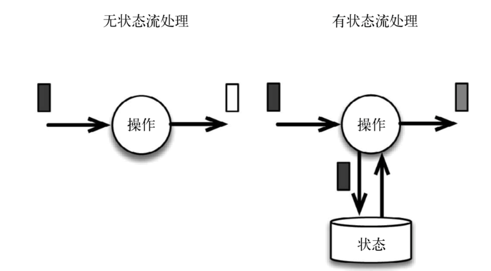
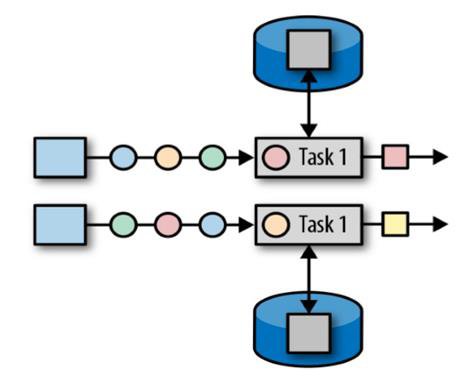
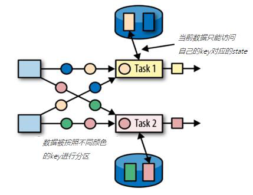

### 八、状态编程和容错机制

流式计算分为无状态和有状态两种情况。无状态的计算观察每个独立事件，并根据最后一个事件输出结果。例如，流处理应用程序从传感器接收温度读数，并在温度超过 90度时发出警告。有状态的计算则会基于多个事件输出结果。以下是一些例子。

- 所有类型的窗口。例如，计算过去一小时的平均温度，就是有状态的计算。
- 所有用于复杂事件处理的状态机。例如，若在一分钟内收到两个相差 20 度以上的温度读数，则发出警告，这是有状态的计算。
- 流与流之间的所有关联操作，以及 流与静态表或动态表之间的关联操作，都是有状态的计算。

下图展示了无状态流处理和有状态流处理的主要区别。无状态流处理分别接收每条数据记录（图中的黑条)，然后根据最新输入的数据生成输出数据白条。有状态流处理会维护状态（根据每条输入记录进行更新)，并基于最新输入的记录和当前的状态值生成输出记录灰条。



#### 8.1 有状态的算子和应用程序

Flink 内置的很多算子，数据源 source，数据存储 sink 都是有状态的，流中的数据都是 buffer records，会保存一定的元素或者元数据。

例如 : ProcessWindowFunction 会缓存输入流的数据 ProcessFunction 会保存设置的定时器信息等等。

在 Flink 中，状态始终与特定算子相关联。总的来说，有两种类型的状态：

##### 1. 算子状态（operator state）

算子状态的作用范围限定为算子任务。这意味着由同一并行任务所处理的所有数据都可以访问到相同的状态，状态对于同一任务而言是共享的。算子状态不能由相同或不同算子的另一个任务访问。



Flink 为算子状态提供三种基本数据结构：

- 列表状态（List state）
    将状态表示为一组数据的列表。
- 联合列表状态（Union list state）
    也将状态表示为数据的列表。它与常规列表状态的区别在于，在发生故障时，或者从保存点（savepoint）启动应用程序时如何恢复。
- 广播状态（Broadcast state）
    如果一个算子有多项任务，而它的每项任务状态又都相同，那么这种特殊情况最适合应用广播状态。

##### 2. 键控状态（keyed state）

键控状态是根据输入数据流中定义的键（key）来维护和访问的。Flink 为每个键值维护一个状态实例，并将具有相同键的所有数据，都分区到同一个算子任务中，这个任务会维护和处理这个 key 对应的状态 。当任务处理 一条数据 时，它会自动将状态 的访问范围限定为当前数据的 key。因此，具有相同 key 的所有数据 都会访问相同的状态。 Keyed State 很类似于一个分布式的 key-value、map 数据结构只能用于 KeyedStream（keyBy 算子处理之后）。



Flink的 Keyed State 支持以下数据类型：

- ValueState[T] 保存单个的值，值的类型为 T 。

    get 操作: ValueState.value()

    set 操作: ValueState.update(T value)

- ListState[T] 保存一个列表，列表里的元素的数据类型为 T 。基本操作如下：

    ListState.add(T value)

    ListState.addAll(List[T] values)

    ListState.get() 返回 Iterable[T]

    ListState.update(List[T] values)

- MapState[K, V] 保存 Key-Value 对。

    MapState.get(UK key)

    MapState.put(UK key, UV value)

    MapState.contains(UK key)

    MapState.remove(UK key)

- ReducingState[T]

- AggregatingState[I, O]

我们可以利用Keyed State，实现这样一个需求：检测传感器的温度值，如果连续的两个温度差值超过 10 度，就输出报警。

```scala
def main(args: Array[String]): Unit = {
    // 环境变量
    val env = StreamExecutionEnvironment.getExecutionEnvironment
    // 设置并行度
    env.setParallelism(1)

    // 从文件读取数据
    val socketStream = env.socketTextStream("hadoop003", 9999)

    // 构造Stream
    val sensorStream = socketStream.map(line => {
        val values = line.split(",")
        Sensor(values(0), values(1).trim.toLong, values(2).trim.toDouble)
    })

    // 定义一个有状态的map操作，统计当前分区数据个数
    val resultStream = sensorStream.keyBy(_.id).flatMap(new CustomRichMapFunction(10.0))
    resultStream.print("result ")

    env.execute("Streaming State KeyedState Case")
}

class CustomRichMapFunction(val threshold: Double) extends RichFlatMapFunction[Sensor, (String, Double, Double)] {

    // 定义状态，保存上一次的温度值
    var lastTempState: ValueState[Double] = _

    override def flatMap(value: Sensor, out: Collector[(String, Double, Double)]): Unit = {
        // 获取状态
        val lastTemp = lastTempState.value

        // 如果状态不为null，那么就判断两次温度差值
        val diff = Math.abs(value.temp - lastTemp)
        if (diff >= threshold) {
            out.collect((value.id, lastTemp, value.temp))
        }

        // 更新状态
        lastTempState.update(value.temp)
    }

    override def open(parameters: Configuration): Unit = {
        lastTempState = getRuntimeContext.getState(new ValueStateDescriptor[Double]("last-temp-state", classOf[Double]))
        super.open(parameters)
    }

    override def close(): Unit = {
        lastTempState.clear()
        super.close()
    }
}
```

#### 8.2 状态一致性

当在分布式系统中引入状态时，自然也引入了一致性问题。一致性实际上是正确性级别的另一种说法，也就是说在成功处理故障并恢复之后得到的结果，与没有发生任何故障时得到的结果相比，前者到底有多正确。

##### 1. 一致性级别

在流处理中，一致性可以 分为 3 个级别：

- at-most-once: 这其实是没有正确性保障的委婉说法 故障发生之后，计数结果可能丢失。同样的还有 udp。
- at-least-once: 这表示计数结果可能大于正确值，但绝不会小于正确值。也就是说，计数程序在发生故障后可能多算，但是绝不会少算。
- exactly-once: 这指的是系统保证在发生故障后得到的计数结果与正确值一致。

Flink 的一个重大价值在于，它既保证了 exactly-once，也具有低延迟和高吞吐的处理能力 。

##### 2. 端到端（end to end）状态一致性

目前我们看到的一致性保证都是由流处理器实现的，也就是说都是在 Flink 流处理器内部保证的。

而在真实应用中，流处理应用除了流处理器以外还包含了数据源（例如 Kafka ）和输出到持久化系统 。

端到端的一致性保证，意味着结果的正确性贯穿了整个流处理应用的始终；

每一个组件都保证了它自己的一致性 整个端到端的一致性级别取决于所有组件中一致性最弱的组件 。具体可以划分如下：

- **内部保证** ： 依赖 checkpoint
- **source 端** ： 需要外部源 可重设数据的读取位置
- **sink 端** ： 需要保证 从故障恢复时，数据不会 重复写入外部系统

而对于sink 端，又有两种具体的实现方式：幂等（Idempotent）写入和事务性（Transactional）写入。

- 幂等写入

    所谓幂等操作，是说一个操作，可以重复执行很多次，但只导致一次结果更改，也就是说，后面再重复执行就不起作用了 。

- 事务写入

    需要构建事务来写入外部系统，构建的事务对应着checkpoint，等到 checkpoint 真正完成的时候，才把所有对应的结果写入 sink 系统中。

    对于事务性写入，具体又有两种实现方式：预写日志（WAL）和两阶段提交（2PC）。 
    
    DataStream API 提供了 GenericWriteAheadSink 模板类 和 TwoPhaseCommitSinkFunction 接口，可以方便地实现这两种方式的事务性写入。

#### 8.3 检查点 checkpoint

Flink 使用一种被称为检查点 checkpoint的特性来保证 exactly-once，在出现故障时将系统重置回正确状态。

