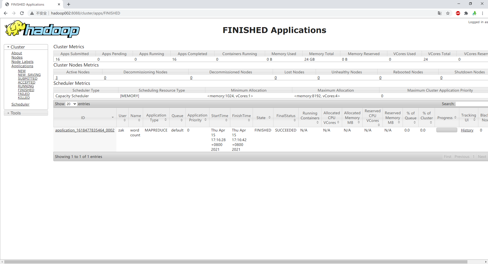

### Hadoop 运行模式

Hadoop运行模式包括：本地模式、伪分布式模式以及完全分布式模式。

#### 三、完全分布式模式

##### 1. 集群部署规划

|      | hadoop001          | hadoop002                    | hadoop003                   |
| ---- | ------------------ | ---------------------------- | --------------------------- |
| HDFS | NameNode、DataNode | DataNode                     | SecondaryNameNode、DataNode |
| YARN | NodeManager        | ResourceManager、NodeManager | NodeManager                 |

##### 2. 配置集群

- 修改配置文件：core-site.xml

```shell
  <!-- 指定HDFS中NameNode的地址 -->
  <property>
    <name>fs.defaultFS</name>
    <value>hdfs://hadoop001:9000</value>
  </property>

  <!-- 指定Hadoop运行时产生文件的存储目录 -->
  <property>
    <name>hadoop.tmp.dir</name>
    <value>/opt/module/hadoop-2.9.2/data/tmp</value>
  </property>
```

- 修改配置文件：hdfs-site.xml

```
  <property>
    <name>dfs.replication</name>
    <value>3</value>
  </property>

  <!-- 指定Hadoop辅助名称节点主机配置 -->
  <property>
    <name>dfs.namenode.secondary.http-address</name>
    <value>hadoop003:50090</value>
  </property>

```

- 修改配置文件：yarn-site.xml

```
  <!-- Reducer获取数据的方式 -->
  <property>
    <name>yarn.nodemanager.aux-services</name>
	<value>mapreduce_shuffle</value>
  </property>

  <!-- 指定YARN的ResourceManager的地址 -->
  <property>
    <name>yarn.resourcemanager.hostname</name>
	<value>hadoop002</value>
  </property>
```

- 修改配置文件：mapred-site.xml

```
  <!-- 指定MR运行在Yarn上 -->
  <property>
    <name>mapreduce.framework.name</name>
    <value>yarn</value>
  </property>
```

- 在集群上分发配置好的Hadoop配置文件

```
[zak@hadoop001 hadoop-2.9.2]$ sudo scp etc/hadoop/*  hadoop002:/opt/module/hadoop-2.9.2/etc/hadoop/
[zak@hadoop001 hadoop-2.9.2]$ sudo scp etc/hadoop/*  hadoop003:/opt/module/hadoop-2.9.2/etc/hadoop/
```

##### 3. 集群单点启动

- 格式化NameNode

```
[zak@hadoop001 hadoop-2.9.2]$ hadoop namenode -format
```

- 在hadoop102上启动NameNode

```
[zak@hadoop001 hadoop-2.9.2]$ hadoop-daemon.sh start namenode
```

- 在hadoop102、hadoop103以及hadoop104上分别启动DataNode

```
[zak@hadoop001 hadoop-2.9.2]$ hadoop-daemon.sh start datanode
[atguigu@hadoop102 hadoop-2.9.2]$ jps
3461 NameNode
3608 Jps
3561 DataNode
[atguigu@hadoop103 hadoop-2.9.2]$ hadoop-daemon.sh start datanode
[atguigu@hadoop103 hadoop-2.9.2]$ jps
3190 DataNode
3279 Jps
[atguigu@hadoop104 hadoop-2.9.2]$ hadoop-daemon.sh start datanode
[atguigu@hadoop104 hadoop-2.9.2]$ jps
3237 Jps
3163 DataNode
```

##### 4. 群起集群

- 配置slaves

```
/opt/module/hadoop-2.9.2/etc/hadoop/slaves
[zak@hadoop001 hadoop]$ vi slaves
```

在该文件中增加如下内容并同步所有节点配置文件

```
hadoop001
hadoop002
hadoop003
```

- 格式化NameNode

```
[zak@hadoop001 hadoop-2.9.2]$ bin/hdfs namenode -format
```

- 启动HDFS

```
[zak@hadoop001 hadoop-2.9.2]$ sbin/start-dfs.sh
[zak@hadoop001 hadoop-2.9.2]$ jps
4166 NameNode
4482 Jps
4263 DataNode
[zak@hadoop001 hadoop-2.9.2]$ jps
3218 DataNode
3288 Jps
[zak@hadoop001 hadoop-2.9.2]$ jps
3221 DataNode
3283 SecondaryNameNode
3364 Jps
```

- 启动YARN

```
[zak@hadoop002 hadoop-2.9.2]$ sbin/start-yarn.sh
```

- Web端查看SecondaryNameNode

http://hadoop003:50090/status.html


##### 5. 集群基本测试

- 执行wordcount程序

```shell
bin/hadoop jar share/hadoop/mapreduce/hadoop-mapreduce-examples-2.9.2.jar wordcount /user/zak/input /user/zak/output
```

- 查看执行日志



- 查看执行结果

```shell
[zak@hadoop003 hadoop-2.9.2]$ hdfs dfs -cat /user/zak/output/*
Ambari	1
CDH	1
CHD	1
ClickHouse	1
HDP	1
Kylin	1
Oozie	1
azkaban	1
.......
```

##### 6. 集群启动/停止方式总结

- 各个服务组件逐一启动/停止

  分别启动/停止HDFS组件

  ```shell
  hadoop-daemon.sh start / stop namenode / datanode / secondarynamenode
  ```

  启动/停止YARN

  ```shell
  yarn-daemon.sh start / stop resourcemanager / nodemanager
  ```

  

- 各个模块分开启动/停止（配置ssh是前提）常用

   整体启动/停止HDFS

    ```
    start-dfs.sh  / stop-dfs.sh
    ```

    整体启动/停止YARN

    ```
     start-yarn.sh / stop-yarn.sh
    ```


