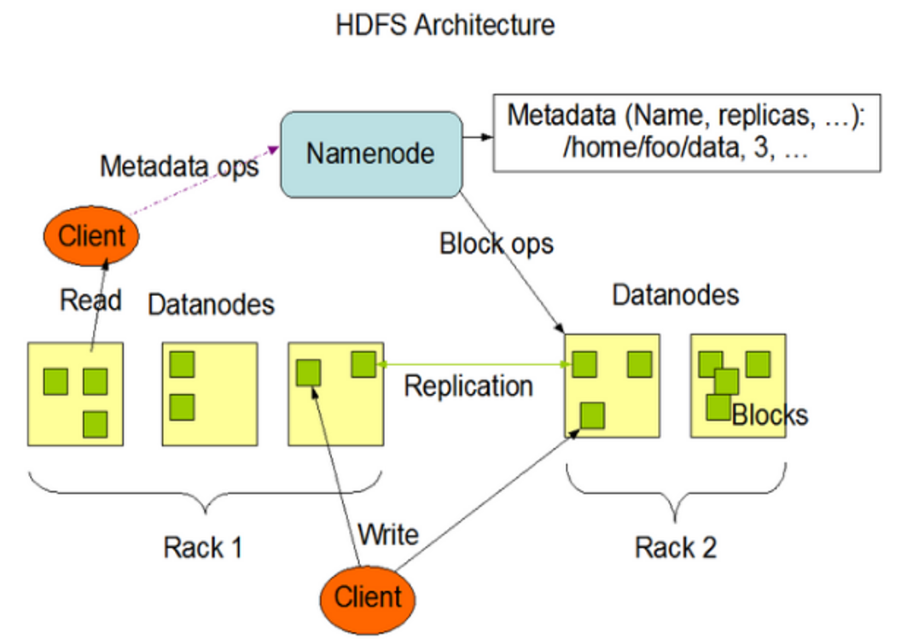
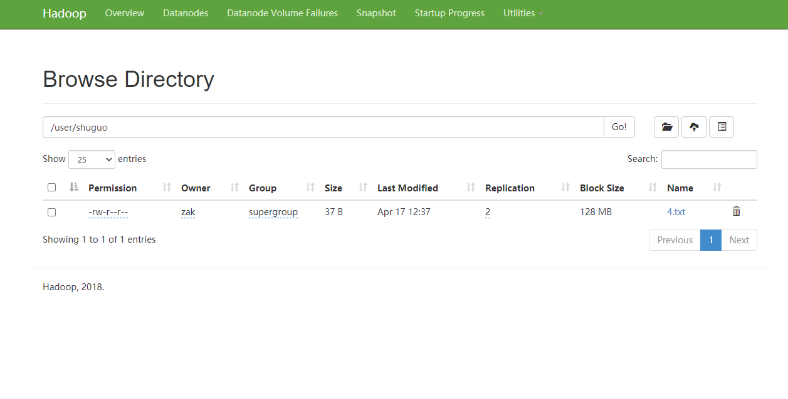

### 一、HDFS概述

#### 1. HDFS产生背景

随着数据量越来越大，在一个操作系统存不下所有的数据，那么就分配到更多的操作系统管理的磁盘中，但是不方便管理和维护，迫切需要一种系统来管理多台机器上的文件，这就是分布式文件管理系统。HDFS只是分布式文件管理系统中的一种。

#### 2. HDFS定义

HDFS（Hadoop Distributed File System），它是一个文件系统，用于存储文件，通过目录树来定位文件；其次，它是分布式的，由很多服务器联合起来实现其功能，集群中的服务器有各自的角色。

#### 3. HDFS优点

- 高容错性

- 适合处理大数据

  数据规模：能够处理数据规模达到GB、TB、甚至PB级别的数据

  文件规模：能够处理百万规模以上的文件数量，数量相当之大。

- 可构建在廉价机器上，通过多副本机制，提高可靠性。

#### 4. HDFS缺点

- 不适合低延时数据访问，比如毫秒级的存储数据，是做不到的。

- 无法高效的对大量小文件进行存储。

  存储大量小文件的话，它会占用NameNode大量的内存来存储文件目录和块信息。这样是不可取的，因为NameNode的内存总是有限的。

  小文件存储的寻址时间会超过读取时间，它违反了HDFS的设计目标。

- 不支持并发写入、文件随机修改。

  一个文件只能有一个写，不允许多个线程同时写。

  仅支持数据append（追加），不支持文件的随机修改。

#### 5. HDFS组成架构



1）NameNode（nn）：就是Master，它是一个主管、管理者。

（1）管理HDFS的名称空间；

（2）配置副本策略；

（3）管理数据块（Block）映射信息；

（4）处理客户端读写请求。

2）DataNode：就是Slave。NameNode下达命令，DataNode执行实际的操作。

（1）存储实际的数据块；

（2）执行数据块的读/写操作。

3）Client：就是客户端。

（1）文件切分。文件上传HDFS的时候，Client将文件切分成一个一个的Block，然后进行上传；

（2）与NameNode交互，获取文件的位置信息；

（3）与DataNode交互，读取或者写入数据；

（4）Client提供一些命令来管理HDFS，比如NameNode格式化；

（5）Client可以通过一些命令来访问HDFS，比如对HDFS增删查改操作；

4）Secondary NameNode：并非NameNode的热备。当NameNode挂掉的时候，它并不能马上替换NameNode并提供服务。

（1）辅助NameNode，分担其工作量，比如定期合并Fsimage和Edits，并推送给NameNode ；

（2）在紧急情况下，可辅助恢复NameNode。


#### 6. HDFS文件块大小

HDFS中的文件在物理上是分块存储（Block），块的大小可以通过配置参数( dfs.blocksize)来规定，默认大小在Hadoop2.x版本中是128M，老版本中是64M。

一般情况下建议设置：Block大小 = 磁盘的传输速率 * 寻址时间

2 如果寻址时间约为10ms，即查找到目标block的时间为10ms。

3 寻址时间为传输时间的1%时，则为最佳状态。因此，传输时间=10ms/0.01=1000ms=1s

4 而目前磁盘的传输速率普遍为100MB/s。

5 block大小=1s*100MB/s=100MB


为什么块的大小不能设置太小，也不能设置太大？

HDFS的块设置太小，会增加寻址时间，程序一直在找块的开始位置

2）如果块设置的太大，从磁盘传输数据的时间会明显大于定位这个块开始位置所需的时间。导致程序在处理这块数据时，会非常慢。


总结：HDFS块的大小设置主要取决于磁盘传输速率。

#### 

### 二、HDFS的Shell操作

#### 1．基本语法

bin/hadoop fs 具体命令  OR bin/hdfs dfs 具体命令

#### 2．命令大全

```shell
[zak@hadoop001 hadoop-2.9.2]$  bin/hadoop fs
Usage: hadoop fs [generic options]
	[-appendToFile <localsrc> ... <dst>]
	[-cat [-ignoreCrc] <src> ...]
	[-checksum <src> ...]
	[-chgrp [-R] GROUP PATH...]
	[-chmod [-R] <MODE[,MODE]... | OCTALMODE> PATH...]
	[-chown [-R] [OWNER][:[GROUP]] PATH...]
	[-copyFromLocal [-f] [-p] [-l] [-d] <localsrc> ... <dst>]
	[-copyToLocal [-f] [-p] [-ignoreCrc] [-crc] <src> ... <localdst>]
	[-count [-q] [-h] [-v] [-t [<storage type>]] [-u] [-x] <path> ...]
	[-cp [-f] [-p | -p[topax]] [-d] <src> ... <dst>]
	[-createSnapshot <snapshotDir> [<snapshotName>]]
	[-deleteSnapshot <snapshotDir> <snapshotName>]
	[-df [-h] [<path> ...]]
	[-du [-s] [-h] [-x] <path> ...]
	[-expunge]
	[-find <path> ... <expression> ...]
	[-get [-f] [-p] [-ignoreCrc] [-crc] <src> ... <localdst>]
	[-getfacl [-R] <path>]
	[-getfattr [-R] {-n name | -d} [-e en] <path>]
	[-getmerge [-nl] [-skip-empty-file] <src> <localdst>]
	[-help [cmd ...]]
	[-ls [-C] [-d] [-h] [-q] [-R] [-t] [-S] [-r] [-u] [<path> ...]]
	[-mkdir [-p] <path> ...]
	[-moveFromLocal <localsrc> ... <dst>]
	[-moveToLocal <src> <localdst>]
	[-mv <src> ... <dst>]
	[-put [-f] [-p] [-l] [-d] <localsrc> ... <dst>]
	[-renameSnapshot <snapshotDir> <oldName> <newName>]
	[-rm [-f] [-r|-R] [-skipTrash] [-safely] <src> ...]
	[-rmdir [--ignore-fail-on-non-empty] <dir> ...]
	[-setfacl [-R] [{-b|-k} {-m|-x <acl_spec>} <path>]|[--set <acl_spec> <path>]]
	[-setfattr {-n name [-v value] | -x name} <path>]
	[-setrep [-R] [-w] <rep> <path> ...]
	[-stat [format] <path> ...]
	[-tail [-f] <file>]
	[-test -[defsz] <path>]
	[-text [-ignoreCrc] <src> ...]
	[-touchz <path> ...]
	[-truncate [-w] <length> <path> ...]
	[-usage [cmd ...]]

```

#### 4. 常用命令实操

（1）-help：输出这个命令参数

```shell
[zak@hadoop001 hadoop-2.9.2]$ hadoop fs -help rm
-rm [-f] [-r|-R] [-skipTrash] [-safely] <src> ... :
  Delete all files that match the specified file pattern. Equivalent to the Unix
  command "rm <src>"
                                                                                 
  -f          If the file does not exist, do not display a diagnostic message or 
              modify the exit status to reflect an error.                        
  -[rR]       Recursively deletes directories.                                   
  -skipTrash  option bypasses trash, if enabled, and immediately deletes <src>.  
  -safely     option requires safety confirmation, if enabled, requires          
              confirmation before deleting large directory with more than        
              <hadoop.shell.delete.limit.num.files> files. Delay is expected when
              walking over large directory recursively to count the number of    
              files to be deleted before the confirmation.        
```


（2）-ls: 显示目录信息

```shell
[zak@hadoop001 hadoop-2.9.2]$ hadoop fs -ls /
Found 2 items
drwxr--r--   - zak supergroup          0 2021-04-16 20:17 /tmp
drwxr-xr-x   - zak supergroup          0 2021-04-17 12:00 /user
```


（3）-mkdir：在HDFS上创建目录

```shell
[zak@hadoop001 hadoop-2.9.2]$ hadoop fs -mkdir -p /user/shuguo
```


（4）-moveFromLocal：从本地移动到HDFS

```shell
[zak@hadoop001 input]$ ll
total 16
-rw-r--r-- 1 zak zak 171 Apr 16 21:16 1.txt
-rw-rw-r-- 1 zak zak 131 Apr 16 20:23 2.txt
-rw-rw-r-- 1 zak zak  79 Apr 16 20:24 3.txt
-rw-rw-r-- 1 zak zak  37 Apr 16 21:11 4.txt
[zak@hadoop001 input]$ cd ..
[zak@hadoop001 hadoop-2.9.2]$ hadoop fs -moveFromLocal input/4.txt /user/shuguo
[zak@hadoop001 hadoop-2.9.2]$ ls input/
1.txt  2.txt  3.txt
[zak@hadoop001 hadoop-2.9.2]$ ll input/
total 12
-rw-r--r-- 1 zak zak 171 Apr 16 21:16 1.txt
-rw-rw-r-- 1 zak zak 131 Apr 16 20:23 2.txt
-rw-rw-r-- 1 zak zak  79 Apr 16 20:24 3.txt
```



（5）-appendToFile：追加一个文件到已经存在的文件末尾

```shell
[zak@hadoop001 hadoop-2.9.2]$ vi input/5.txt
[zak@hadoop001 hadoop-2.9.2]$ echo  "Hello World" > input/5.txt 
[zak@hadoop001 hadoop-2.9.2]$ cat input/5.txt 
Hello World
[zak@hadoop001 hadoop-2.9.2]$ hadoop fs -appendToFile input/5.txt /user/shuguo/4.txt
[zak@hadoop001 hadoop-2.9.2]$ hadoop fs -cat /user/shuguo/4.txt
tomcat
hello

Hello World
[zak@hadoop001 hadoop-2.9.2]$
```

