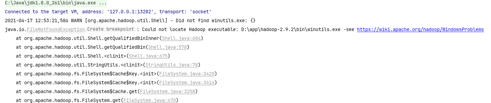
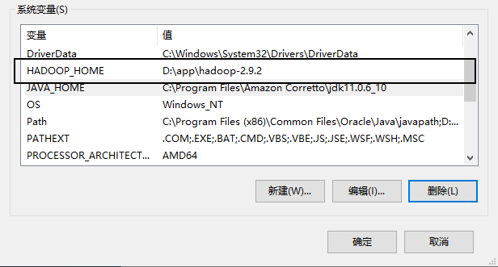

### 三、HDFS客户端操作

#### 1.  HDFS客户端环境准备

下载hadoop安装包到本地，并解压。

下载Hadoop Windows运行套件：https://github.com/cdarlint/winutils，并解压到Hadoop目录的bin目录下，否则在本地测试的时候会出现以下错误：




#### 2. 配置HADOOP_HOME环境变量

然后在系统环境变量中配置系统变量，如下图所示。



#### 3. 创建Maven工程，并引入对应的客户的包

````xml
<dependencies>
        <dependency>
            <groupId>org.apache.hadoop</groupId>
            <artifactId>hadoop-common</artifactId>
            <version>2.9.2</version>
        </dependency>
        <dependency>
            <groupId>org.apache.hadoop</groupId>
            <artifactId>hadoop-client</artifactId>
            <version>2.9.2</version>
        </dependency>
        <dependency>
            <groupId>org.apache.hadoop</groupId>
            <artifactId>hadoop-hdfs</artifactId>
            <version>2.9.2</version>
        </dependency>
        <dependency>
            <groupId>org.projectlombok</groupId>
            <artifactId>lombok</artifactId>
        </dependency>
        <dependency>
            <groupId>junit</groupId>
            <artifactId>junit</artifactId>
            <scope>test</scope>
        </dependency>
    </dependencies>
````

#### 4. 创建客户端类，开始测试

```java
public class HdfsClient {

    public static void main(String[] args) throws URISyntaxException, IOException, InterruptedException {
        // 1 获取文件系统
        Configuration configuration = new Configuration();
        FileSystem fs = FileSystem.get(new URI("hdfs://hadoop001:9000"), configuration, "zak");
        // 2 创建目录
        fs.mkdirs(new Path("/user/client/zhang"));
        // 3 关闭资源
        fs.close();
    }
}
```


#### 5.  HDFS的API操作

```java
@FixMethodOrder
public class HdfsTest {

    private FileSystem fileSystem = null;

    @Before
    public void crateFileSystem() throws URISyntaxException, IOException, InterruptedException {
        // 1 获取文件系统
        Configuration configuration = new Configuration();
        configuration.set("dfs.replication", "2");
        fileSystem = FileSystem.get(new URI("hdfs://hadoop001:9000"), configuration, "zak");
    }

    @After
    public void closeFileSystem() throws IOException {
        fileSystem.close();
    }

    @Test
    public void testCreateDir() throws IOException {
        // 创建目录
        fileSystem.mkdirs(new Path("/user/client/dir"));
    }
    
    @Test
    public void testDelete() throws IOException {
        // 执行删除
        fileSystem.delete(new Path("/user/client/dir"), true);
    }

    @Test
    public void testCopyFromLocalFile() throws IOException {
        // 上传文件
        fileSystem.copyFromLocalFile(new Path("D:/docs/market.sql"), new Path("/user/market.sql"));
    }

    @Test
    public void testCopyToLocalFile() throws IOException {
        // 下载文件
        fileSystem.copyToLocalFile(new Path("/user/input/1.txt"), new Path("D:/docs/1.txt"));
    }

    @Test
    public void testRename() throws IOException {
        // 修改文件名称
        fileSystem.rename(new Path("/user/1.txt"), new Path("/user/rename.txt"));
    }

    @Test
    public void testListFiles() throws IOException {
        // 获取文件详情
        RemoteIterator<LocatedFileStatus> listFiles = fileSystem.listFiles(new Path("/"), true);
        while (listFiles.hasNext()) {
            LocatedFileStatus status = listFiles.next();
            // 输出详情
            // 文件名称
            System.out.println(status.getPath().getName());
            // 长度
            System.out.println(status.getLen());
            // 权限
            System.out.println(status.getPermission());
            // 分组
            System.out.println(status.getGroup());
            // 获取存储的块信息
            BlockLocation[] blockLocations = status.getBlockLocations();
            for (BlockLocation blockLocation : blockLocations) {
                // 获取块存储的主机节点
                String[] hosts = blockLocation.getHosts();
                for (String host : hosts) {
                    System.out.println(host);
                }
            }
        }
    }

    @Test
    public void testListStatus() throws IOException {
        // 判断是文件还是文件夹
        FileStatus[] listStatus = fileSystem.listStatus(new Path("/user"));
        for (FileStatus fileStatus : listStatus) {
            // 如果是文件
            if (fileStatus.isFile()) {
                System.out.println("f:" + fileStatus.getPath().getName());
            } else {
                System.out.println("d:" + fileStatus.getPath().getName());
            }
        }
    }
}
```

#### 6. 文件上传下载

```java
    @Test
    public void putFileToHDFS() throws IOException, InterruptedException, URISyntaxException {
        Configuration configuration = new Configuration();
        configuration.set("dfs.replication", "2");
        FileSystem fileSystem = FileSystem.get(new URI("hdfs://hadoop001:9000"), configuration, "zak");
        // 2 创建输入流
        FileInputStream fis = new FileInputStream(new File("d:/chrome/apache-maven-3.8.1-bin.tar.gz"));
        // 3 获取输出流
        FSDataOutputStream fos = fileSystem.create(new Path("/user/apache-maven-3.8.1-bin.tar.gz"));
        // 4 流对拷
        IOUtils.copyBytes(fis, fos, configuration);

        // 5 关闭资源
        IOUtils.closeStream(fos);
        IOUtils.closeStream(fis);
    }


    // 文件下载
    @Test
    public void getFileFromHDFS() throws IOException, InterruptedException, URISyntaxException {
        // 1 获取文件系统
        Configuration configuration = new Configuration();
        FileSystem fileSystem = FileSystem.get(new URI("hdfs://hadoop001:9000"), configuration, "zak");
        // 2 获取输入流
        FSDataInputStream fis = fileSystem.open(new Path("/user/apache-maven-3.8.1-bin.tar.gz"));
        // 3 获取输出流
        FileOutputStream fos = new FileOutputStream(new File("e:/apache-maven-3.8.1-bin.tar.gz"));

        // 4 流的对拷
        IOUtils.copyBytes(fis, fos, configuration);
        // 5 关闭资源
        IOUtils.closeStream(fos);
        IOUtils.closeStream(fis);
        fileSystem.close();
    }

    @Test
    public void readFileSeek1() throws IOException, InterruptedException, URISyntaxException {
        // 1 获取文件系统
        Configuration configuration = new Configuration();
        FileSystem fileSystem = FileSystem.get(new URI("hdfs://hadoop001:9000"), configuration, "zak");
        // 2 获取输入流
        FSDataInputStream fis = fileSystem.open(new Path("/user/apache-maven-3.8.1-bin.tar.gz"));
        // 3 创建输出流
        FileOutputStream fos = new FileOutputStream(new File("e:/apache-maven-3.8.1-bin.tar.gz.part1"));

        // 4 流的拷贝
        byte[] buf = new byte[1024];
        for (int i = 0; i < 1024 * 4; i++) {
            fis.read(buf);
            fos.write(buf);
        }

        // 5关闭资源
        IOUtils.closeStream(fis);
        IOUtils.closeStream(fos);
        fileSystem.close();
    }

    @Test
    public void readFileSeek2() throws IOException, InterruptedException, URISyntaxException {
        // 1 获取文件系统
        Configuration configuration = new Configuration();
        FileSystem fileSystem = FileSystem.get(new URI("hdfs://hadoop001:9000"), configuration, "zak");
        // 2 打开输入流
        FSDataInputStream fis = fileSystem.open(new Path("/user/apache-maven-3.8.1-bin.tar.gz"));
        // 3 定位输入数据位置
        fis.seek(1024 * 1024 * 4);
        // 4 创建输出流
        FileOutputStream fos = new FileOutputStream(new File("e:/apache-maven-3.8.1-bin.tar.gz.part2"));
        // 5 流的对拷
        IOUtils.copyBytes(fis, fos, configuration);

        // 6 关闭资源
        IOUtils.closeStream(fis);
        IOUtils.closeStream(fos);
        fileSystem.close();
    }
```
