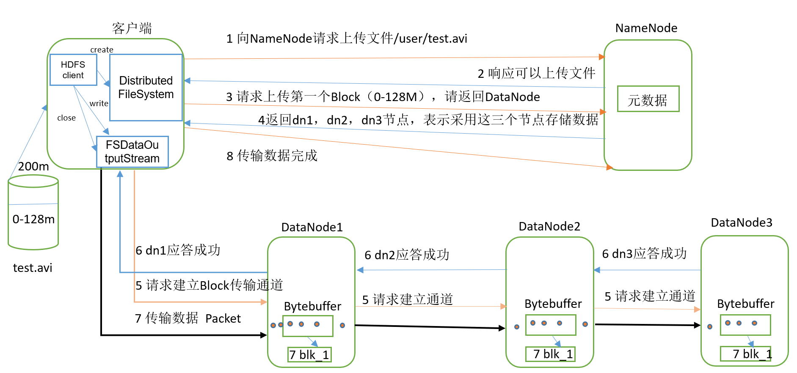
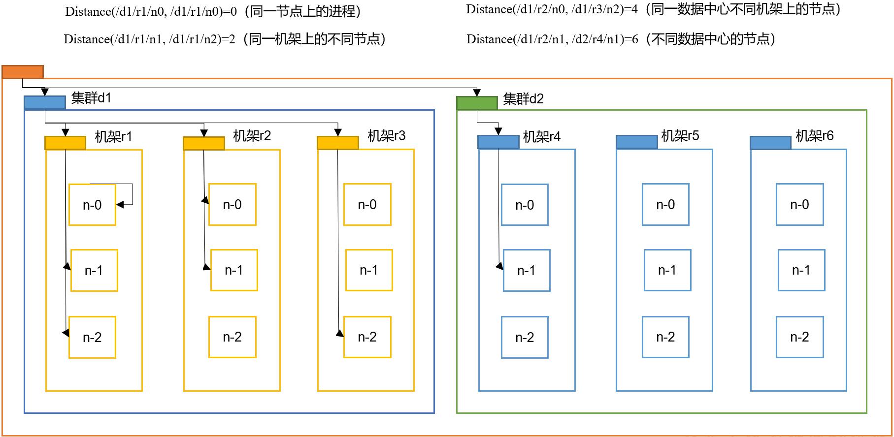
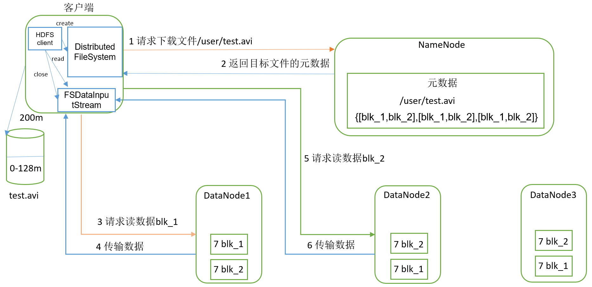
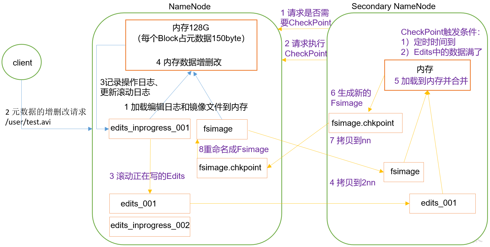
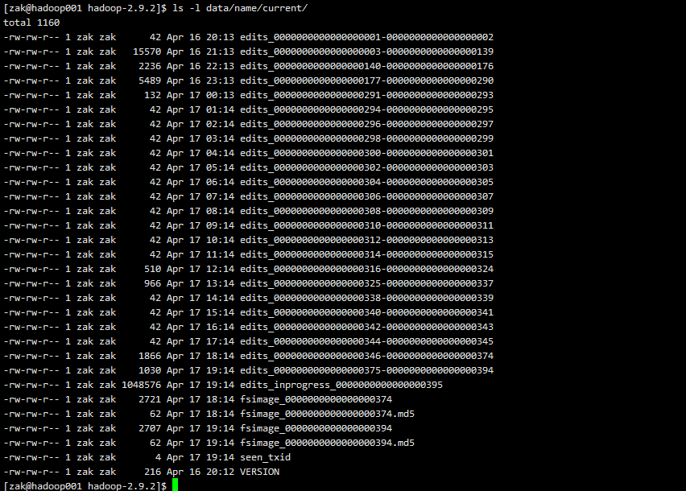
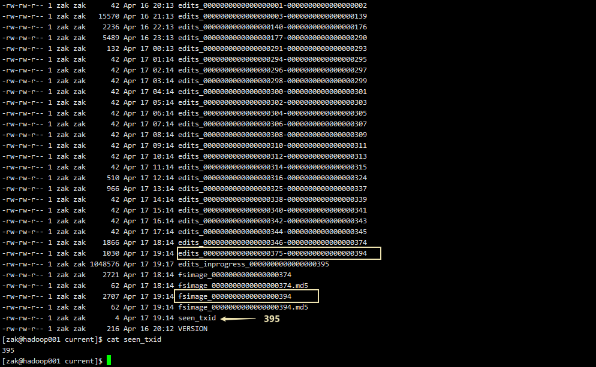

### 四、HDFS的数据流

#### 1. HDFS写数据流程



1. 客户端通过Distributed FileSystem模块向NameNode请求上传文件，NameNode检查目标文件是否已存在，父目录是否存在。

2. NameNode返回是否可以上传。

3. 客户端请求第一个 Block上传到哪几个DataNode服务器上。

4. NameNode返回3个DataNode节点，分别为dn1、dn2、dn3。

5. 客户端通过FSDataOutputStream模块请求dn1上传数据，dn1收到请求会继续调用dn2，然后dn2调用dn3，将这个通信管道建立完成。

6. dn1、dn2、dn3逐级应答客户端。

7. 客户端开始往dn1上传第一个Block（先从磁盘读取数据放到一个本地内存缓存），以Packet为单位，dn1收到一个Packet就会传给dn2，dn2传给dn3；dn1每传一个packet会放入一个应答队列等待应答。

8. 当一个Block传输完成之后，客户端再次请求NameNode上传第二个Block的服务器。（重复执行3-7步）。

#### 2. 网络拓扑-节点距离计算



#### 3. HDFS读数据流程



1. 客户端通过Distributed FileSystem向NameNode请求下载文件，NameNode通过查询元数据，找到文件块所在的DataNode地址。

2. 挑选一台DataNode（就近原则，然后随机）服务器，请求读取数据。

3. DataNode开始传输数据给客户端（从磁盘里面读取数据输入流，以Packet为单位来做校验）。

4. 客户端以Packet为单位接收，先在本地缓存，然后写入目标文件。

### 五、NN和2NN工作机制



##### 第一阶段：NameNode启动

1. 第一次启动NameNode格式化后，创建Fsimage和Edits文件。如果不是第一次启动，直接加载编辑日志和镜像文件到内存。

2. 客户端对元数据进行增删改的请求。

3. NameNode记录操作日志，更新滚动日志。

4. NameNode在内存中对数据进行增删改。

##### 第二阶段：Secondary NameNode工作

1. Secondary NameNode询问NameNode是否需要CheckPoint。直接带回NameNode是否检查结果。

2. Secondary NameNode请求执行CheckPoint。

3. NameNode滚动正在写的Edits日志。

4. 将滚动前的编辑日志和镜像文件拷贝到Secondary NameNode。

5. Secondary NameNode加载编辑日志和镜像文件到内存，并合并。

6. 生成新的镜像文件fsimage.chkpoint。

7. 拷贝fsimage.chkpoint到NameNode。

8. NameNode将fsimage.chkpoint重新命名成fsimage。

#### 1. NN和2NN工作机制详解

Fsimage：NameNode内存中元数据序列化后形成的文件。  

Edits：记录客户端更新元数据信息的每一步操作（可通过Edits运算出元数据）。

NameNode启动时，先滚动Edits并生成一个空的 edits.inprogress，然后加载Edits和Fsimage到内存中，此时NameNode内存就持有最新的元数据信息。

Client开始对NameNode发送元数据的增删改的请求，这些请求的操作首先会被记录到edits.inprogress中（查询元数据的操作不会被记录在Edits中，因为查询操作不会更改元数据信息），如果此时NameNode挂掉，重启后会从Edits中读取元数据的信息。

然后，NameNode会在内存中执行元数据的增删改的操作。由于Edits中记录的操作会越来越多，Edits文件会越来越大，导致NameNode在启动加载Edits时会很慢，所以需要对Edits和Fsimage进行合并（所谓合并，就是将Edits和Fsimage加载到内存中，照着Edits中的操作一步步执行，最终形成新的Fsimage）。

SecondaryNameNode的作用就是帮助NameNode进行Edits和Fsimage的合并工作。

SecondaryNameNode首先会询问NameNode是否需要CheckPoint（触发CheckPoint需要满足两个条件中的任意一个，定时时间到和Edits中数据写满了）。直接带回NameNode是否检查结果。

SecondaryNameNode执行CheckPoint操作，首先会让NameNode滚动Edits并生成一个空的edits.inprogress，滚动Edits的目的是给Edits打个标记，以后所有新的操作都写入edits.inprogress，其他未合并的Edits和Fsimage会拷贝到SecondaryNameNode的本地，然后将拷贝的Edits和Fsimage加载到内存中进行合并，生成fsimage.chkpoint，然后将fsimage.chkpoint拷贝给NameNode，重命名为Fsimage后替换掉原来的Fsimage。

NameNode在启动时就只需要加载之前未合并的Edits和Fsimage即可，因为合并过的Edits中的元数据信息已经被记录在Fsimage中。  

#### 2. Fsimage和Edits解析

NameNode被格式化之后，将在/opt/module/hadoop-2.9.2/data/tmp/dfs/name/current目录中产生如下文件


Fsimage文件：HDFS文件系统元数据的一个**永久性的检查点**，其中包含HDFS文件系统的所有目录和文件inode的序列化信息。 

Edits文件：存放HDFS文件系统的所有更新操作的路径，文件系统客户端执行的所有写操作首先会被记录到Edits文件中。 

seen_txid文件保存的是一个数字，就是最后一个edits_的数字

每次NameNode启动的时候都会将Fsimage文件读入内存，加载Edits里面的更新操作，保证内存中的元数据信息是最新的、同步的，可以看成NameNode启动的时候就将Fsimage和Edits文件进行了合并。

```shell
[zak@hadoop001 hadoop-2.9.2]$ hdfs
  oiv                  apply the offline fsimage viewer to an fsimage
  oev                  apply the offline edits viewer to an edits file
```

#### 3. oiv查看Fsimage文件

##### 基本语法

hdfs oiv -p 文件类型 -i镜像文件 -o 转换后文件输出路径

##### 案例实操

```sh
[zak@hadoop001 current]$ hdfs oiv -p XML -i fsimage_0000000000000000374 -o /opt/module/hadoop-2.9.2/fsimage.xml
```

将显示的xml文件导出并格式化。部分显示结果如下。

```xml
<?xml version="1.0"?>
<fsimage>
    <version>
        <layoutVersion>-63</layoutVersion>
        <onDiskVersion>1</onDiskVersion>
        <oivRevision>826afbeae31ca687bc2f8471dc841b66ed2c6704</oivRevision>
    </version>
    <NameSection>
        <namespaceId>842469487</namespaceId>
        <genstampV1>1000</genstampV1>
        <genstampV2>1048</genstampV2>
        <genstampV1Limit>0</genstampV1Limit>
        <lastAllocatedBlockId>1073741870</lastAllocatedBlockId>
        <txid>374</txid>
    </NameSection>
    <INodeSection>
        <lastInodeId>16443</lastInodeId>
        <numInodes>34</numInodes>
        <inode>
            <id>16385</id>
            <type>DIRECTORY</type>
            <name></name>
            <mtime>1618575965343</mtime>
            <permission>zak:supergroup:0755</permission>
            <nsquota>9223372036854775807</nsquota>
            <dsquota>-1</dsquota>
        </inode>
        ......
        <inode>
            <id>16394</id>
            <type>FILE</type>
            <name>1.txt</name>
            <replication>2</replication>
            <mtime>1618575987457</mtime>
            <atime>1618632277212</atime>
            <preferredBlockSize>134217728</preferredBlockSize>
            <permission>zak:supergroup:0644</permission>
            <blocks>
                <block>
                    <id>1073741825</id>
                    <genstamp>1001</genstamp>
                    <numBytes>134</numBytes>
                </block>
            </blocks>
            <storagePolicyId>0</storagePolicyId>
        </inode>
        ......
        <inode>
            <id>16443</id>
            <type>FILE</type>
            <name>apache-maven-3.8.1-bin.tar.gz</name>
            <replication>2</replication>
            <mtime>1618654421239</mtime>
            <atime>1618654421239</atime>
            <preferredBlockSize>134217728</preferredBlockSize>
            <permission>zak:supergroup:0644</permission>
            <blocks>
                <block>
                    <id>1073741870</id>
                    <genstamp>1048</genstamp>
                    <numBytes>0</numBytes>
                </block>
            </blocks>
            <storagePolicyId>0</storagePolicyId>
            <file-under-construction>
                <clientName>DFSClient_NONMAPREDUCE_-515527543_1</clientName>
                <clientMachine>220.202.225.40</clientMachine>
            </file-under-construction>
        </inode>
    </INodeSection>
    <INodeReferenceSection></INodeReferenceSection>
    <SnapshotSection>
        <snapshotCounter>0</snapshotCounter>
        <numSnapshots>0</numSnapshots>
    </SnapshotSection>
    <INodeDirectorySection>
        <directory>
            <parent>16385</parent>
            <child>16386</child>
            <child>16392</child>
        </directory>
       ......
    </INodeDirectorySection>
    <FileUnderConstructionSection>
        <inode>
            <id>16443</id>
            <path>/user/apache-maven-3.8.1-bin.tar.gz</path>
        </inode>
    </FileUnderConstructionSection>
    <SecretManagerSection>
        <currentId>0</currentId>
        <tokenSequenceNumber>0</tokenSequenceNumber>
        <numDelegationKeys>0</numDelegationKeys>
        <numTokens>0</numTokens>
    </SecretManagerSection>
    <CacheManagerSection>
        <nextDirectiveId>1</nextDirectiveId>
        <numDirectives>0</numDirectives>
        <numPools>0</numPools>
    </CacheManagerSection>
</fsimage>

```

#### 4. oev查看Edits文件

##### 基本语法

hdfs oev -p 文件类型 -i编辑日志 -o 转换后文件输出路径

##### 案例实操

```shell
[zak@hadoop001 current]$ hdfs oev -p XML -i edits_0000000000000000012-0000000000000000013 -o /opt/module/hadoop-2.9.2/edits.xml
```

将显示的xml文件导出并格式化。部分显示结果如下。

```xml
<?xml version="1.0" encoding="UTF-8"?>
<EDITS>
    <EDITS_VERSION>-63</EDITS_VERSION>
    <RECORD>
        <OPCODE>OP_START_LOG_SEGMENT</OPCODE>
        <DATA>
            <TXID>375</TXID>
        </DATA>
    </RECORD>
    <RECORD>
        <OPCODE>OP_UPDATE_BLOCKS</OPCODE>
        <DATA>
            <TXID>376</TXID>
            <PATH>/user/apache-maven-3.8.1-bin.tar.gz</PATH>
            <RPC_CLIENTID></RPC_CLIENTID>
            <RPC_CALLID>-2</RPC_CALLID>
        </DATA>
    </RECORD>
    .......
    <RECORD>
        <OPCODE>OP_ADD</OPCODE>
        <DATA>
            <TXID>381</TXID>
            <LENGTH>0</LENGTH>
            <INODEID>16444</INODEID>
            <PATH>/user/apache-maven-3.8.1-bin.tar.gz</PATH>
            <REPLICATION>2</REPLICATION>
            <MTIME>1618654561262</MTIME>
            <ATIME>1618654561262</ATIME>
            <BLOCKSIZE>134217728</BLOCKSIZE>
            <CLIENT_NAME>DFSClient_NONMAPREDUCE_-291087530_1</CLIENT_NAME>
            <CLIENT_MACHINE>220.202.225.40</CLIENT_MACHINE>
            <OVERWRITE>true</OVERWRITE>
            <PERMISSION_STATUS>
                <USERNAME>zak</USERNAME>
                <GROUPNAME>supergroup</GROUPNAME>
                <MODE>420</MODE>
            </PERMISSION_STATUS>
            <RPC_CLIENTID>af18342b-1498-4db6-8b55-3823e782b167</RPC_CLIENTID>
            <RPC_CALLID>0</RPC_CALLID>
        </DATA>
    </RECORD>
</EDITS>

```


#### 5. CheckPoint时间设置

通常情况下，SecondaryNameNode每隔一小时执行一次。配置项在 hdfs-default.xml 中。

 ```xml
<property>
  <name>dfs.namenode.checkpoint.period</name>
  <value>3600</value>
  <description>The number of seconds between two periodic checkpoints.
  </description>
</property>
 ```

一分钟检查一次操作次数，当操作次数达到1百万时，SecondaryNameNode执行一次。

```xml
<property>
  <name>dfs.namenode.checkpoint.txns</name>
  <value>1000000</value>
  <description>The Secondary NameNode or CheckpointNode will create a checkpoint
  of the namespace every 'dfs.namenode.checkpoint.txns' transactions, regardless
  of whether 'dfs.namenode.checkpoint.period' has expired.
  </description>
</property>

<property>
  <name>dfs.namenode.checkpoint.check.period</name>
  <value>60</value>
  <description>The SecondaryNameNode and CheckpointNode will poll the NameNode
  every 'dfs.namenode.checkpoint.check.period' seconds to query the number
  of uncheckpointed transactions.
  </description>
</property>
```

#### 6. 集群安全模式

##### 1. NameNode启动

NameNode启动时，首先将镜像文件（Fsimage）载入内存，并执行编辑日志（Edits）中的各项操作。一旦在内存中成功建立文件系统元数据的映像，则创建一个新的Fsimage文件和一个空的编辑日志。此时，NameNode开始监听DataNode请求。这个过程期间，NameNode一直运行在安全模式，即NameNode的文件系统对于客户端来说是只读的。

##### 2. DataNode启动

系统中的数据块的位置并不是由NameNode维护的，而是以块列表的形式存储在DataNode中。在系统的正常操作期间，NameNode会在内存中保留所有块位置的映射信息。在安全模式下，各个DataNode会向NameNode发送最新的块列表信息，NameNode了解到足够多的块位置信息之后，即可高效运行文件系统。

##### 3. 安全模式退出判断

如果满足"最小副本条件"，NameNode会在30秒钟之后就退出安全模式。所谓的最小副本条件指的是在整个文件系统中99.9%的块满足最小副本级别（默认值：dfs.replication.min=1）。在启动一个刚刚格式化的HDFS集群时，因为系统中还没有任何块，所以NameNode不会进入安全模式。

##### 4. 基本语法

集群处于安全模式，不能执行重要操作（写操作）。集群启动完成后，自动退出安全模式。

- bin/hdfs dfsadmin -safemode get   -- 查看安全模式状态

- bin/hdfs dfsadmin -safemode enter -- 进入安全模式状态

- bin/hdfs dfsadmin -safemode leave -- 离开安全模式状态

- bin/hdfs dfsadmin -safemode wait  -- 等待安全模式状态

##### 5. 案例

模拟等待安全模式

- 查看当前模式

```shell
[zak@hadoop001 hadoop-2.9.2]$ hdfs dfsadmin -safemode get
Safe mode is OFF
```

- 先进入安全模式

```shell
[zak@hadoop001 hadoop-2.9.2]$ bin/hdfs dfsadmin -safemode enter
```

- 创建并执行下面的脚本

在/opt/module/hadoop-2.9.2路径上，编辑一个脚本safemode.sh

```shell
[zak@hadoop001 hadoop-2.9.2]$ touch safemode.sh
[zak@hadoop001 hadoop-2.9.2]$ vim safemode.sh

\#!/bin/bash
hdfs dfsadmin -safemode wait
hdfs dfs -put /opt/module/hadoop-2.9.2/README.txt /

[zak@hadoop001 hadoop-2.9.2]$ chmod 777 safemode.sh
[zak@hadoop001 hadoop-2.9.2]$ ./safemode.sh 
```

- 再打开一个窗口，执行

```shell
[zak@hadoop001 hadoop-2.9.2]$ bin/hdfs dfsadmin -safemode leave
```

- 观察

再观察上一个窗口

```shell
Safe mode is OFF
```

HDFS集群上已经有上传的数据了。