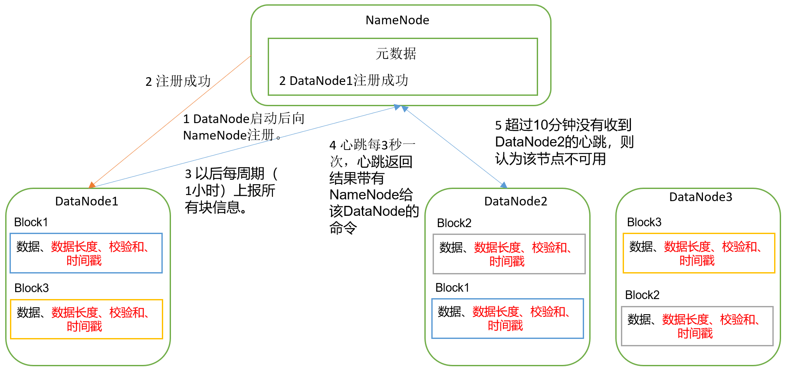
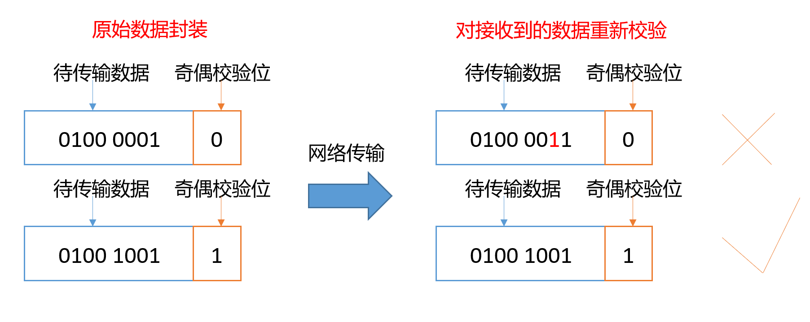
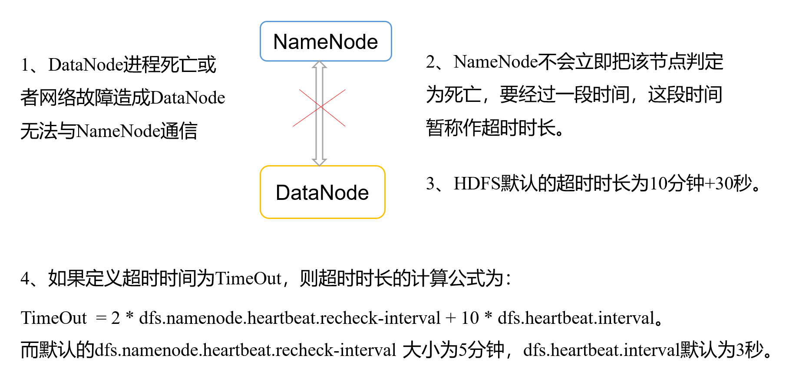

### 六、DataNode

#### 1. DataNode工作机制



1）一个数据块在DataNode上以文件形式存储在磁盘上，包括两个文件，一个是数据本身，一个是元数据包括数据块的长度，块数据的校验和，以及时间戳。

2）DataNode启动后向NameNode注册，通过后，周期性（1小时）的向NameNode上报所有的块信息。

3）心跳是每3秒一次，心跳返回结果带有NameNode给该DataNode的命令如复制块数据到另一台机器，或删除某个数据块。如果超过10分钟没有收到某个DataNode的心跳，则认为该节点不可用。

4）集群运行中可以安全加入和退出一些机器。


#### 2. 数据完整性

思考：如果电脑磁盘里面存储的数据是控制高铁信号灯的红灯信号（1）和绿灯信号（0），但是存储该数据的磁盘坏了，一直显示是绿灯，是否很危险？同理DataNode节点上的数据损坏了，却没有发现，是否也很危险，那么如何解决呢？

如下是DataNode节点保证数据完整性的方法。

1）当DataNode读取Block的时候，它会计算CheckSum。

2）如果计算后的CheckSum，与Block创建时值不一样，说明Block已经损坏。

3）Client读取其他DataNode上的Block。

4）DataNode在其文件创建后周期验证CheckSum，如图3-16所示。



#### 3. 掉线时限参数设置



需要注意的是hdfs-site.xml 配置文件中的heartbeat.recheck.interval的单位为毫秒，dfs.heartbeat.interval的单位为秒。

```
<property>
  <name>dfs.namenode.heartbeat.recheck-interval</name>
  <value>300000</value>
</property>

<property>
  <name>dfs.heartbeat.interval</name>
  <value>3</value>
</property>
```


#### 4 . 服役新数据节点

随着公司业务的增长，数据量越来越大，原有的数据节点的容量已经不能满足存储数据的需求，需要在原有集群基础上动态添加新的数据节点。

1. 环境准备

​    （1）在hadoop104主机上再克隆一台hadoop105主机

​    （2）修改IP地址和主机名称

​    （3）删除原来HDFS文件系统留存的文件（/opt/module/hadoop-2.7.2/data和log）

​    （4）source一下配置文件

[atguigu@hadoop105 hadoop-2.7.2]$ source /etc/profile

\2.  服役新节点具体步骤

（1）直接启动DataNode，即可关联到集群

[atguigu@hadoop105 hadoop-2.7.2]$ sbin/hadoop-daemon.sh start datanode

[atguigu@hadoop105 hadoop-2.7.2]$ sbin/yarn-daemon.sh start nodemanager

如果数据不均衡，可以用命令实现集群的再平衡

[atguigu@hadoop102 sbin]$ ./start-balancer.sh

starting balancer, logging to /opt/module/hadoop-2.7.2/logs/hadoop-atguigu-balancer-hadoop102.out

Time Stamp        Iteration# Bytes Already Moved Bytes Left To Move Bytes Being Moved


#### 5. 退役旧数据节点

##### 添加白名单

添加到白名单的主机节点，都允许访问NameNode，不在白名单的主机节点，都会被退出。

配置白名单的具体步骤如下：

（1）在NameNode的/opt/module/hadoop-2.7.2/etc/hadoop目录下创建dfs.hosts文件

[atguigu@hadoop102 hadoop]$ pwd

/opt/module/hadoop-2.7.2/etc/hadoop

[atguigu@hadoop102 hadoop]$ touch dfs.hosts

[atguigu@hadoop102 hadoop]$ vi dfs.hosts

添加如下主机名称（不添加hadoop105）

hadoop102

hadoop103

hadoop104

（2）在NameNode的hdfs-site.xml配置文件中增加dfs.hosts属性

```
<property>
  <name>dfs.hosts</name>
  <value>/opt/module/hadoop-2.7.2/etc/hadoop/dfs.hosts</value>
</property>
```

（3）配置文件分发

[atguigu@hadoop102 hadoop]$ xsync hdfs-site.xml

​    （4）刷新NameNode

[atguigu@hadoop102 hadoop-2.7.2]$ hdfs dfsadmin -refreshNodes

Refresh nodes successful

​    （5）更新ResourceManager节点

[atguigu@hadoop102 hadoop-2.7.2]$ yarn rmadmin -refreshNodes

17/06/24 14:17:11 INFO client.RMProxy: Connecting to ResourceManager at hadoop103/192.168.1.103:8033

\4.  如果数据不均衡，可以用命令实现集群的再平衡

[atguigu@hadoop102 sbin]$ ./start-balancer.sh

starting balancer, logging to /opt/module/hadoop-2.7.2/logs/hadoop-atguigu-balancer-hadoop102.out

Time Stamp        Iteration# Bytes Already Moved Bytes Left To Move Bytes Being Moved


##### 黑名单退役

在黑名单上面的主机都会被强制退出。

1.在NameNode的/opt/module/hadoop-2.7.2/etc/hadoop目录下创建dfs.hosts.exclude文件

[atguigu@hadoop102 hadoop]$ pwd

/opt/module/hadoop-2.7.2/etc/hadoop

[atguigu@hadoop102 hadoop]$ touch dfs.hosts.exclude

[atguigu@hadoop102 hadoop]$ vi dfs.hosts.exclude

添加如下主机名称（要退役的节点）

hadoop105

2．在NameNode的hdfs-site.xml配置文件中增加dfs.hosts.exclude属性

<property>

<name>dfs.hosts.exclude</name>

   <value>/opt/module/hadoop-2.7.2/etc/hadoop/dfs.hosts.exclude</value>

</property>

3．刷新NameNode、刷新ResourceManager

[atguigu@hadoop102 hadoop-2.7.2]$ hdfs dfsadmin -refreshNodes

Refresh nodes successful

 

[atguigu@hadoop102 hadoop-2.7.2]$ yarn rmadmin -refreshNodes

17/06/24 14:55:56 INFO client.RMProxy: Connecting to ResourceManager at hadoop103/192.168.1.103:8033

\4.   检查Web浏览器，退役节点的状态为decommission in progress（退役中），说明数据节点正在复制块到其他节点，如图3-17所示

​                               

图3-17 退役中

\5.  等待退役节点状态为decommissioned（所有块已经复制完成），停止该节点及节点资源管理器。注意：如果副本数是3，服役的节点小于等于3，是不能退役成功的，需要修改副本数后才能退役，如图3-18所示

 

图3-18 已退役

[atguigu@hadoop105 hadoop-2.7.2]$ sbin/hadoop-daemon.sh stop datanode

stopping datanode

[atguigu@hadoop105 hadoop-2.7.2]$ sbin/yarn-daemon.sh stop nodemanager

stopping nodemanager

\6.  如果数据不均衡，可以用命令实现集群的再平衡

[atguigu@hadoop102 hadoop-2.7.2]$ sbin/start-balancer.sh 

starting balancer, logging to /opt/module/hadoop-2.7.2/logs/hadoop-atguigu-balancer-hadoop102.out

Time Stamp        Iteration# Bytes Already Moved Bytes Left To Move Bytes Being Moved

​    注意：不允许白名单和黑名单中同时出现同一个主机名称。