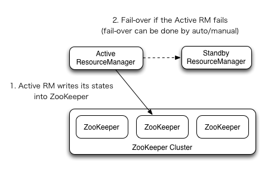

### 七、Hadoop HA集群

#### 1. HDFS HA高可用

1）所谓HA（High Available），即高可用（7*24小时不中断服务）。

2）实现高可用最关键的策略是消除单点故障。HA严格来说应该分成各个组件的HA机制：HDFS的HA和YARN的HA。

3）Hadoop2.0之前，在HDFS集群中NameNode存在单点故障（SPOF）。

4）NameNode主要在以下两个方面影响HDFS集群

​    NameNode机器发生意外，如宕机，集群将无法使用，直到管理员重启

​    NameNode机器需要升级，包括软件、硬件升级，此时集群也将无法使用

HDFS HA功能通过配置Active/Standby两个NameNodes实现在集群中对NameNode的热备来解决上述问题。如果出现故障，如机器崩溃或机器需要升级维护，这时可通过此种方式将NameNode很快的切换到另外一台机器。

## 8.2 HDFS-HA工作机制

通过双NameNode消除单点故障

### 8.2.1 HDFS-HA工作要点

\1.  元数据管理方式需要改变

内存中各自保存一份元数据；

Edits日志只有Active状态的NameNode节点可以做写操作；

两个NameNode都可以读取Edits；

共享的Edits放在一个共享存储中管理（qjournal和NFS两个主流实现）；

\2.  需要一个状态管理功能模块

实现了一个zkfailover，常驻在每一个namenode所在的节点，每一个zkfailover负责监控自己所在NameNode节点，利用zk进行状态标识，当需要进行状态切换时，由zkfailover来负责切换，切换时需要防止brain split现象的发生。

\3.  必须保证两个NameNode之间能够ssh无密码登录

\4.  隔离（Fence），即同一时刻仅仅有一个NameNode对外提供服务

### 8.2.2 HDFS-HA自动故障转移工作机制

前面学习了使用命令hdfs haadmin -failover手动进行故障转移，在该模式下，即使现役NameNode已经失效，系统也不会自动从现役NameNode转移到待机NameNode，下面学习如何配置部署HA自动进行故障转移。自动故障转移为HDFS部署增加了两个新组件：ZooKeeper和ZKFailoverController（ZKFC）进程，如图3-20所示。ZooKeeper是维护少量协调数据，通知客户端这些数据的改变和监视客户端故障的高可用服务。HA的自动故障转移依赖于ZooKeeper的以下功能：

**1****）故障检测：**集群中的每个NameNode在ZooKeeper中维护了一个持久会话，如果机器崩溃，ZooKeeper中的会话将终止，ZooKeeper通知另一个NameNode需要触发故障转移。

**2****）现役NameNode****选择：**ZooKeeper提供了一个简单的机制用于唯一的选择一个节点为active状态。如果目前现役NameNode崩溃，另一个节点可能从ZooKeeper获得特殊的排外锁以表明它应该成为现役NameNode。

ZKFC是自动故障转移中的另一个新组件，是ZooKeeper的客户端，也监视和管理NameNode的状态。每个运行NameNode的主机也运行了一个ZKFC进程，ZKFC负责：

**1****）健康监测：**ZKFC使用一个健康检查命令定期地ping与之在相同主机的NameNode，只要该NameNode及时地回复健康状态，ZKFC认为该节点是健康的。如果该节点崩溃，冻结或进入不健康状态，健康监测器标识该节点为非健康的。

**2****）ZooKeeper****会话管理：**当本地NameNode是健康的，ZKFC保持一个在ZooKeeper中打开的会话。如果本地NameNode处于active状态，ZKFC也保持一个特殊的znode锁，该锁使用了ZooKeeper对短暂节点的支持，如果会话终止，锁节点将自动删除。

**3****）基于ZooKeeper****的选择：**如果本地NameNode是健康的，且ZKFC发现没有其它的节点当前持有znode锁，它将为自己获取该锁。如果成功，则它已经赢得了选择，并负责运行故障转移进程以使它的本地NameNode为Active。故障转移进程与前面描述的手动故障转移相似，首先如果必要保护之前的现役NameNode，然后本地NameNode转换为Active状态。


## 8.3 HDFS-HA集群配置

### 8.3.1 环境准备

\1.  修改IP

\2.  修改主机名及主机名和IP地址的映射

\3.  关闭防火墙

\4.  ssh免密登录

\5.  安装JDK，配置环境变量等

### 8.3.2 规划集群

表3-1

| hadoop102   | hadoop103       | hadoop104   |
| ----------- | --------------- | ----------- |
| NameNode    | NameNode        |             |
| JournalNode | JournalNode     | JournalNode |
| DataNode    | DataNode        | DataNode    |
| ZK          | ZK              | ZK          |
|             | ResourceManager |             |
| NodeManager | NodeManager     | NodeManager |

### 8.3.3 配置Zookeeper集群

\1.  集群规划

在hadoop102、hadoop103和hadoop104三个节点上部署Zookeeper。

\2.  解压安装

（1）解压Zookeeper安装包到/opt/module/目录下

[atguigu@hadoop102 software]$ tar -zxvf zookeeper-3.4.10.tar.gz -C /opt/module/

（2）在/opt/module/zookeeper-3.4.10/这个目录下创建zkData

mkdir -p zkData

（3）重命名/opt/module/zookeeper-3.4.10/conf这个目录下的zoo_sample.cfg为zoo.cfg

mv zoo_sample.cfg zoo.cfg

\3.  配置zoo.cfg文件

​    （1）具体配置

dataDir=/opt/module/zookeeper-3.4.10/zkData

​    增加如下配置

\#######################cluster##########################

server.2=hadoop102:2888:3888

server.3=hadoop103:2888:3888

server.4=hadoop104:2888:3888

（2）配置参数解读

Server.A=B:C:D。

A是一个数字，表示这个是第几号服务器；

B是这个服务器的IP地址；

C是这个服务器与集群中的Leader服务器交换信息的端口；

D是万一集群中的Leader服务器挂了，需要一个端口来重新进行选举，选出一个新的Leader，而这个端口就是用来执行选举时服务器相互通信的端口。

集群模式下配置一个文件myid，这个文件在dataDir目录下，这个文件里面有一个数据就是A的值，Zookeeper启动时读取此文件，拿到里面的数据与zoo.cfg里面的配置信息比较从而判断到底是哪个server。

\4.  集群操作

（1）在/opt/module/zookeeper-3.4.10/zkData目录下创建一个myid的文件

touch myid

添加myid文件，注意一定要在linux里面创建，在notepad++里面很可能乱码

（2）编辑myid文件

vi myid

​    在文件中添加与server对应的编号：如2

（3）拷贝配置好的zookeeper到其他机器上

scp -r zookeeper-3.4.10/ [root@hadoop103.atguigu.com:/opt/app/](mailto:root@hadoop103.atguigu.com:/opt/app/)

scp -r zookeeper-3.4.10/ [root@hadoop104.atguigu.com:/opt/app/](mailto:root@hadoop104.atguigu.com:/opt/app/)

​    并分别修改myid文件中内容为3、4

（4）分别启动zookeeper

[root@hadoop102 zookeeper-3.4.10]# bin/zkServer.sh start

[root@hadoop103 zookeeper-3.4.10]# bin/zkServer.sh start

[root@hadoop104 zookeeper-3.4.10]# bin/zkServer.sh start

（5）查看状态

[root@hadoop102 zookeeper-3.4.10]# bin/zkServer.sh status

JMX enabled by default

Using config: /opt/module/zookeeper-3.4.10/bin/../conf/zoo.cfg

Mode: follower

[root@hadoop103 zookeeper-3.4.10]# bin/zkServer.sh status

JMX enabled by default

Using config: /opt/module/zookeeper-3.4.10/bin/../conf/zoo.cfg

Mode: leader

[root@hadoop104 zookeeper-3.4.5]# bin/zkServer.sh status

JMX enabled by default

Using config: /opt/module/zookeeper-3.4.10/bin/../conf/zoo.cfg

Mode: follower

### 8.3.4 配置HDFS-HA集群

\1.  官方地址：http://hadoop.apache.org/

\2.  在opt目录下创建一个ha文件夹

mkdir ha

\3.  将/opt/app/下的 hadoop-2.7.2拷贝到/opt/ha目录下

cp -r hadoop-2.7.2/ /opt/ha/

\4.  配置hadoop-env.sh

  export  JAVA_HOME=/opt/module/jdk1.8.0_144  

\5.  配置core-site.xml

```
<configuration>
  <!-- 指定HDFS中NameNode的地址 -->
  <property>
    <name>fs.defaultFS</name>
    <value>hdfs://mycluster</value>
  </property>
  <property>
    <name>ha.zookeeper.quorum</name>
    <value>hadoop001:2181,hadoop002:2181,hadoop003:2181</value>
  </property>
  <!-- 指定Hadoop运行时产生文件的存储目录 -->
  <property>
    <name>hadoop.tmp.dir</name>
    <value>/opt/ha/hadoop-2.9.2/data/tmp</value>
  </property>
  <!-- Authentication for Hadoop HTTP web-consoles -->
  <property>
    <name>hadoop.http.filter.initializers</name>
    <value>org.apache.hadoop.security.AuthenticationFilterInitializer</value>
  </property>
  <property>
    <name>hadoop.http.authentication.type</name>
    <value>simple</value>
  </property>
  <property>
    <name>hadoop.http.authentication.token.validity</name>
    <value>3600</value>
  </property>
  <property>
    <name>hadoop.http.authentication.signature.secret.file</name>
    <value>/opt/ha/hadoop-2.9.2/secret/hadoop-http-auth-signature-secret</value>
  </property>
  <property>
    <name>hadoop.http.authentication.cookie.domain</name>
    <value></value>
  </property>
  <property>
    <name>hadoop.http.authentication.simple.anonymous.allowed</name>
    <value>false</value>
  </property>
</configuration>
```


\6.  配置hdfs-site.xml

```
<configuration>
  <property>
    <name>dfs.replication</name>
    <value>2</value>
  </property>

  <!-- 完全分布式集群名称 -->
  <property>
    <name>dfs.nameservices</name>
    <value>mycluster</value>
  </property>

  <!-- 集群中NameNode节点都有哪些 -->
  <property>
    <name>dfs.ha.namenodes.mycluster</name>
    <value>nn1,nn2</value>
  </property>

  <!-- nn1的RPC通信地址 -->
  <property>
    <name>dfs.namenode.rpc-address.mycluster.nn1</name>
    <value>hadoop001:9000</value>
  </property>

  <!-- nn2的RPC通信地址 -->
  <property>
    <name>dfs.namenode.rpc-address.mycluster.nn2</name>
    <value>hadoop002:9000</value>
  </property>

  <!-- nn1的http通信地址 -->
  <property>
    <name>dfs.namenode.http-address.mycluster.nn1</name>
    <value>hadoop001:50070</value>
  </property>

  <!-- nn2的http通信地址 -->
  <property>
    <name>dfs.namenode.http-address.mycluster.nn2</name>
    <value>hadoop002:50070</value>
  </property>

  <!-- 指定NameNode元数据在JournalNode上的存放位置 -->
  <property>
    <name>dfs.namenode.shared.edits.dir</name>
    <value>qjournal://hadoop001:8485;hadoop002:8485;hadoop003:8485/mycluster</value>
  </property>

  <!-- 配置隔离机制，即同一时刻只能有一台服务器对外响应 -->
  <property>
    <name>dfs.ha.fencing.methods</name>
    <value>sshfence</value>
  </property>

  <!-- 使用隔离机制时需要ssh无秘钥登录-->
  <property>
    <name>dfs.ha.fencing.ssh.private-key-files</name>
    <value>/home/zak/.ssh/id_rsa</value>
  </property>

  <!-- 声明journalnode服务器存储目录-->
  <property>
    <name>dfs.journalnode.edits.dir</name>
    <value>/opt/ha/hadoop-2.9.2/data/jn</value>
  </property>

  <!-- 关闭权限检查-->
  <property>
    <name>dfs.permissions.enable</name>
    <value>false</value>
  </property>

  <!-- 访问代理类：client，mycluster，active配置失败自动切换实现方式-->
  <property>
    <name>dfs.client.failover.proxy.provider.mycluster</name>
    <value>org.apache.hadoop.hdfs.server.namenode.ha.ConfiguredFailoverProxyProvider</value>
  </property>

  <!--指定hdfs中namenode的存储位置-->
  <property>
    <name>dfs.namenode.name.dir</name> 
    <value>/opt/ha/hadoop-2.9.2/data/name</value>
  </property>
    
  <!--指定hdfs中datanode的存储位置-->
  <property>
    <name>dfs.datanode.data.dir</name>
    <value>/opt/ha/hadoop-2.9.2/data/data</value>
  </property>

  <property>
    <name>dfs.ha.automatic-failover.enabled</name>
    <value>true</value>
  </property>
</configuration>
```


\7.  拷贝配置好的hadoop环境到其他节点

### 8.3.5 启动HDFS-HA集群

\1.  在各个JournalNode节点上，输入以下命令启动journalnode服务

 sbin/hadoop-daemon.sh start journalnode

\2.  在[nn1]上，对其进行格式化，并启动

 bin/hdfs namenode -format

 sbin/hadoop-daemon.sh start namenode

\3.  在[nn2]上，同步nn1的元数据信息

 bin/hdfs namenode -bootstrapStandby

\4.  启动[nn2]

 sbin/hadoop-daemon.sh start namenode

\5.  查看web页面显示，如图3-21，3-22所示


\6.  在[nn1]上，启动所有datanode

 sbin/hadoop-daemons.sh start datanode

\7.  将[nn1]切换为Active

 bin/hdfs haadmin -transitionToActive nn1

\5.  查看是否Active

 bin/hdfs haadmin -getServiceState nn1


### 8.3.6 配置HDFS-HA自动故障转移

\1.  具体配置

​    （1）在hdfs-site.xml中增加

```
<property>

 <name>dfs.ha.automatic-failover.enabled</name>

 <value>true</value>

</property>
```


​    （2）在core-site.xml文件中增加

```
<property>

 <name>ha.zookeeper.quorum</name>

 <value>hadoop102:2181,hadoop103:2181,hadoop104:2181</value>

</property>
```


\2.  启动

​    （1）关闭所有HDFS服务：

sbin/stop-dfs.sh

​    （2）启动Zookeeper集群：

bin/zkServer.sh start

​    （3）初始化HA在Zookeeper中状态：

bin/hdfs zkfc -formatZK

​    （4）启动HDFS服务：

sbin/start-dfs.sh

​    （5）在各个NameNode节点上启动DFSZK Failover Controller，先在哪台机器启动，哪个机器的NameNode就是Active NameNode

sbin/hadoop-daemin.sh start zkfc

\3.  验证

​    （1）将Active NameNode进程kill

kill -9 namenode的进程id

​    （2）将Active NameNode机器断开网络

service network stop


#### 2. YARN-HA配置

##### YARN-HA工作机制

 

### 8.4.2 配置YARN-HA集群

\1.  环境准备

（1）修改IP

（2）修改主机名及主机名和IP地址的映射

（3）关闭防火墙

（4）ssh免密登录

（5）安装JDK，配置环境变量等

​    （6）配置Zookeeper集群

\2.  规划集群

表3-2

| hadoop102       | hadoop103       | hadoop104   |
| --------------- | --------------- | ----------- |
| NameNode        | NameNode        |             |
| JournalNode     | JournalNode     | JournalNode |
| DataNode        | DataNode        | DataNode    |
| ZK              | ZK              | ZK          |
| ResourceManager | ResourceManager |             |
| NodeManager     | NodeManager     | NodeManager |

\3.  具体配置

（1）yarn-site.xml

```
<configuration>

<!-- Site specific YARN configuration properties -->
  <!-- Reducer获取数据的方式 -->
  <property>
    <name>yarn.nodemanager.aux-services</name>
    <value>mapreduce_shuffle</value>
  </property>

  <!--启用resourcemanager ha-->
  <property>
    <name>yarn.resourcemanager.ha.enabled</name>
    <value>true</value>
  </property>
 
  <!--声明两台resourcemanager的地址-->
  <property>
    <name>yarn.resourcemanager.cluster-id</name>
    <value>cluster-yarn1</value>
  </property>

  <property>
    <name>yarn.resourcemanager.ha.rm-ids</name>
    <value>rm1,rm2</value>
  </property>

  <property>
    <name>yarn.resourcemanager.hostname.rm1</name>
    <value>hadoop001</value>
  </property>

  <property>
    <name>yarn.resourcemanager.hostname.rm2</name>
    <value>hadoop002</value>
  </property>
 
  <!--指定zookeeper集群的地址--> 
  <property>
    <name>yarn.resourcemanager.zk-address</name>
    <value>hadoop001:2181,hadoop002:2181,hadoop003:2181</value>
  </property>

  <!--启用自动恢复--> 
  <property>
    <name>yarn.resourcemanager.recovery.enabled</name>
    <value>true</value>
  </property>
 
  <!--指定resourcemanager的状态信息存储在zookeeper集群--> 
  <property>
    <name>yarn.resourcemanager.store.class</name>
    <value>org.apache.hadoop.yarn.server.resourcemanager.recovery.ZKRMStateStore</value>
  </property>


  <!--新版本指定文件-->
  <property>
    <name>yarn.resourcemanager.webapp.address.rm1</name>
    <value>hadoop001</value>
  </property>
  <property>
    <name>yarn.resourcemanager.webapp.address.rm2</name>
    <value>hadoop002</value>
  </property>

</configuration>

```

​    （2）同步更新其他节点的配置信息

\4.  启动hdfs 

（1）在各个JournalNode节点上，输入以下命令启动journalnode服务：

sbin/hadoop-daemon.sh start journalnode

（2）在[nn1]上，对其进行格式化，并启动：

bin/hdfs namenode -format

sbin/hadoop-daemon.sh start namenode

（3）在[nn2]上，同步nn1的元数据信息：

bin/hdfs namenode -bootstrapStandby

（4）启动[nn2]：

sbin/hadoop-daemon.sh start namenode

（5）启动所有DataNode

sbin/hadoop-daemons.sh start datanode

（6）将[nn1]切换为Active

bin/hdfs haadmin -transitionToActive nn1

\5.  启动YARN 

（1）在hadoop102中执行：

sbin/start-yarn.sh

（2）在hadoop103中执行：

sbin/yarn-daemon.sh start resourcemanager

（3）查看服务状态，如图3-24所示

bin/yarn rmadmin -getServiceState rm1