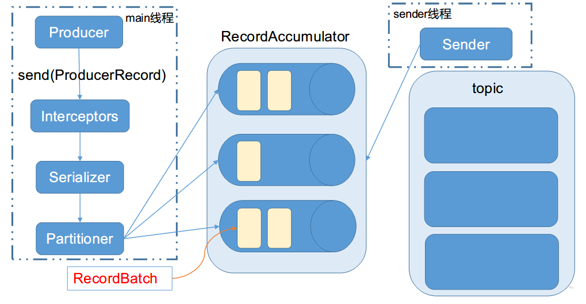

### Producer API

#### 消息发送流程

Kafka的Producer发送消息采用的是异步发送的方式。在消息发送的过程中，涉及到了两个线程——main线程和Sender线程，以及一个线程共享变量——RecordAccumulator。main线程将消息发送给RecordAccumulator，Sender线程不断从RecordAccumulator中拉取消息发送到Kafka broker。



相关参数：

- batch.size：只有数据积累到batch.size之后，sender才会发送数据。
- linger.ms：如果数据迟迟未达到batch.size，sender等待linger.time之后就会发送数据。

#### 异步发送API

回调函数会在producer收到ack时调用，为异步调用，该方法有两个参数，分别是RecordMetadata和Exception，如果Exception为null，说明消息发送成功，如果Exception不为null，说明消息发送失败。

注意：消息发送失败会自动重试，不需要我们在回调函数中手动重试。

```
public static void main(String[] args) {
        Properties props = new Properties();
        props.put("bootstrap.servers", "127.0.0.1:9092");
        props.put("acks", "all");
        // 重试次数
        props.put("retries", 1);
        // 批次大小
        props.put("batch.size", 16384);
        // 等待时间
        props.put("linger.ms", 1);
        // RecordAccumulator缓冲区大小
        props.put("buffer.memory", 33554432);
        props.put("key.serializer", "org.apache.kafka.common.serialization.StringSerializer");
        props.put("value.serializer", "org.apache.kafka.common.serialization.StringSerializer");

        // 发送消息
        try (KafkaProducer<String, String> producer = new KafkaProducer<>(props)) {
            for (int i = 0; i < 10; i++) {
                //回调函数，该方法会在Producer收到ack时调用，为异步调用
                ProducerRecord record = new ProducerRecord<String, String>("top-events", 0, Integer.toString(i),
                    Integer.toString(i));
                producer.send(record, (metadata, exception) -> {
                    if (exception == null) {
                        System.out.println("success->" + metadata.offset());
                    } else {
                        exception.printStackTrace();
                    }
                });
            }
        }
    }
```

- KafkaProducer：需要创建一个生产者对象，用来发送数据。
- ProducerConfig：获取所需的一系列配置参数。
- ProducerRecord：每条数据都要封装成一个ProducerRecord对象。

使用Spring KafkaTemplate发送数据。

```
kafkaTemplate.send(topicName, message).addCallback(result -> System.out.println("发送成功"),ex -> System.out.println(ex.getMessage()));
```

#### 同步发送API

同步发送的意思就是，一条消息发送之后，会阻塞当前线程，直至返回ack。
由于send方法返回的是一个Future对象，根据Futrue对象的特点，我们也可以实现同步发送的效果，只需在调用Future对象的get方发即可。

```
public static void main(String[] args) throws ExecutionException, InterruptedException {
        Properties props = new Properties();
        props.put("bootstrap.servers", "127.0.0.1:9092");
        props.put("acks", "all");
        // 重试次数
        props.put("retries", 1);
        // 批次大小
        props.put("batch.size", 16384);
        // 等待时间
        props.put("linger.ms", 1);
        // RecordAccumulator缓冲区大小
        props.put("buffer.memory", 33554432);
        props.put("key.serializer", "org.apache.kafka.common.serialization.StringSerializer");
        props.put("value.serializer", "org.apache.kafka.common.serialization.StringSerializer");

        // 发送消息
        try (KafkaProducer<String, String> producer = new KafkaProducer<>(props)) {
            for (int i = 0; i < 10; i++) {
                //回调函数，该方法会在Producer收到ack时调用，为异步调用
                ProducerRecord record = new ProducerRecord<String, String>("top-events", 0, Integer.toString(i),
                    Integer.toString(i));
                producer.send(record).get();
            }
        }
    }
```

### Consumer API

Consumer消费数据时的可靠性是很容易保证的，因为数据在Kafka中是持久化的，故不用担心数据丢失问题。
由于consumer在消费过程中可能会出现断电宕机等故障，consumer恢复后，需要从故障前的位置的继续消费，所以consumer需要实时记录自己消费到了哪个offset，以便故障恢复后继续消费。
所以offset的维护是Consumer消费数据是必须考虑的问题。

```
public static void main(String[] args) {
    Properties props = new Properties();
    props.put("bootstrap.servers", "127.0.0.1:9092");
    // 消费者组，只要group.id相同，就属于同一个消费者组
    props.put("group.id", "customer");
    // 自动提交offset
    props.put("enable.auto.commit", "false");

    props.put("key.deserializer", "org.apache.kafka.common.serialization.StringDeserializer");
    props.put("value.deserializer", "org.apache.kafka.common.serialization.StringDeserializer");
    KafkaConsumer<String, String> consumer = new KafkaConsumer<>(props);
    consumer.subscribe(Arrays.asList("top-events"));
    while (true) {
        ConsumerRecords<String, String> records = consumer.poll(100);
        for (ConsumerRecord<String, String> record : records) {
        	System.out.printf("offset = %d, key = %s, value = %s%n", record.offset(), record.key(), record.value());
        }
        consumer.commitSync();
    }
}
```

- KafkaConsumer：需要创建一个消费者对象，用来消费数据。
- ConsumerConfig：获取所需的一系列配置参数。
- ConsumerRecord：每条数据都要封装成一个ConsumerRecord对象。

手动提交offset的方法有两种：分别是commitSync（同步提交）和commitAsync（异步提交）。

两者的相同点是：都会将本次poll的一批数据最高的偏移量提交。

两者的不同点是：commitSync会失败重试，一直到提交成功（如果由于不可恢复原因导致，也会提交失败）；而commitAsync则没有失败重试机制，故有可能提交失败。

commitSync和commitAsync都有可能会造成数据重复消费。

使用Spring KafkaListener消费数据。

```
@KafkaListener(topics = "top-events", topicPartitions = {
        @TopicPartition(topic = "top-events", partitionOffsets = @PartitionOffset(partition = "0", initialOffset = "-1"))})
public void topEvents(Object value) {
    System.out.println(value);
}
```

#### 自动提交

为了使我们能够专注于自己的业务逻辑，Kafka提供了自动提交offset的功能。 

自动提交offset的相关参数：

- enable.auto.commit：是否开启自动提交offset功能。
- auto.commit.interval.ms：自动提交offset的时间间隔。

```
public static void main(String[] args) {
    Properties props = new Properties();
    props.put("bootstrap.servers", "127.0.0.1:9092");
    // 消费者组，只要group.id相同，就属于同一个消费者组
    props.put("group.id", "customer");
    // 自动提交offset
    props.put("enable.auto.commit", "true");
    props.put("auto.commit.interval.ms", "1000");
    props.put("key.deserializer", "org.apache.kafka.common.serialization.StringDeserializer");
    props.put("value.deserializer", "org.apache.kafka.common.serialization.StringDeserializer");
    KafkaConsumer<String, String> consumer = new KafkaConsumer<>(props);
    consumer.subscribe(Arrays.asList("top-events"));
    while (true) {
        ConsumerRecords<String, String> records = consumer.poll(100);
        for (ConsumerRecord<String, String> record : records) {
        	System.out.printf("offset = %d, key = %s, value = %s%n", record.offset(), record.key(), record.value());
        }
        consumer.commitSync();
    }
}
```

### 自定义拦截器

#### 拦截器原理

Producer拦截器(interceptor)是在Kafka 0.10版本被引入的，主要用于实现clients端的定制化控制逻辑。
对于producer而言，interceptor使得用户在消息发送前以及producer回调逻辑前有机会对消息做一些定制化需求，比如修改消息等。同时，producer允许用户指定多个interceptor按序作用于同一条消息从而形成一个拦截链(interceptor chain)。Intercetpor的实现接口是org.apache.kafka.clients.producer.ProducerInterceptor，其定义的方法包括：

1. configure(configs)
    获取配置信息和初始化数据时调用。
2. onSend(ProducerRecord)：
    该方法封装进KafkaProducer.send方法中，即它运行在用户主线程中。Producer确保在消息被序列化以及计算分区前调用该方法。用户可以在该方法中对消息做任何操作，但最好保证不要修改消息所属的topic和分区，否则会影响目标分区的计算。
3. onAcknowledgement(RecordMetadata, Exception)：
    该方法会在消息从RecordAccumulator成功发送到Kafka Broker之后，或者在发送过程中失败时调用。并且通常都是在producer回调逻辑触发之前。onAcknowledgement运行在producer的IO线程中，因此不要在该方法中放入很重的逻辑，否则会拖慢producer的消息发送效率。
4. close：
    关闭interceptor，主要用于执行一些资源清理工作
    如前所述，interceptor可能被运行在多个线程中，因此在具体实现时用户需要自行确保线程安全。另外倘若指定了多个interceptor，则producer将按照指定顺序调用它们，并仅仅是捕获每个interceptor可能抛出的异常记录到错误日志中而非在向上传递。这在使用过程中要特别留意。

#### 案例实操

1. 增加时间戳拦截器

```
public class TimeInterceptor implements ProducerInterceptor<String, String> {

    @Override
    public void configure(Map<String, ?> configs) {
    }

    @Override
    public ProducerRecord<String, String> onSend(ProducerRecord<String, String> record) {
        // 创建一个新的record，把时间戳写入消息体的最前部
        return new ProducerRecord(record.topic(), record.partition(), record.timestamp(), record.key(),
            System.currentTimeMillis() + "," + record.value());
    }

    @Override
    public void onAcknowledgement(RecordMetadata metadata, Exception exception) {
    }

    @Override
    public void close() {
    }
}

```

2. 统计发送消息成功和发送失败消息数，并在producer关闭时打印这两个计数器

```
public class CounterInterceptor implements ProducerInterceptor<String, String> {
    
    private int errorCounter = 0;
    private int successCounter = 0;

    @Override
    public void configure(Map<String, ?> configs) {
    }

    @Override
    public ProducerRecord<String, String> onSend(ProducerRecord<String, String> record) {
        return record;
    }

    @Override
    public void onAcknowledgement(RecordMetadata metadata, Exception exception) {
        // 统计成功和失败的次数
        if (exception == null) {
            successCounter++;
        } else {
            errorCounter++;
        }
    }

    @Override
    public void close() {
        // 保存结果
        System.out.println("Successful sent: " + successCounter);
        System.out.println("Failed sent: " + errorCounter);
    }
}
```

3. 生产者主程序

```
public static void main(String[] args) throws ExecutionException, InterruptedException {
    Properties props = new Properties();
    props.put("bootstrap.servers", "10.50.2.220:9092");
    props.put("acks", "all");
    // 重试次数
    props.put("retries", 1);
    // 批次大小
    props.put("batch.size", 16384);
    // 等待时间
    props.put("linger.ms", 1);
    // RecordAccumulator缓冲区大小
    props.put("buffer.memory", 33554432);
    props.put("key.serializer", "org.apache.kafka.common.serialization.StringSerializer");
    props.put("value.serializer", "org.apache.kafka.common.serialization.StringSerializer");

    // 2 构建拦截链
    List<String> interceptors = Lists.newArrayList();
    interceptors.add("TimeInterceptor");
    interceptors.add("CounterInterceptor");
    props.put(ProducerConfig.INTERCEPTOR_CLASSES_CONFIG, interceptors);
    // 发送消息
    try (KafkaProducer<String, String> producer = new KafkaProducer<>(props)) {
        for (int i = 0; i < 10; i++) {
            //回调函数，该方法会在Producer收到ack时调用，为异步调用
            ProducerRecord record = new ProducerRecord<String, String>("top-events", 0, Integer.toString(i),
            Integer.toString(i));
            producer.send(record).get();
        }
    }
}
```

4. 测试结果

```
......
Successful sent: 10
Failed sent: 0
......
```

