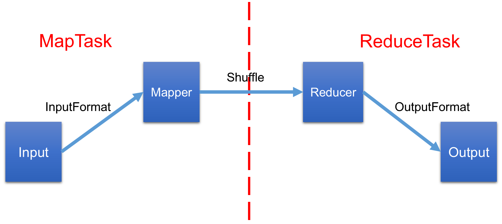
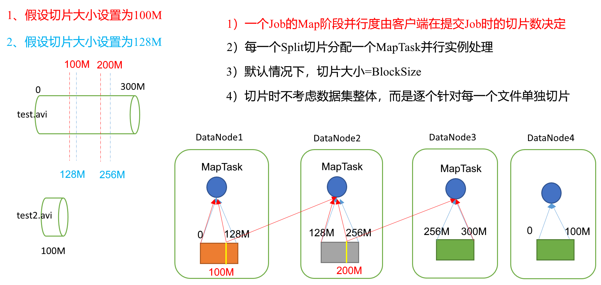
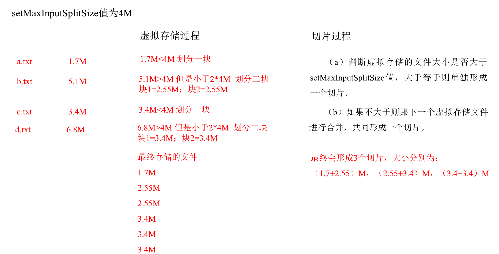
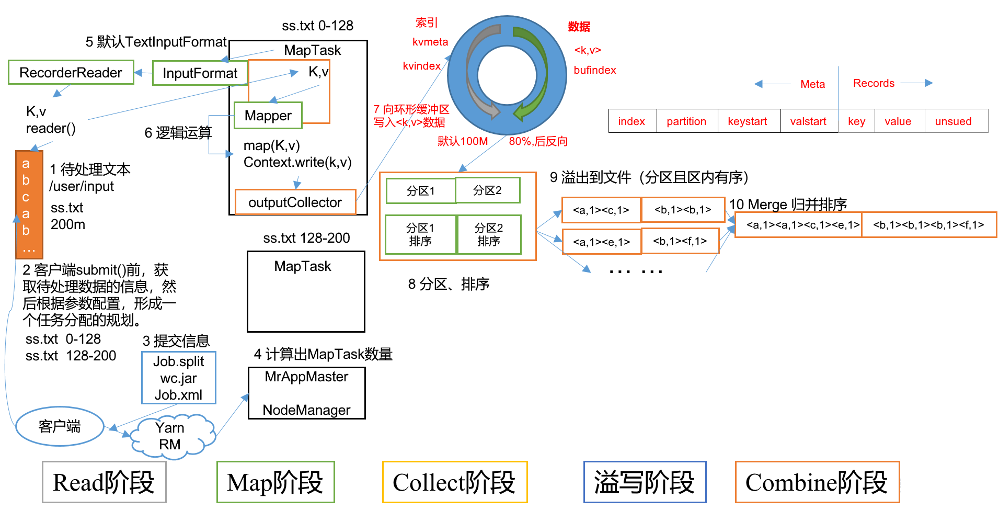
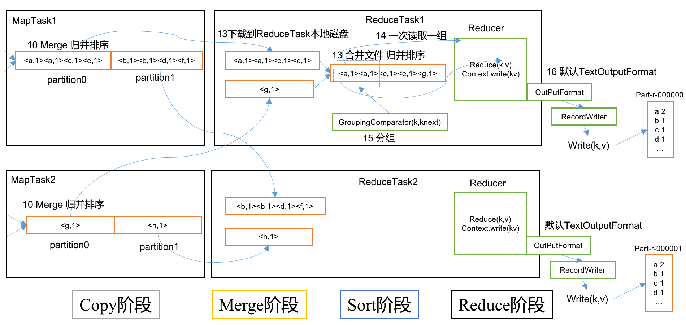
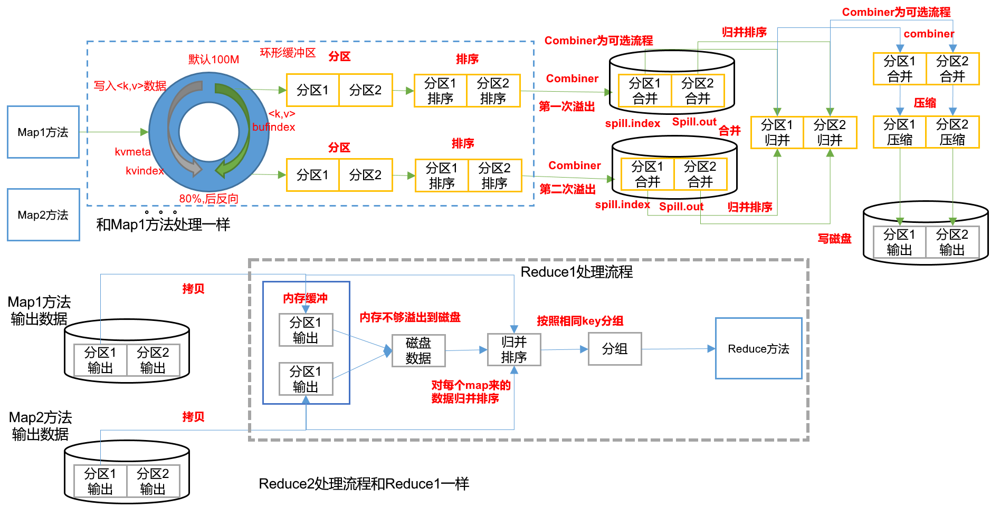

### 三、MapReduce框架原理

#### InputFormat数据输入



##### 切片与MapTask并行度决定机制

1. 数据块：Block是HDFS物理上把数据分成一块一块。

2. 数据切片：数据切片只是在逻辑上对输入进行分片，并不会在磁盘上将其切分成片进行存储。



##### FileInputFormat切片机制

- 简单地按照文件的内容长度进行切片。

- 切片大小，默认等于Block大小

- 切片时不考虑数据集整体，而是逐个针对每一个文件单独切片

1. 输入数据有两个文件：

    file1.txt  320M

    file2.txt  10M

2. 经过FileInputFormat的切片机制运算后，形成的切片信息如下：

    file1.txt.split1 -- 0~128M

    file1.txt.split2 -- 128~256M

    file1.txt.split3 -- 256~320M

    file2.txt.split1 -- 0~10M

##### FileInputFormat切片大小的参数配置

1. 源码中计算切片大小的公式

```java
Math.max(minSize, Math.min(maxSize, blockSize)); 
mapreduce.input.fileinputformat.split.minsize=1  // 默认值为1
mapreduce.input.fileinputformat.split.maxsize= Long.MAXValue  // 默认值Long.MAXValue
```

因此，默认情况下，切片大小=blocksize。

2. 切片大小设置
    maxsize（切片最大值）：参数如果调得比blockSize小，则会让切片变小，而且就等于配置的这个参数的值。

    minsize（切片最小值）：参数调的比blockSize大，则可以让切片变得比blockSize还大。

3. 获取切片信息API

```java
// 获取切片的文件名称
String name = inputSplit.getPath().getName();
// 根据文件类型获取切片信息
FileSplit inputSplit = (FileSplit) context.getInputSplit();
```

##### CombineTextInputFormat切片机制

框架默认的TextInputFormat切片机制是对任务按文件规划切片，不管文件多小，都会是一个单独的切片，都会交给一个MapTask，这样如果有大量小文件，就会产生大量的MapTask，处理效率极其低下。

1. 应用场景

    CombineTextInputFormat用于小文件过多的场景，它可以将多个小文件从逻辑上规划到一个切片中，这样，多个小文件就可以交给一个MapTask处理。

2. 虚拟存储切片最大值设置

    CombineTextInputFormat.setMaxInputSplitSize(job, 4194304); // 4m
    注意：虚拟存储切片最大值设置最好根据实际的小文件大小情况来设置具体的值。

3. 切片机制
    生成切片过程包括：虚拟存储过程和切片过程二部分。



- 虚拟存储过程：

    将输入目录下所有文件大小，依次和设置的setMaxInputSplitSize值比较，如果不大于设置的最大值，逻辑上划分一个块。如果输入文件大于设置的最大值且大于两倍，那么以最大值切割一块；当剩余数据大小超过设置的最大值且不大于最大值2倍，此时将文件均分成2个虚拟存储块（防止出现太小切片）。

    例如setMaxInputSplitSize值为4M，输入文件大小为8.02M，则先逻辑上分成一个4M。剩余的大小为4.02M，如果按照4M逻辑划分，就会出现0.02M的小的虚拟存储文件，所以将剩余的4.02M文件切分成（2.01M和2.01M）两个文件。

- 切片过程：

    - 判断虚拟存储的文件大小是否大于setMaxInputSplitSize值，大于等于则单独形成一个切片。

    - 如果不大于则跟下一个虚拟存储文件进行合并，共同形成一个切片。

    - 测试举例：有4个小文件大小分别为1.7M、5.1M、3.4M以及6.8M这四个小文件，则虚拟存储之后形成6个文件块，大小分别为：

        1.7M，（2.55M、2.55M），3.4M，（3.4M、3.4M）

    - 最终会形成3个切片，大小分别为：

        （1.7+2.55）M，（2.55+3.4）M，（3.4+3.4）M

#### MapReduce工作流程

##### MapTask工作机制



1. Read阶段：MapTask通过用户编写的RecordReader，从输入InputSplit中解析出一个个key/value。
2. Map阶段：该节点主要是将解析出的key/value交给用户编写map()函数处理，并产生一系列新的key/value。
3. Collect收集阶段：在用户编写map()函数中，当数据处理完成后，一般会调用OutputCollector.collect()输出结果。在该函数内部，它会将生成的key/value分区（调用Partitioner），并写入一个环形内存缓冲区中。

4. Spill阶段：即 "溢写"，当环形缓冲区满后，MapReduce会将数据写到本地磁盘上，生成一个临时文件。需要注意的是，将数据写入本地磁盘之前，先要对数据进行一次本地排序，并在必要时对数据进行合并、压缩等操作。

 溢写阶段详情：

- 利用快速排序算法对缓存区内的数据进行排序，排序方式是，先按照分区编号Partition进行排序，然后按照key进行排序。这样，经过排序后，数据以分区为单位聚集在一起，且同一分区内所有数据按照key有序。
- 按照分区编号由小到大依次将每个分区中的数据写入任务工作目录下的临时文件output/spillN.out（N表示当前溢写次数）中。如果用户设置了Combiner，则写入文件之前，对每个分区中的数据进行一次聚集操作。
- 将分区数据的元信息写到内存索引数据结构SpillRecord中，其中每个分区的元信息包括在临时文件中的偏移量、压缩前数据大小和压缩后数据大小。如果当前内存索引大小超过1MB，则将内存索引写到文件output/spillN.out.index中。

5. Combine阶段：当所有数据处理完成后，MapTask对所有临时文件进行一次合并，以确保最终只会生成一个数据文件。

​    当所有数据处理完后，MapTask会将所有临时文件合并成一个大文件，并保存到文件output/file.out中，同时生成相应的索引文件output/file.out.index。

​    在进行文件合并过程中，MapTask以分区为单位进行合并。对于某个分区，它将采用多轮递归合并的方式。每轮合并io.sort.factor（默认10）个文件，并将产生的文件重新加入待合并列表中，对文件排序后，重复以上过程，直到最终得到一个大文件。

​    让每个MapTask最终只生成一个数据文件，可避免同时打开大量文件和同时读取大量小文件产生的随机读取带来的开销。

##### ReduceTask工作机制



1. Copy阶段：ReduceTask从各个MapTask上远程拷贝一片数据，并针对某一片数据，如果其大小超过一定阈值，则写到磁盘上，否则直接放到内存中。

2. Merge阶段：在远程拷贝数据的同时，ReduceTask启动了两个后台线程对内存和磁盘上的文件进行合并，以防止内存使用过多或磁盘上文件过多。

3. Sort阶段：按照MapReduce语义，用户编写reduce()函数输入数据是按key进行聚集的一组数据。为了将key相同的数据聚在一起，Hadoop采用了基于排序的策略。由于各个MapTask已经实现对自己的处理结果进行了局部排序，因此，ReduceTask只需对所有数据进行一次归并排序即可。

4. Reduce阶段：reduce()函数将计算结果写到HDFS上。

##### ReduceTask并行度

ReduceTask的并行度同样影响整个Job的执行并发度和执行效率，但与MapTask的并发数由切片数决定不同，ReduceTask数量的决定是可以直接手动设置：

```java
// 默认值是1，手动设置为4
job.setNumReduceTasks(4);
```

#### Shuffle机制

##### 工作机制

Map方法之后，Reduce方法之前的数据处理过程称之为Shuffle。

上面的流程是整个MapReduce最全工作流程，但是Shuffle过程只是从第7步开始到第16步结束，具体Shuffle过程详解，如下：

1. MapTask收集我们的map()方法输出的kv对，放到内存缓冲区中。

2. 从内存缓冲区不断溢出本地磁盘文件，可能会溢出多个文件。

3. 多个溢出文件会被合并成大的溢出文件。

4. 在溢出过程及合并的过程中，都要调用Partitioner进行分区和针对key进行排序。

5. ReduceTask根据自己的分区号，去各个MapTask机器上取相应的结果分区数据。

6. ReduceTask会取到同一个分区的来自不同MapTask的结果文件，ReduceTask会将这些文件再进行合并（归并排序）。

7. 合并成大文件后，Shuffle的过程也就结束了，后面进入ReduceTask的逻辑运算过程（从文件中取出一个一个的键值对Group，调用用户自定义的reduce()方法）。

##### 注意事项

Shuffle中的缓冲区大小会影响到MapReduce程序的执行效率，原则上说，缓冲区越大，磁盘io的次数越少，执行速度就越快。

缓冲区的大小可以通过参数调整，参数：**io.sort.mb** 默认100M。



#### Partition分区

##### 问题引出

要求将统计结果按照条件输出到不同文件中（分区）。比如：将统计结果按照手机归属地不同省份输出到不同文件中（分区）。

##### 默认Partitioner分区

```java
public class HashPartitioner<K, V> extends Partitioner<K, V> {
    public int getPartition(K key, V value, int numReduceTasks) {
    	return (key.hashCode() & Integer.MAX_VALUE) % numReduceTasks;
    }
}
```

默认分区是根据key的hashCode对ReduceTasks个数取模得到的。用户没法控制哪个key存储到哪个分区。

##### 自定义Partitioner步骤

1. 自定义类继承Partitioner，重写getPartition()方法

```java
public class CustomPartitioner extends Partitioner<Text, FlowBean> {
 	@Override
	public int getPartition(Text key, FlowBean value, int numPartitions) {
        // 控制分区代码逻辑
        // … …
        return partition;
	}
}
```

2. 在Job驱动中，设置自定义Partitioner 

```java
job.setPartitionerClass(CustomPartitioner.class);
```

3. 自定义Partition后，要根据自定义Partitioner的逻辑设置相应数量的ReduceTask

```java
job.setNumReduceTasks(5);
```

##### 分区总结

1. **如果ReduceTask的数量 > getPartition的结果数**，则会多产生几个空的输出文件part-r-000xx。
2. **如果 1 < ReduceTask的数量 < getPartition的结果数**，则有一部分分区数据无处安放，会Exception。
3. **如果 ReduceTask的数量 = 1**，则不管MapTask端输出多少个分区文件，最终结果都交给这一个ReduceTask，最终也就只会产生一个结果文件 part-r-00000。
4. 分区号必须从零开始，逐一累加。

##### 案例分析

例如：假设自定义分区数为5，则

1. **job.setNumReduceTasks(1)** 会正常运行，只不过会产生一个输出文件。
2. **job.setNumReduceTasks(2)** 会报错。
3. **job.setNumReduceTasks(6)** 大于5，程序会正常运行，会产生空文件。