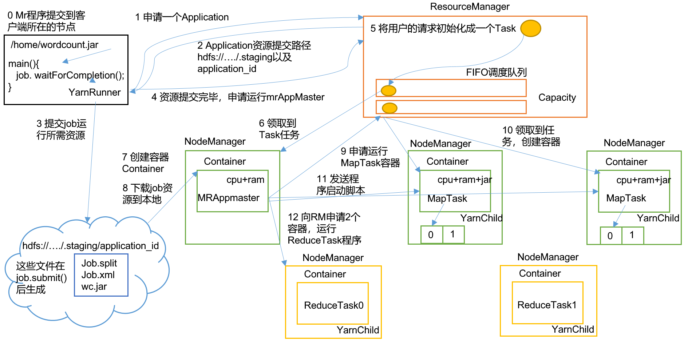
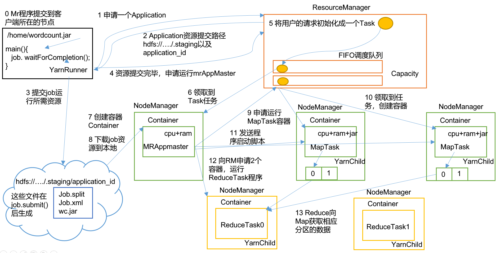
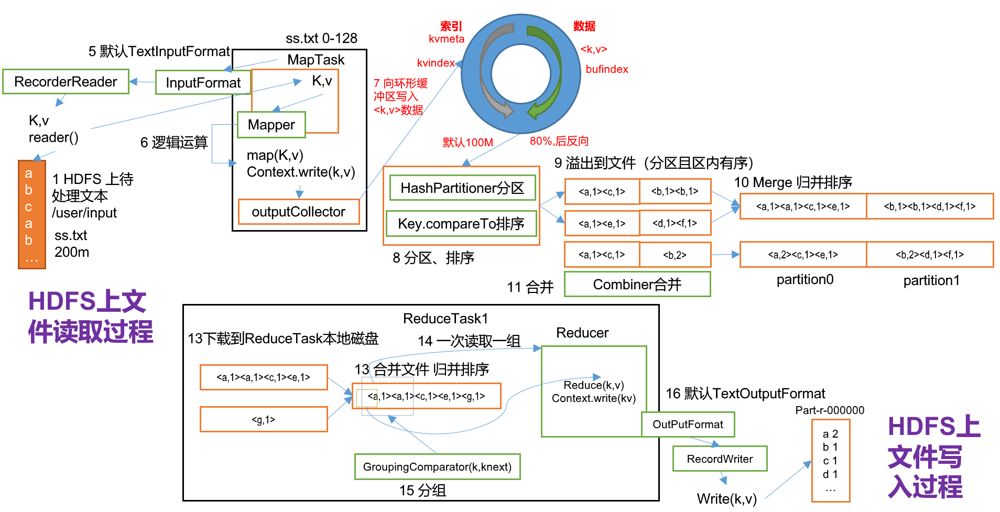

### 五、Yarn资源调度器

Yarn是一个资源调度平台，负责为运算程序提供服务器运算资源，相当于一个分布式的操作系统平台，而 MapReduce 等运算程序则相当于运行于操作系统之上的应用程序。

#### Yarn基本架构

YARN主要由 **ResourceManager**、**NodeManager**、**ApplicationMaster** 和 **Container** 等组件构成。


#### Yarn工作机制

##### Yarn运行机制



##### 工作机制详解

1. MR程序提交到客户端所在的节点。
2. YarnRunner向ResourceManager申请一个Application。
3. RM将该应用程序的资源路径返回给YarnRunner。
4. 该程序将运行所需资源提交到HDFS上。
5. 程序资源提交完毕后，申请运行mrAppMaster。
6. RM将用户的请求初始化成一个Task。
7. 其中一个NodeManager领取到Task任务。
8. 该NodeManager创建容器Container，并产生MRAppmaster。
9. Container从HDFS上拷贝资源到本地。
10. MRAppmaster向RM 申请运行MapTask资源。
11. RM将运行MapTask任务分配给另外两个NodeManager，另两个NodeManager分别领取任务并创建容器。
12. MR向两个接收到任务的NodeManager发送程序启动脚本，这两个NodeManager分别启动MapTask，MapTask对数据分区排序。
13. MrAppMaster等待所有MapTask运行完毕后，向RM申请容器，运行ReduceTask。
14. ReduceTask向MapTask获取相应分区的数据。
15. 程序运行完毕后，MR会向RM申请注销自己。

#### 作业提交全过程

##### 作业提交过程之YARN



##### 作业提交全过程详解

1. 作业提交

- Client调用job.waitForCompletion方法，向整个集群提交MapReduce作业。
- Client向RM申请一个作业id。
- RM给Client返回该job资源的提交路径和作业id。
- Client提交jar包、切片信息和配置文件到指定的资源提交路径。
- Client提交完资源后，向RM申请运行MrAppMaster。

2. 作业初始化

- 当RM收到Client的请求后，将该job添加到容量调度器中。
- 某一个空闲的NM领取到该Job。
- 该NM创建Container，并产生MRAppmaster。
- 下载Client提交的资源到本地。

3. 任务分配

- MrAppMaster向RM申请运行多个MapTask任务资源。

- RM将运行MapTask任务分配给另外两个NodeManager，另两个NodeManager分别领取任务并创建容器。

4. 任务运行

- MR向两个接收到任务的NodeManager发送程序启动脚本，这两个NodeManager分别启动MapTask，MapTask对数据分区排序。

- MrAppMaster等待所有MapTask运行完毕后，向RM申请容器，运行ReduceTask。

- ReduceTask向MapTask获取相应分区的数据。

- 程序运行完毕后，MR会向RM申请注销自己。

5. 进度和状态更新

- YARN中的任务将其进度和状态(包括counter)返回给应用管理器, 客户端每秒(通过mapreduce.client.progressmonitor.pollinterval设置)向应用管理器请求进度更新, 展示给用户。

6. 作业完成

- 除了向应用管理器请求作业进度外, 客户端每5秒都会通过调用waitForCompletion()来检查作业是否完成。时间间隔可以通过mapreduce.client.completion.pollinterval 来设置。作业完成之后, 应用管理器和Container会清理工作状态。作业的信息会被作业历史服务器存储以备之后用户核查。

##### 作业提交过程之 MapReduce



#### 资源调度器

目前，Hadoop作业调度器主要有三种：FIFO、Capacity Scheduler和Fair Scheduler。

Hadoop2.9.2默认的资源调度器是Capacity Scheduler。具体设置详见：**/share/hadoop/yarn/hadoop-yarn-common-2.9.2.jar/yarn-default.xml** 文件

```xml
<property>
  <description>The class to use as the resource scheduler.</description>
  <name>yarn.resourcemanager.scheduler.class</name>
  <value>org.apache.hadoop.yarn.server.resourcemanager.scheduler.capacity.CapacityScheduler</value>
</property>
```

##### 1. 先进先出调度器（FIFO）


##### 2. 容量调度器（Capacity Scheduler）


##### 3. 公平调度器（Fair Scheduler）


