### 一、Spark 概述

Spark是一种基于内存的快速、通用、可扩展的大数据分析计算引擎。

#### 1.1 内置模块

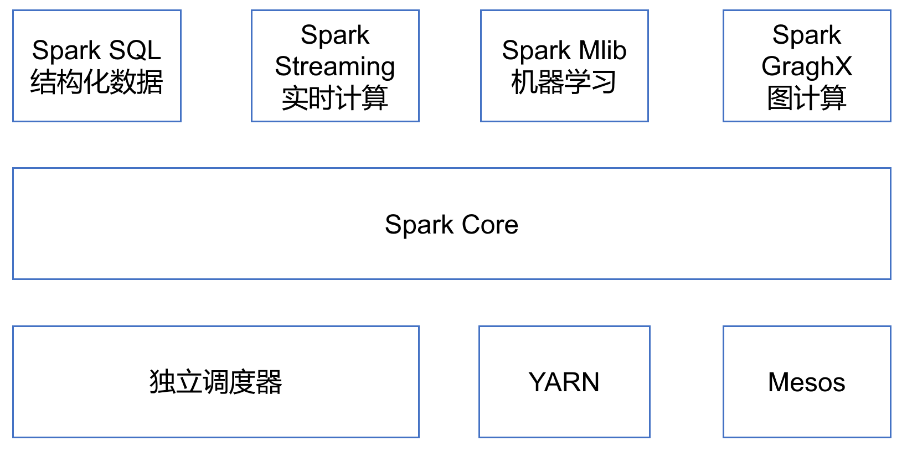

**Spark Core**：提供了Spark最基础与最核心的功能，Spark其他的功能如：Spark SQL，Spark Streaming，GraphX, MLlib都是在Spark Core的基础上进行扩展的。

**Spark SQL**：Spark用来操作结构化数据的组件。通过Spark SQL，用户可以使用SQL或者Apache Hive版本的SQL方言（HQL）来查询数据。

**Spark Streaming**：Spark平台上针对实时数据进行流式计算的组件，提供了丰富的处理数据流的API。

**Spark MLlib**：Spark提供的一个机器学习算法库。MLlib不仅提供了模型评估、数据导入等额外的功能，还提供了一些更底层的机器学习原语。

**Spark GraphX**：GraphX是Spark面向图计算提供的框架与算法库。

### 二、Spark运行环境

Spark作为一个数据处理框架和计算引擎，被设计在所有常见的集群环境中运行, 在国内工作中主流的环境为Yarn，不过逐渐容器式环境也慢慢流行起来。接下来，我们就分别看看不同环境下Spark的运行。

#### 2.1 重要组成

##### Driver（驱动器）

Spark的驱动器是执行开发程序中的main方法的进程。它负责开发人员编写的用来创建SparkContext、创建RDD，以及进行RDD的转化操作和行动操作代码的执行。如果你是用spark shell，那么当你启动Spark shell的时候，系统后台自启了一个Spark驱动器程序，就是在Spark shell中预加载的一个叫作 sc的SparkContext对象。如果驱动器程序终止，那么Spark应用也就结束了。

主要负责：

- 把用户程序转为作业（JOB）

- 跟踪Executor的运行状况

- 为执行器节点调度任务

- UI展示应用运行状况

##### Executor（执行器）

Spark Executor是一个工作进程，负责在 Spark 作业中运行任务，任务间相互独立。Spark 应用启动时，Executor节点被同时启动，并且始终伴随着整个 Spark 应用的生命周期而存在。如果有Executor节点发生了故障或崩溃，Spark 应用也可以继续执行，会将出错节点上的任务调度到其他Executor节点上继续运行。

主要负责：

- 负责运行组成 Spark 应用的任务，并将结果返回给驱动器进程；

- 通过自身的块管理器（Block Manager）为用户程序中要求缓存的RDD提供内存式存储。RDD是直接缓存在Executor进程内的，因此任务可以在运行时充分利用缓存数据加速运算。

#### 2.2 运行模式

##### Local模式

Local模式就是运行在一台计算机上的模式，通常就是用于在本机上练手和测试。它可以通过以下集中方式设置Master。

**local**：所有计算都运行在一个线程当中，没有任何并行计算，通常我们在本机执行一些测试代码，或者练手，就用这种模式。

**local[K]**：指定使用几个线程来运行计算，比如local[4]就是运行4个Worker线程。通常我们的Cpu有几个Core，就指定几个线程，最大化利用Cpu的计算能力。

**local[*]**：这种模式直接帮你按照Cpu最多Cores来设置线程数了。

1. Local环境

进入spark根目录，执行如下命令

```shell
[zak@hadoop003 spark-3.1.1]$ bin/spark-shell 
```

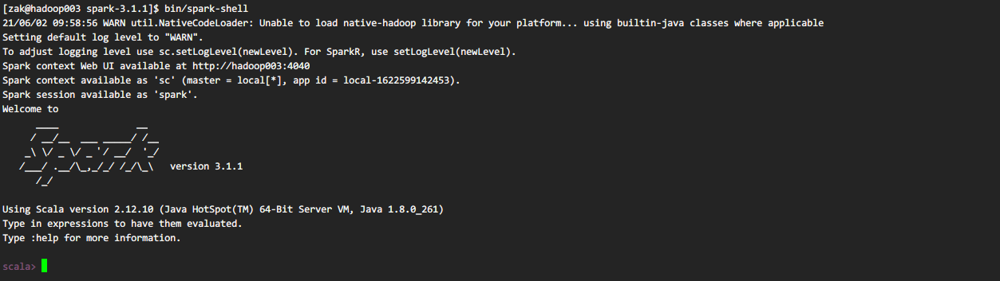

启动成功后，可以输入网址进行Web UI监控页面访问 http://hadoop003:4040。

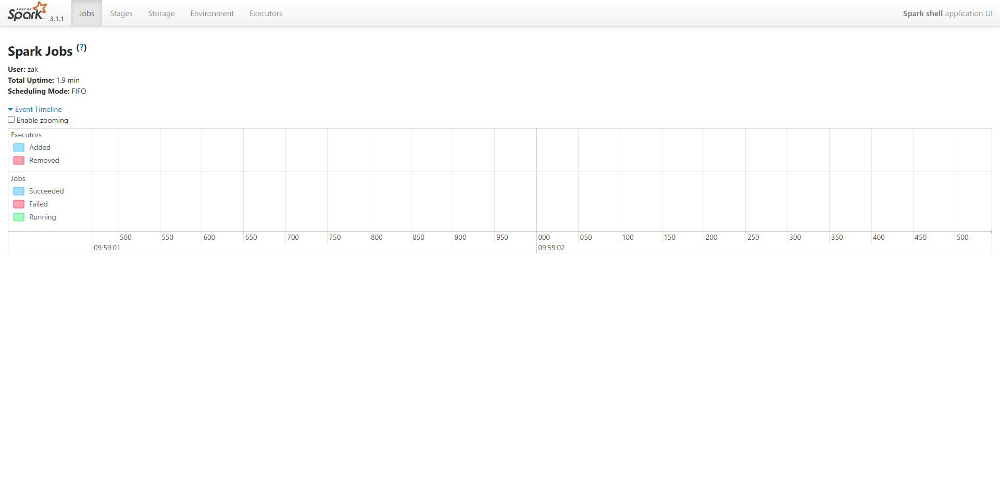

2. 命令行工具

在解压缩文件夹下的data目录中，添加word.txt文件。在命令行工具中执行如下代码指令。

```scala
sc.textFile("hdfs://hadoop001:9000/user/data/1.txt").flatMap(_.split("")).map((_,1)).reduceByKey(_+_).collect
```

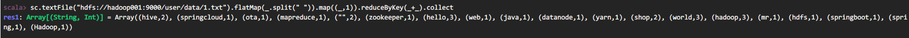

3. 提交应用

```shell
[zak@hadoop003 spark-3.1.1]$ bin/spark-submit --class org.apache.spark.examples.SparkPi --master local[2] ./examples/jars/spark-examples_2.12-3.1.1.jar 10
```

- --class 表示要执行程序的主类，此处可以更换为咱们自己写的应用程序。
- --master local[2] 部署模式，默认为本地模式，数字表示分配的虚拟CPU核数量。
- spark-examples_2.12-3.1.1.jar 运行的应用类所在的jar包，实际使用时，可以设定为咱们自己打的jar包。
- 数字10表示程序的入口参数，用于设定当前应用的任务数量。

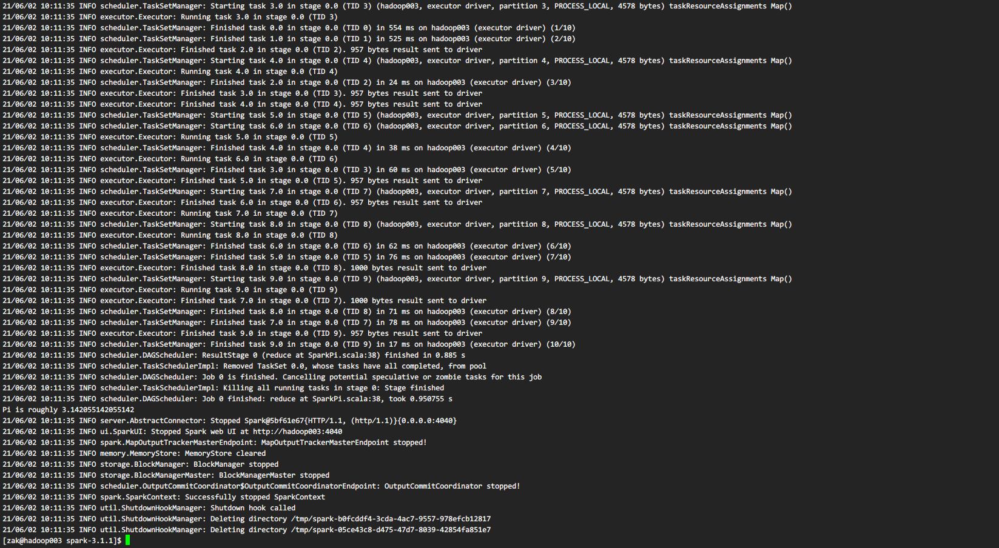

##### Standalone模式

local本地模式毕竟只是用来进行练习演示的，真实工作中还是要将应用提交到对应的集群中去执行，这里我们来看看只使用Spark自身节点运行的集群模式，也就是我们所谓的独立部署（Standalone）模式。

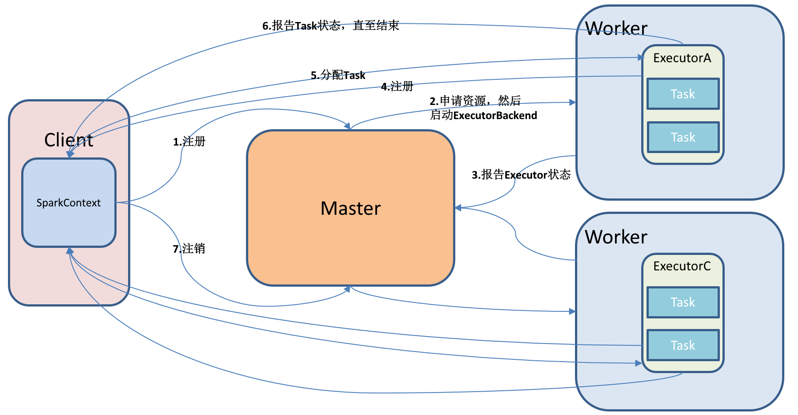

1. 安装使用

进入spark安装目录下的conf文件夹

```shell
[zak@hadoop003 module]$ cd spark-3.1.1/conf/
```

2. 修改配置文件名称

```shell
[zak@hadoop003 conf]$ mv workers.template workers
[zak@hadoop003 conf]$ mv spark-env.sh.template spark-env.sh
```

3. 修改workers文件，添加work节点：

```shell
[zak@hadoop003 conf]$ vim workers
hadoop001
hadoop002
hadoop003
```

4. 修改spark-env.sh文件，添加如下配置：

```shell
[zak@hadoop003 conf]$ vim spark-env.sh
SPARK_MASTER_HOST=hadoop003
SPARK_MASTER_PORT=7077
```

5. 分发spark包

```shell
[zak@hadoop003 module]$ scp -r spark-3.1.1/ hadoop001:/opt/module/
[zak@hadoop003 module]$ scp -r spark-3.1.1/ hadoop002:/opt/module/
```

6. 启动

```shell
[zak@hadoop003 spark-3.1.1]$ sbin/start-all.sh
```

7. 官方求PI案例

```shell
[zak@hadoop003 spark-3.1.1]$ bin/spark-submit --class org.apache.spark.examples.SparkPi --master spark://hadoop003:7077 --executor-memory 1G --total-executor-cores 2 ./examples/jars/spark-examples_2.12-3.1.1.jar 100
```

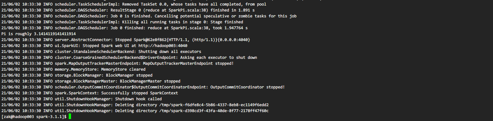

可以访问Web页面查看执行情况 http://hadoop003:8081。

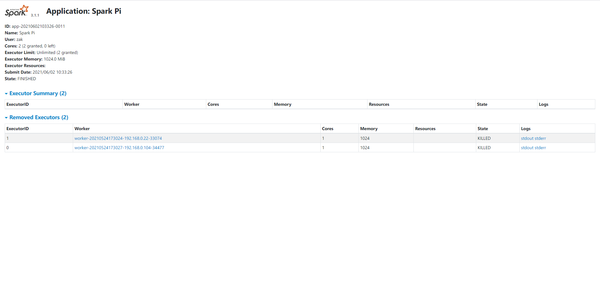

8. 启动spark shell

```shell
[zak@hadoop003 spark-3.1.1]$ bin/spark-shell --master spark://hadoop003:7077 --executor-memory 1g --total-executor-cores 2
```

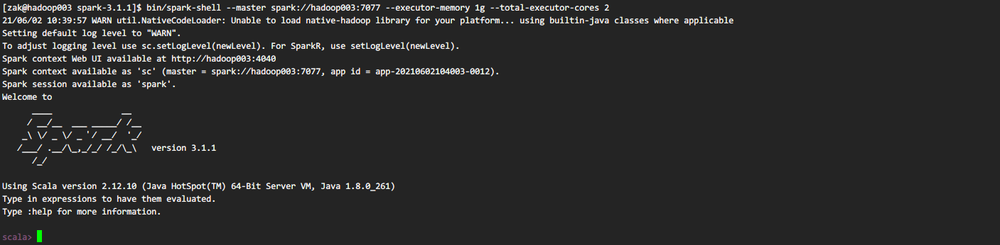

9. JobHistoryServer配置

- 修改spark-default.conf.template名称

```shell
[zak@hadoop003 conf]$ mv spark-defaults.conf.template spark-defaults.conf
```

- 修改spark-default.conf文件，开启Log：

```shell
[zak@hadoop003 conf]$ vi spark-defaults.conf
spark.eventLog.enabled      true
spark.eventLog.dir        hdfs://hadoop001:9000/directory
```

参数描述：

**spark.eventLog.dir**：Application在运行过程中所有的信息均记录在该属性指定的路径下。

注意：HDFS上的目录需要提前存在。

```shell
[zak@hadoop003 hadoop-2.9.2]$ bin/hadoop fs –mkdir /directory
```

- 修改spark-env.sh文件，添加如下配置：

```shell
[zak@hadoop003 conf]$ vi spark-env.sh

export SPARK_HISTORY_OPTS="-Dspark.history.ui.port=18080  -Dspark.history.retainedApplications=30 -Dspark.history.fs.logDirectory=hdfs://hadoop001:9000/directory"
```

参数描述：

**spark.history.ui.port=18080** Web UI访问的端口号为18080。

**spark.history.fs.logDirectory=hdfs://hadoop001:9000/directory** 配置了该属性后，在 **start-history-server.sh** 时就无需再显式的指定路径，Spark History Server页面只展示该指定路径下的信息。

**spark.history.retainedApplications=30** 指定保存Application历史记录的个数，如果超过这个值，旧的应用程序信息将被删除，这个是内存中的应用数，而不是页面上显示的应用数。

- 分发配置文件

```shell
[zak@hadoop003 module]$ scp -r spark-3.1.1/conf/ hadoop001:/opt/module/spark-3.1.1/conf/
[zak@hadoop003 module]$ scp -r spark-3.1.1/conf/ hadoop002:/opt/module/spark-3.1.1/conf/
```

- 启动历史服务

```shell
[zak@hadoop003 spark-3.1.1]$ sbin/start-history-server.sh
```

- 再次执行任务

```shell
[zak@hadoop003 spark-3.1.1]$ bin/spark-submit --class org.apache.spark.examples.SparkPi --master spark://hadoop003:7077 --executor-memory 1G --total-executor-cores 2 ./examples/jars/spark-examples_2.12-3.1.1.jar 100
```

- 查看历史服务

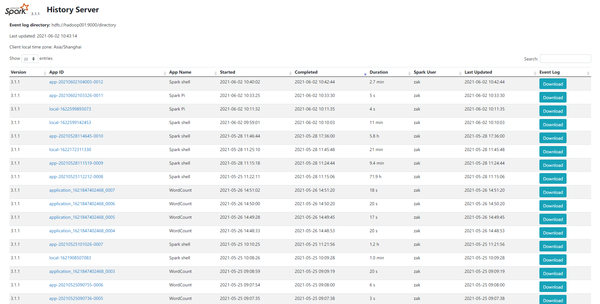


10. HA配置

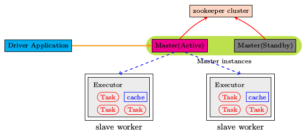

- zookeeper正常安装并启动

- 修改spark-env.sh文件添加如下配置：

```shell
[zak@hadoop003 conf]$ vi spark-env.sh
```

注释掉如下内容：

```shell
# SPARK_MASTER_HOST=hadoop003
# SPARK_MASTER_PORT=7077
```

添加上如下内容：

```shell
export SPARK_DAEMON_JAVA_OPTS="
-Dspark.deploy.recoveryMode=ZOOKEEPER 
-Dspark.deploy.zookeeper.url=hadoop001,hadoop002,hadoop003
-Dspark.deploy.zookeeper.dir=/spark"
```

- 分发配置文件

```shell
[zak@hadoop003 module]$ scp -r spark-3.1.1/conf/ hadoop001:/opt/module/spark-3.1.1/conf/
[zak@hadoop003 module]$ scp -r spark-3.1.1/conf/ hadoop002:/opt/module/spark-3.1.1/conf/
```

- 在hadoop001上启动全部节点

```shell
[zak@hadoop001 spark-3.1.1]$ sbin/start-all.sh
```

- 在hadoop003上单独启动master节点

```shell
[zak@hadoop003 spark-3.1.1]$ sbin/start-master.sh
```

- spark HA集群访问

```shell
[zak@hadoop003 spark-3.1.1]$ bin/spark-shell --master spark://hadoop001:7077,hadoop003:7077 --executor-memory 1g --total-executor-cores 2
```

##### Yarn模式

Spark客户端直接连接Yarn，不需要额外构建Spark集群。有yarn-client和yarn-cluster两种模式，主要区别在于Driver程序的运行节点。

- **yarn-client**：Driver程序运行在客户端，适用于交互、调试，希望立即看到app的输出。

- **yarn-cluster**：Driver程序运行在由RM（ResourceManager）启动的AP（APPMaster）适用于生产环境。

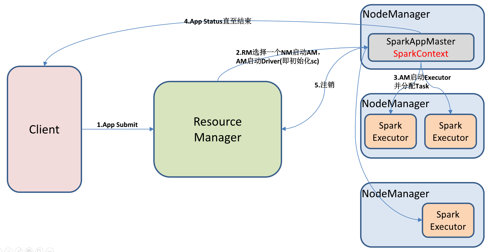

1. 安装使用

- 修改hadoop配置文件yarn-site.xml,添加如下内容：

```shell
[zak@hadoop001 hadoop-2.9.2]$ vi yarn-site.xml
<!--是否启动一个线程检查每个任务正使用的物理内存量，如果任务超出分配值，则直接将其杀掉，默认是true -->
<property>
    <name>yarn.nodemanager.pmem-check-enabled</name>
    <value>false</value>
</property>

<!--是否启动一个线程检查每个任务正使用的虚拟内存量，如果任务超出分配值，则直接将其杀掉，默认是true -->
<property>
    <name>yarn.nodemanager.vmem-check-enabled</name>
    <value>false</value>
</property>
```

- 修改spark-env.sh，添加如下配置：

```shell
[zak@hadoop003 conf]$ vi spark-env.sh
YARN_CONF_DIR=/opt/ha/hadoop-2.9.2/etc/hadoop
```

- 分发配置文件

```shell
[zak@hadoop003 module]$ scp -r spark-3.1.1/conf/ hadoop001:/opt/module/spark-3.1.1/conf/
[zak@hadoop003 module]$ scp -r spark-3.1.1/conf/ hadoop002:/opt/module/spark-3.1.1/conf/
```

- 执行一个程序

```shell
[zak@hadoop003 spark-3.1.1]$ bin/spark-submit --class org.apache.spark.examples.SparkPi --master yarn --deploy-mode client ./examples/jars/spark-examples_2.12-3.1.1.jar 100
```

注意：在提交任务之前需启动HDFS以及YARN集群。

2. 日志查看

- 修改配置文件spark-defaults.conf

添加如下内容：

```shell
spark.yarn.historyServer.address=hadoop003:18080
spark.history.ui.port=18080
```

- 重启spark历史服务

```shell
[zak@hadoop003 spark-3.1.1]$ sbin/stop-history-server.sh 
stopping org.apache.spark.deploy.history.HistoryServer
[zak@hadoop003 spark-3.1.1]$ sbin/start-history-server.sh 
starting org.apache.spark.deploy.history.HistoryServer, logging to /opt/module/spark-3.1.1/logs/spark-zak-org.apache.spark.deploy.history.HistoryServer-1-hadoop003.out
[zak@hadoop003 spark-3.1.1]$ 
```

- 提交任务到Yarn执行

```shell
[zak@hadoop003 spark-3.1.1]$ bin/spark-submit --class org.apache.spark.examples.SparkPi --master yarn --deploy-mode client ./examples/jars/spark-examples_2.12-3.1.1.jar 100
```

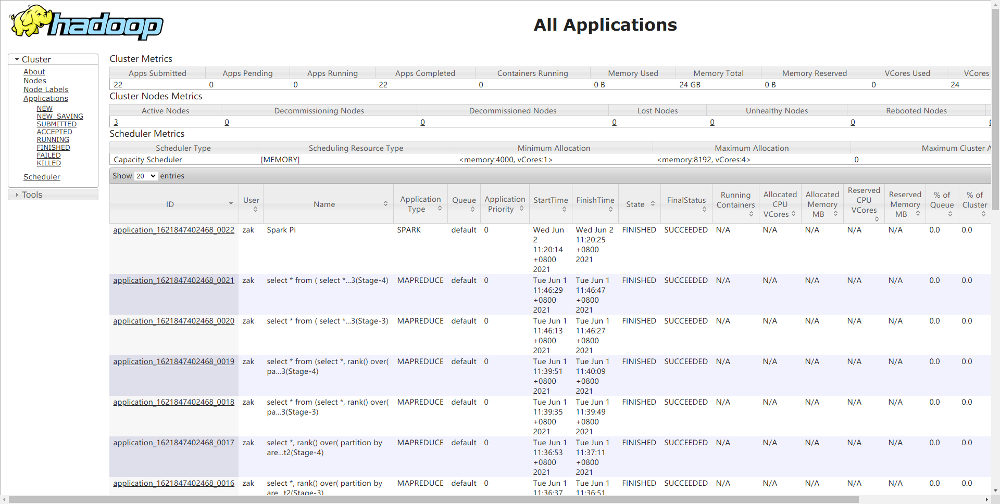

- Web页面查看日志

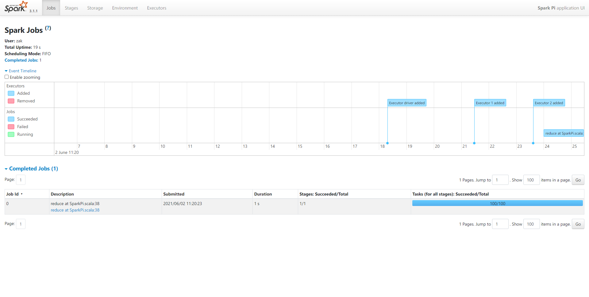

- 程序运行的Stages和DAG图。

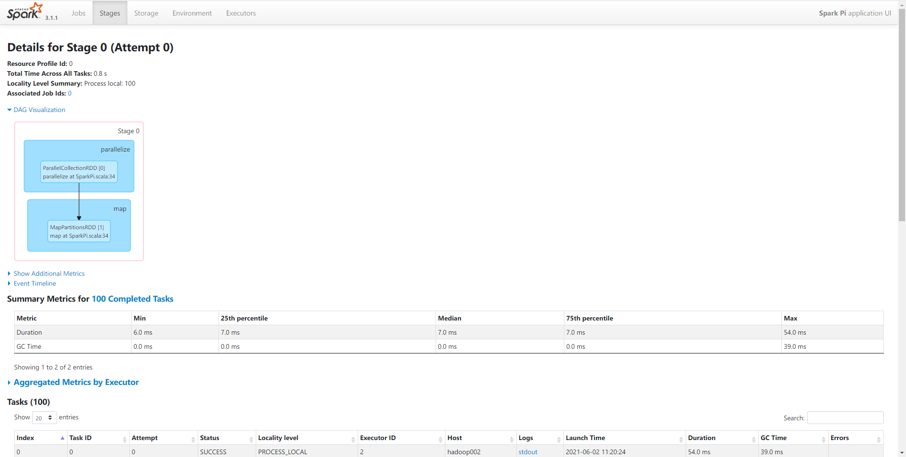
