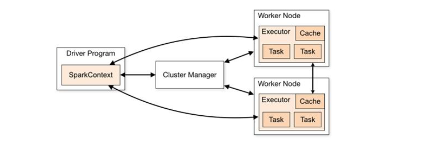
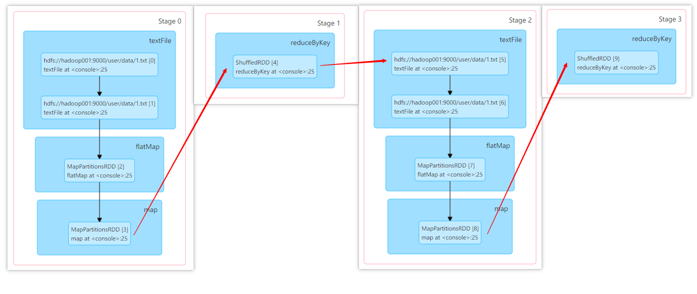
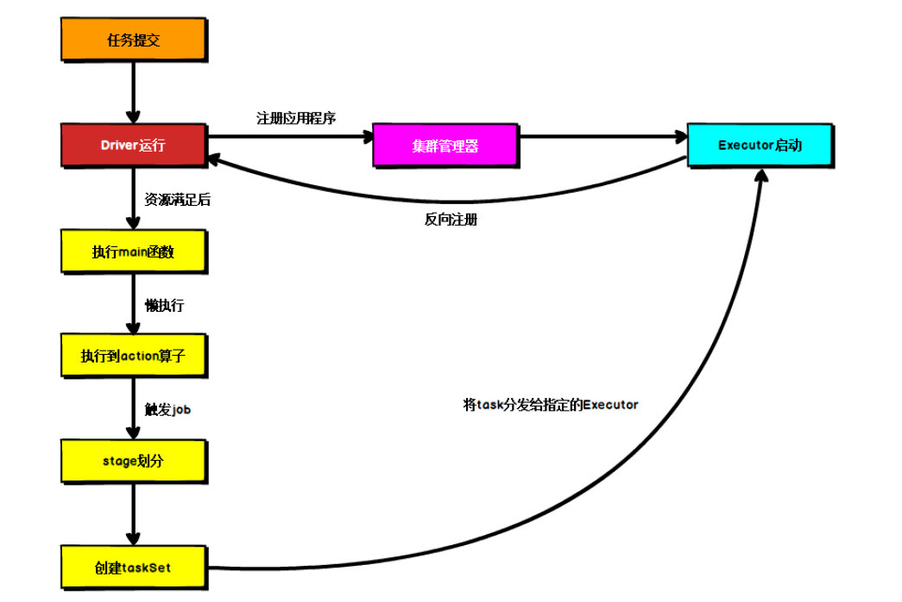

### 三、Spark 运行架构

#### 3.1 运行架构

Spark框架的核心是一个计算引擎，整体来说，它采用了标准 master-slave 的结构。
下图展示了一个Spark执行时的基本结构。图形中的Driver表示master，负责管理整个集群中的作业任务调度。图形中的Executor 则是 slave，负责实际执行任务。

#### 3.2 核心组件

##### Driver（驱动器）

Spark驱动器节点，用于执行Spark任务中的main方法，负责实际代码的执行工作。Driver在Spark作业执行时主要负责：

- 将用户程序转化为作业（job）

- 在Executor之间调度任务(task)

- 跟踪Executor的执行情况

- 通过UI展示查询运行情况

实际上，我们无法准确地描述Driver的定义，因为在整个的编程过程中没有看到任何有关Driver的字眼。所以简单理解，所谓的Driver就是驱使整个应用运行起来的程序，也称之为Driver类。

##### Executor（执行器）

Spark Executor是集群中工作节点（Worker）中的一个JVM进程，负责在 Spark 作业中运行具体任务（Task），任务彼此之间相互独立。Spark 应用启动时，Executor节点被同时启动，并且始终伴随着整个 Spark 应用的生命周期而存在。如果有Executor节点发生了故障或崩溃，Spark 应用也可以继续执行，会将出错节点上的任务调度到其他Executor节点上继续运行。

Executor有两个核心功能：

- 负责运行组成Spark应用的任务，并将结果返回给驱动器进程
- 它们通过自身的块管理器（Block Manager）为用户程序中要求缓存的 RDD 提供内存式存储。RDD 是直接缓存在Executor进程内的，因此任务可以在运行时充分利用缓存数据加速运算。

##### Master & Worker

Spark集群的独立部署环境中，不需要依赖其他的资源调度框架，自身就实现了资源调度的功能，所以环境中还有其他两个核心组件：Master和Worker，这里的Master是一个进程，主要负责资源的调度和分配，并进行集群的监控等职责，类似于Yarn环境中的RM, 而Worker呢，也是进程，一个Worker运行在集群中的一台服务器上，由Master分配资源对数据进行并行的处理和计算，类似于Yarn环境中NM。

##### ApplicationMaster

Hadoop用户向YARN集群提交应用程序时,提交程序中应该包含ApplicationMaster，用于向资源调度器申请执行任务的资源容器Container，运行用户自己的程序任务job，监控整个任务的执行，跟踪整个任务的状态，处理任务失败等异常情况。

说的简单点就是，ResourceManager（资源）和Driver（计算）之间的解耦合靠的就是ApplicationMaster。

#### 3.3 核心概念

##### Executor 与 Core

Spark Executor是集群中运行在工作节点（Worker）中的一个JVM进程，是整个集群中的专门用于计算的节点。在提交应用中，可以提供参数指定计算节点的个数，以及对应的资源。这里的资源一般指的是工作节点Executor的内存大小和使用的虚拟CPU核（Core）数量。

应用程序相关启动参数如下：

| 名称              | 说明                               |
| ----------------- | ---------------------------------- |
| --num-executors   | 配置Executor的数量                 |
| --executor-memory | 配置每个Executor的内存大小         |
| --executor-cores  | 配置每个Executor的虚拟CPU core数量 |

##### 并行度（Parallelism）

在分布式计算框架中一般都是多个任务同时执行，由于任务分布在不同的计算节点进行计算，所以能够真正地实现多任务并行执行，记住，这里是并行，而不是并发。这里我们将整个集群并行执行任务的数量称之为并行度。那么一个作业到底并行度是多少呢？这个取决于框架的默认配置。应用程序也可以在运行过程中动态修改。

##### 有向无环图（DAG）

这里所谓的有向无环图，并不是真正意义的图形，而是由Spark程序直接映射成的数据流的高级抽象模型。简单理解就是将整个程序计算的执行过程用图形表示出来,这样更直观，更便于理解，可以用于表示程序的拓扑结构。

由于MapReduce框架分为阶段执行任务的弊端，催生了支持DAG框架的产生。Spark作为这些计算引擎的代表，Job支持DAG，以及实时计算。

DAG（Directed Acyclic Graph）有向无环图是由点和线组成的拓扑图形，该图形具有方向，不会闭环。

#### 3.4 提交流程

所谓的提交流程，其实就是我们开发人员根据需求写的应用程序通过Spark客户端提交给Spark运行环境执行计算的流程。在不同的部署环境中，这个提交过程基本相同，但是又有细微的区别，我们这里不进行详细的比较，但是因为国内工作中，将Spark引用部署到Yarn环境中会更多一些，所以本课程中的提交流程是基于Yarn环境的。

Spark应用程序提交到Yarn环境中执行的时候，一般会有两种部署执行的方式：Client和Cluster。两种模式主要区别在于：Driver程序的运行节点位置。

##### Client模式

Client模式将用于监控和调度的Driver模块在客户端执行，而不是在Yarn中，所以一般用于测试。

- Driver在任务提交的本地机器上运行。
- Driver启动后会和ResourceManager通讯申请启动ApplicationMaster。
- ResourceManager分配container，在合适的NodeManager上启动ApplicationMaster，负责向ResourceManager申请Executor内存。
- ResourceManager接到ApplicationMaster的资源申请后会分配container，然后ApplicationMaster在资源分配指定的NodeManager上启动Executor进程。
- Executor进程启动后会向Driver反向注册，Executor全部注册完成后Driver开始执行main函数。
- 之后执行到Action算子时，触发一个Job，并根据宽依赖开始划分stage，每个stage生成对应的TaskSet，之后将task分发到各个Executor上执行。

##### Cluster模式

Cluster模式将用于监控和调度的Driver模块启动在Yarn集群资源中执行。一般应用于实际生产环境。

- 在YARN Cluster模式下，任务提交后会和ResourceManager通讯申请启动ApplicationMaster。
- 随后ResourceManager分配container，在合适的NodeManager上启动ApplicationMaster，此时的ApplicationMaster就是Driver。
- Driver启动后向ResourceManager申请Executor内存，ResourceManager接到ApplicationMaster的资源申请后会分配container，然后在合适的NodeManager上启动Executor进程。
- Executor进程启动后会向Driver反向注册，Executor全部注册完成后Driver开始执行main函数。
- 之后执行到Action算子时，触发一个Job，并根据宽依赖开始划分stage，每个stage生成对应的TaskSet，之后将task分发到各个Executor上执行。