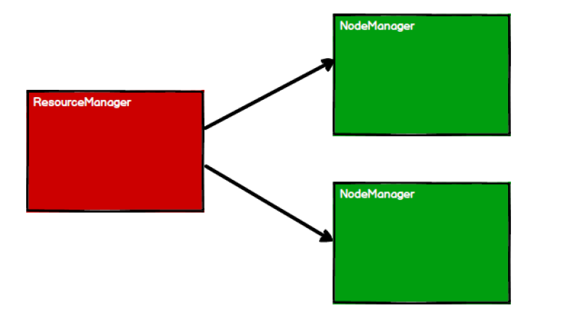
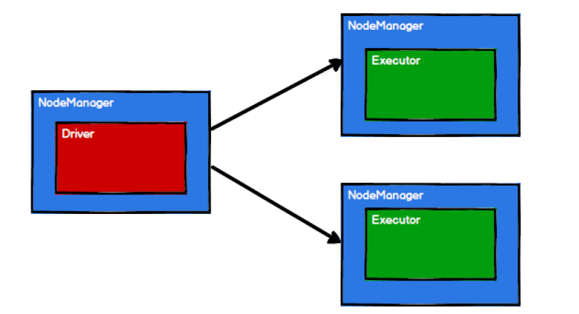
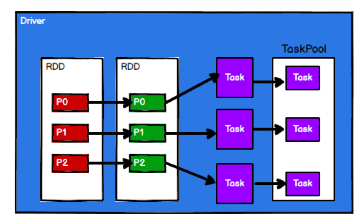
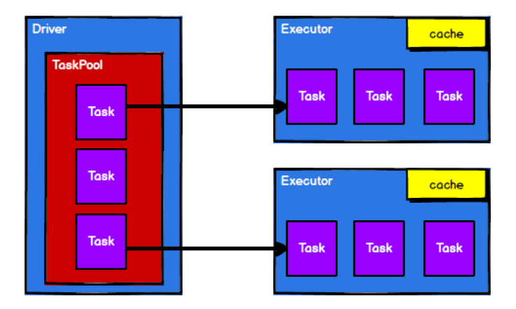

### 四、Spark核心编程

Spark计算框架为了能够进行高并发和高吞吐的数据处理，封装了三大数据结构，用于处理不同的应用场景。三大数据结构分别是：

- **RDD** : 弹性分布式数据集
- **累加器**：分布式共享只写变量
- **广播变量**：分布式共享只读变量

#### 4.1 RDD

##### 什么是 RDD

RDD（Resilient Distributed Dataset）叫做弹性分布式数据集，是Spark中最基本的数据处理模型。代码中是一个抽象类，它代表一个弹性的、不可变、可分区、里面的元素可并行计算的集合。

1. **弹性**

    - 存储的弹性：内存与磁盘的自动切换。

    - 容错的弹性：数据丢失可以自动恢复。
    -  计算的弹性：计算出错重试机制。

2. **分片的弹性**：可根据需要重新分片。

3. **分布式**：数据存储在大数据集群不同节点上。

4. **数据集**：RDD 封装了计算逻辑，并不保存数据。

5. **数据抽象**：RDD 是一个抽象类，需要子类具体实现。

6. **不可变**：RDD 封装了计算逻辑，是不可以改变的，想要改变，只能产生新的 RDD，在新的 RDD 里面封装计算逻辑。

7. **可分区、并行计算。**

##### 核心属性

```scala
 * Internally, each RDD is characterized by five main properties:
 *
 *  - A list of partitions
 *  - A function for computing each split
 *  - A list of dependencies on other RDDs
 *  - Optionally, a Partitioner for key-value RDDs (e.g. to say that the RDD is hash-partitioned)
 *  - Optionally, a list of preferred locations to compute each split on (e.g. block locations for
 *    an HDFS file)
 *
```

1. 分区列表

RDD数据结构中存在分区列表，用于执行任务时并行计算，是实现分布式计算的重要属性。

```scala
  /**
   * Implemented by subclasses to return the set of partitions in this RDD. This method will only
   * be called once, so it is safe to implement a time-consuming computation in it.
   *
   * The partitions in this array must satisfy the following property:
   *   `rdd.partitions.zipWithIndex.forall { case (partition, index) => partition.index == index }`
   */
  protected def getPartitions: Array[Partition]
```

2. 分区计算函数

Spark在计算时，是使用分区函数对每一个分区进行计算。

```scala
  /**
   * :: DeveloperApi ::
   * Implemented by subclasses to compute a given partition.
   */
  @DeveloperApi
  def compute(split: Partition, context: TaskContext): Iterator[T]
```

3. RDD之间的依赖关系

RDD是计算模型的封装，当需求中需要将多个计算模型进行组合时，就需要将多个 RDD 建立依赖关系。

```scala
  /**
   * Implemented by subclasses to return how this RDD depends on parent RDDs. This method will only
   * be called once, so it is safe to implement a time-consuming computation in it.
   */
  protected def getDependencies: Seq[Dependency[_]] = deps
```

4. 分区器（可选）

当数据为 KV 类型数据时，可以通过设定分区器自定义数据的分区。

```scala

  /** Optionally overridden by subclasses to specify how they are partitioned. */
  @transient val partitioner: Option[Partitioner] = None
```

5. 首选位置（可选）

计算数据时，可以根据计算节点的状态选择不同的节点位置进行计算。

```scala
  /**
   * Optionally overridden by subclasses to specify placement preferences.
   */
  protected def getPreferredLocations(split: Partition): Seq[String] = Nil
```

##### 执行原理

从计算的角度来讲，数据处理过程中需要计算资源（内存& CPU ）和计算模型（逻辑）。执行时，需要将计算资源和计算模型进行协调和整合。

Spark框架在执行时，先申请资源，然后将应用程序的数据处理逻辑分解成一个一个的计算任务。然后将任务发到已经分配资源的计算节点上 , 按照指定的计算模型进行数据计算。最后得到计算结果。

RDD是 Spark 框架中用于数据处理的核心模型，接下来我们看看，在 Yarn 环境中， RDD的工作原理：

1. 启动 Yarn 集群环境。



2. Spark 通过申请资源创建调度节点和计算节点。



3. Spark 框架根据需求将计算逻辑根据分区划分成不同的任务。



4. 调度节点将任务根据计算节点状态发送到对应的计算节点进行计算。



从以上流程可以看出RDD 在整个流程中主要用于将逻辑进行封装，并生成 Task 发送给Executor 节点执行计算，接下来我们就一起看看 Spark 框架中 RDD 是具体是如何进行数据处理的。

