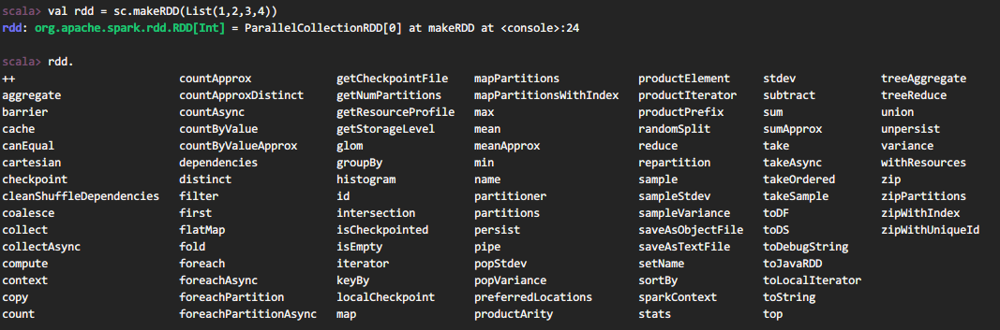

### 四、Spark核心编程

#### 4.2 基础编程

##### RDD 创建

1. 从集合（内存）中创建 RDD

从集合中创建RDD，Spark主要提供了两个方法：parallelize和 makeRDD

```scala
// 1. 配置 
val conf =new SparkConf().setMaster("local[*]").setAppName("spark")
val sc = new SparkContext(conf)

// 2. 创建RDD
val rdd1 = sc.parallelize(List(1,2,3,4))
val rdd2 = sc.makeRDD(List(1,2,3,4))

// 3. 输出
rdd1.collect().foreach(println)
rdd2.collect().foreach(println)

// 4. 关闭
sc.stop()
```

2. 从底层代码实现来讲，makeRDD 方法其实就是 parallelize方法。

```scala
  def makeRDD[T: ClassTag](
      seq: Seq[T],
      numSlices: Int = defaultParallelism): RDD[T] = withScope {
    parallelize(seq, numSlices)
  }
```

3. 从外部存储（文件）创建 RDD

由外部存储系统的数据集创建RDD包括：本地的文件系统，所有Hadoop支持的数据集，比如HDFS、HBase等。

```scala
val conf =new SparkConf().setMaster("local[*]").setAppName("spark")
val sc = new SparkContext(conf)

val fileRDD: RDD[String] = sc.textFile("input")

fileRDD.collect().foreach(println)

sc.stop()
```

4. 从其他 RDD 创建

主要是通过一个RDD 运算完后，再产生新的 RDD。

5. 直接创建 RDD

使用 new 的方式直接构造 RDD ，一般由 Spark 框架自身使用。

#### 4.3 RDD 并行度与分区

 默认情况下，Spark可以将一个作业切分多个任务后，发送给Executor节点并行计算，而能够并行计算的任务数量我们称之为并行度。这个数量可以在构建RDD时指定。记住，**这里的并行执行的任务数量，并不是指的切分任务的数量**。

```scala
val conf = new SparkConf().setMaster("local[*]").setAppName("spark")
val sc = new SparkContext(conf)

val dataRDD: RDD[Int] = sc.makeRDD(List(1,2,3,4), 4)
val fileRDD: RDD[String] =sc.textFile("input", 2)

fileRDD.collect().foreach(println)

sc.stop()
```

读取内存数据时，数据可以按照并行度的设定进行数据的分区操作，数据分区规则的Spark核心源码如下：

```scala
// Sequences need to be sliced at the same set of index positions for operations
// like RDD.zip() to behave as expected
def positions(length: Long, numSlices: Int): Iterator[(Int, Int)] = {
  (0 until numSlices).iterator.map { i =>
    val start = ((i * length) / numSlices).toInt
    val end = (((i + 1) * length) / numSlices).toInt
    (start, end)
  }
}
```

读取文件数据时，数据是按照Hadoop文件读取的规则进行切片分区，而切片规则和数据读取的规则有些差异，具体核心源码如下：

```java

  public InputSplit[] getSplits(JobConf job, int numSplits) throws IOException {
    // ......
    long totalSize = 0;                           // compute total size
    boolean ignoreDirs = !job.getBoolean(INPUT_DIR_RECURSIVE, false)
      && job.getBoolean(INPUT_DIR_NONRECURSIVE_IGNORE_SUBDIRS, false);

    List<FileStatus> files = new ArrayList<>(stats.length);
    for (FileStatus file: stats) {                // check we have valid files
    // ......
    }

    long goalSize = totalSize / (numSplits == 0 ? 1 : numSplits);
    long minSize = Math.max(job.getLong(org.apache.hadoop.mapreduce.lib.input.
      FileInputFormat.SPLIT_MINSIZE, 1), minSplitSize);
    // ......
    for (FileStatus file: files) {
      Path path = file.getPath();
      long length = file.getLen();
      if (length != 0) {
		// ......
        if (isSplitable(fs, path)) {
          long blockSize = file.getBlockSize();
          long splitSize = computeSplitSize(goalSize, minSize, blockSize);
		 // ......
        }
      }
    return splits.toArray(new FileSplit[splits.size()]);
  }

  protected long computeSplitSize(long goalSize, long minSize, long blockSize) {
    return Math.max(minSize, Math.min(goalSize, blockSize));
  }
```

#### 4.4 RDD 转换算子

RDD根据数据处理方式的不同将算子整体上分为Value类型、双Value类型和Key-Value类型。


##### Value类型

1. map

- 函数签名

```scala
  def map[U: ClassTag](f: T => U): RDD[U] 
```

- 函数说明

将处理的数据逐条进行映射转换，这里的转换可以是类型的转换，也可以是值的转换。

2. mapPartitions

- 函数签名

```scala
  def mapPartitions[U: ClassTag](
      f: Iterator[T] => Iterator[U],
      preservesPartitioning: Boolean = false): RDD[U] 
```

- 函数说明

将待处理的数据以分区为单位发送到计算节点进行处理，这里的处理是指可以进行任意的处理，哪怕是过滤数据。

```scala
val rdd = sc.makeRDD(List(1, 2, 3, 4), 2)
val mpRDD = rdd.mapPartitions(
  iter => {
    List(iter.max).iterator
  }
)

mpRDD.collect().foreach(println)
// 2
// 4
```

- map和mapPartitions的区别

    数据处理角度

    Map算子是分区内一个数据一个数据的执行，类似于串行操作。而mapPartitions算子是以分区为单位进行批处理操作。

    功能的角度

    Map算子主要目的将数据源中的数据进行转换和改变。但是不会减少或增多数据。MapPartitions算子需要传递一个迭代器，返回一个迭代器，没有要求的元素的个数保持不变，所以可以增加或减少数据。

    性能的角度

    Map算子因为类似于串行操作，所以性能比较低，而是mapPartitions算子类似于批处理，所以性能较高。但是mapPartitions算子会长时间占用内存，那么这样会导致内存可能不够用，出现内存溢出的错误。所以在内存有限的情况下，不推荐使用。使用map操作。

3. mapPartitionsWithIndex

- 函数签名

```scala
  def mapPartitionsWithIndex[U: ClassTag](
      f: (Int, Iterator[T]) => Iterator[U],
      preservesPartitioning: Boolean = false): RDD[U]
```

- 函数说明

将待处理的数据以分区为单位发送到计算节点进行处理，这里的处理是指可以进行任意的处理，哪怕是过滤数据，在处理时同时可以获取当前分区索引。

```scala
val rdd = sc.makeRDD(List(1, 2, 3, 4), 2)
// 【1，2】，【3，4】
val mpiRDD = rdd.mapPartitionsWithIndex(
  (index, iter) => {
    if (index == 1) {
      iter
    } else {
      Nil.iterator
    }
  }
)

mpiRDD.collect().foreach(println)

// 3
// 4
```

4. flatMap

- 函数签名

```scala
  def flatMap[U: ClassTag](f: T => TraversableOnce[U]): RDD[U]
```

- 函数说明

将处理的数据进行扁平化后再进行映射处理，所以算子也称之为扁平映射。

5. glom

- 函数签名

```scala
  def glom(): RDD[Array[T]]
```

- 函数说明

将同一个分区的数据直接转换为相同类型的内存数组进行处理，分区不变。

```scala
val rdd: RDD[Int] = sc.makeRDD(List(1, 2, 3, 4), 2)

// List => Int
// Int => Array
val glomRDD: RDD[Array[Int]] = rdd.glom()

glomRDD.collect().foreach(data => println(data.mkString(",")))

// 1,2
// 3,4
```

6. groupBy

- 函数签名

```scala
  def groupBy[K](f: T => K)(implicit kt: ClassTag[K]): RDD[(K, Iterable[T])]
```

- 函数说明

将数据根据指定的规则进行分组, 分区默认不变，但是数据会被打乱重新组合，我们将这样的操作称之为shuffle。极限情况下，数据可能被分在同一个分区中
一个组的数据在一个分区中，但是并不是说一个分区中只有一个组。

7. filter

- 函数签名

```scala
  def filter(f: T => Boolean): RDD[T]
```

- 函数说明

将数据根据指定的规则进行筛选过滤，符合规则的数据保留，不符合规则的数据丢弃。当数据进行筛选过滤后，分区不变，但是分区内的数据可能不均衡，生产环境下，可能会出现数据倾斜。

8. sample

- 函数签名

```scala
  def sample(withReplacement: Boolean, fraction: Double, seed: Long = Utils.random.nextLong): RDD[T]
```

- 函数说明

根据指定的规则从数据集中抽取数据。

```scala
val dataRDD = sparkContext.makeRDD(List(1,2,3,4), 1)
// 抽取数据不放回（伯努利算法）
// 伯努利算法：又叫 0 、 1 分布。例如扔硬币，要么正面，要么反面。
// 具体实现：根据种子和随机算法算出一个数和第二个参数设置几率比较，小于第二个参数要，大于不
要
// 第一个参数：抽取的数据是否放回， false ：不放回
// 第二个参数：抽取的几率，范围在 [ 之间 ,0 ：全不取 1 ：全取
// 第三个参数：随机数种子
val dataRDD1 = dataRDD.sample(false, 0.5)
// 抽取数据放回（泊松算法）
// 第一个参数：抽取的数据是否放回， true ：放回 false ：不放回
// 第二个参数：重复数据的几率，范围大于等于 0. 表示每一个元素被期望抽取到的次数
// 第三个参数：随机数种子
val dataRDD2 = dataRDD.sample(true, 2)
```

9. distinct

- 函数签名

```scala
def distinct()(implicit ord: Ordering[T] = null): RDD[T]
def distinct(numPartitions: Int)(implicit ord: Ordering[T] = null): RDD[T]
```

- 函数说明

将数据集中重复的数据去重。

```scala
val dataRDD = sc.makeRDD(List(1,2,3,4,1,2), 1)
val dataRDD1 = dataRDD.distinct()
val dataRDD2 = dataRDD.distinct(2)
```

10. coalesce

- 函数签名

```scala
  def coalesce(numPartitions: Int, shuffle: Boolean = false,partitionCoalescer: Option[PartitionCoalescer] = Option.empty)
      (implicit ord: Ordering[T] = null): RDD[T]
```

- 函数说明

根据数据量缩减分区，用于大数据集过滤后，提高小数据集的执行效率
当spark程序中，存在过多的小任务的时候，可以通过coalesce方法，收缩合并分区，减少分区的个数，减小任务调度成本。

```scala
val dataRDD = sc.makeRDD(List(1,2,3,4,1,2), 6)
val dataRDD1 = dataRDD.coalesce(2)
```

11. repartition

- 函数签名

```scala
  def repartition(numPartitions: Int)(implicit ord: Ordering[T] = null): RDD[T]
```

- 函数说明

该操作内部其实执行的是coalesce操作，参数shuffle的默认值为true。无论是将分区数多的RDD转换为分区数少的RDD，还是将分区数少的RDD转换为分区数多的RDD，repartition操作都可以完成，因为无论如何都会经shuffle过程。

```scala
val dataRDD = sc.makeRDD(List(1,2,3,4,1,2), 2)
val dataRDD1 = dataRDD.repartition(4)
```

12. sortBy

- 函数签名

```scala
  def sortBy[K](
      f: (T) => K,
      ascending: Boolean = true,
      numPartitions: Int = this.partitions.length)
      (implicit ord: Ordering[K], ctag: ClassTag[K]): RDD[T]
```

- 函数说明

该操作用于排序数据。在排序之前，可以将数据通过f函数进行处理，之后按照f函数处理的结果进行排序，默认为升序排列。排序后新产生的RDD的分区数与原RDD的分区数一致。中间存在shuffle的过程。

```scala
val rdd = sc.makeRDD(List(("1", 1), ("11", 2), ("2", 3)), 2)

// sortBy方法可以根据指定的规则对数据源中的数据进行排序，默认为升序，第二个参数可以改变排序的方式
// sortBy默认情况下，不会改变分区。但是中间存在shuffle操作
val newRDD = rdd.sortBy(t => t._1.toInt, ascending = false, 4)

// (11,2)
// (2,3)
// (1,1)
```

##### 双Value类型

13. intersection

- 函数签名

```scala
  def intersection(other: RDD[T]): RDD[T] 
```

- 函数说明

对源RDD和参数RDD求交集后返回一个新的RDD。

```scala
val rdd1 = sc.makeRDD(List(1, 2, 3, 4))
val rdd2 = sc.makeRDD(List(3, 4, 5, 6))
val rdd3: RDD[Int] = rdd1.intersection(rdd2)
println(rdd3.collect().mkString(","))
// 3,4
```

14. union

- 函数签名

```scala
  def union(other: RDD[T]): RDD[T]
```

- 函数说明

对源RDD和参数RDD求并集后返回一个新的RDD。

```scala
val rdd1 = sc.makeRDD(List(1, 2, 3, 4))
val rdd2 = sc.makeRDD(List(3, 4, 5, 6))
val rdd4: RDD[Int] = rdd1.union(rdd2)
println(rdd4.collect().mkString(","))
// 1，2，3，4，3，4，5，6
```

15. subtract

- 函数签名

```scala
  def subtract(other: RDD[T]): RDD[T]
```

- 函数说明

以一个RDD元素为主，去除两个RDD中重复元素，将其他元素保留下来。求差集。

```scala
val rdd1 = sc.makeRDD(List(1, 2, 3, 4))
val rdd2 = sc.makeRDD(List(3, 4, 5, 6))
val rdd5: RDD[Int] = rdd1.subtract(rdd2)
println(rdd5.collect().mkString(","))
// 1,2
```

16. zip

- 函数签名

```scala
def zip[U: ClassTag](other: RDD[U]): RDD[(T, U)]
```

- 函数说明

将两个RDD中的元素，以键值对的形式进行合并。其中，键值对中的Key为第1个RDD中的元素，Value为第2个RDD中的相同位置的元素。

```scala
// Can't zip RDDs with unequal numbers of partitions: List(2, 4)
// 两个数据源要求分区数量要保持一致
// Can only zip RDDs with same number of elements in each partition
// 两个数据源要求分区中数据数量保持一致
val rdd1 = sc.makeRDD(List(1, 2, 3, 4), 2)
val rdd2 = sc.makeRDD(List(3, 4, 5, 6), 2)

val rdd6: RDD[(Int, Int)] = rdd1.zip(rdd2)
println(rdd6.collect().mkString(","))
// (1,3),(2,4),(3,5),(4,6)
```

##### Key-Value类型

17. partitionBy

- 函数签名

```scala
  def partitionBy(partitioner: Partitioner): RDD[(K, V)]
```

- 函数说明

将数据按照指定Partitioner重新进行分区。Spark默认的分区器是HashPartitioner。

```scala
val rdd = sc.makeRDD(Array((1,"aaa"),(2,"bbb"),(3,"ccc")), 3)
val rdd2 = rdd.partitionBy(new HashPartitioner(2))
```

18. reduceByKey

- 函数签名

```scala
def reduceByKey(func: (V, V) => V): RDD[(K, V)]
def reduceByKey(func: (V, V) => V, numPartitions: Int): RDD[(K, V)]
```

- 函数说明

可以将数据按照相同的Key对Value进行聚合。

```scala
val dataRDD1 = sc.makeRDD(List(("a",1),("b",2),("c",3)))
val dataRDD2 = dataRDD1.reduceByKey(_+_)
val dataRDD3 = dataRDD1.reduceByKey(_+_, 2)
```

19. groupByKey

- 函数签名

```scala
def groupByKey(): RDD[(K, Iterable[V])]
def groupByKey(numPartitions: Int): RDD[(K, Iterable[V])]
def groupByKey(partitioner: Partitioner): RDD[(K, Iterable[V])]
```

- 函数说明

将数据源的数据根据key对value进行分组。

```scala
val dataRDD1 =sc.makeRDD(List(("a",1),("b",2),("c",3)))
val dataRDD2 = dataRDD1. groupByKey()
val dataRDD3 = dataRDD1. groupByKey(2)
val dataRDD4 = dataRDD1. groupByKey(new HashPartitioner(2))
```

- 区别

    从shuffle的角度：

    reduceByKey和groupByKey都存在shuffle的操作，但是reduceByKey可以在shuffle前对分区内相同key的数据进行预聚合（combine）功能，这样会减少落盘的数据量，而groupByKey只是进行分组，不存在数据量减少的问题，reduceByKey性能比较高。

    从功能的角度：

    reduceByKey其实包含分组和聚合的功能。GroupByKey只能分组，不能聚合，所以在分组聚合的场合下，推荐使用reduceByKey，如果仅仅是分组而不需要聚合。那么还是只能使用groupByKey。

20. aggregateByKey

- 函数签名

```scala
def aggregateByKey[U: ClassTag](zeroValue: U)(seqOp: (U, V) => U,combOp: (U, U) => U): RDD[(K, U)]
```

- 函数说明

将数据根据不同的规则进行分区内计算和分区间计算。

```scala
val dataRDD1 =sc.makeRDD(List(("a",1),("b",2),("c",3)))
val dataRDD2 =dataRDD1.aggregateByKey(0)(_+_, _+_)
```

取出每个分区内相同key的最大值然后分区间相加。

```scala
val rdd = sc.makeRDD(List(("a", 1), ("a", 2), ("a", 3), ("a", 4), ("b", 4)), 2)
// (a,【1,2】), (a, 【3，4】)
// (a, 2), (a, 4)
// (a, 6)
// aggregateByKey存在函数柯里化，有两个参数列表
// 第一个参数列表,需要传递一个参数，表示为初始值
//       主要用于当碰见第一个key的时候，和value进行分区内计算
// 第二个参数列表需要传递2个参数
//      第一个参数表示分区内计算规则
//      第二个参数表示分区间计算规则

// math.min(x, y)
// math.max(x, y)
rdd.aggregateByKey(0)((x, y) => math.max(x, y), (x, y) => x + y).collect.foreach(println)
// (b,4)
// (a,6)
```

21. foldByKey

- 函数签名

```scala
def foldByKey(zeroValue: V)(func: (V, V) => V): RDD[(K, V)]
```

- 函数说明

当分区内计算规则和分区间计算规则相同时，aggregateByKey就可以简化为foldByKey。

```scala
val rdd = sc.makeRDD(List(("a", 1), ("a", 2), ("b", 3),("b", 4), ("b", 5), ("a", 6) ), 2)
 
//rdd.aggregateByKey(0)(_+_, _+_).collect.foreach(println)

// 如果聚合计算时，分区内和分区间计算规则相同，spark提供了简化的方法
rdd.foldByKey(0)(_ + _).collect.foreach(println)

// (b,12)
// (a,9)
```

22. combineByKey

- 函数签名

```scala
def combineByKey[C](
createCombiner: V => C,
mergeValue: (C, V) => C,
mergeCombiners: (C, C) => C): RDD[(K, C)]
```

- 函数说明

最通用的对key-value型rdd进行聚集操作的聚集函数（aggregation function）。类似于aggregate()，combineByKey()允许用户返回值的类型与输入不一致。

```scala
val rdd = sc.makeRDD(List(("a", 1), ("a", 2), ("b", 3),("b", 4), ("b", 5), ("a", 6)), 2)

// combineByKey : 方法需要三个参数
// 第一个参数表示：将相同key的第一个数据进行结构的转换，实现操作
// 第二个参数表示：分区内的计算规则
// 第三个参数表示：分区间的计算规则
val newRDD: RDD[(String, (Int, Int))] = rdd.combineByKey(
    v => (v, 1),
    (t: (Int, Int), v) => {
        (t._1 + v, t._2 + 1)
    },
    (t1: (Int, Int), t2: (Int, Int)) => {
        (t1._1 + t2._1, t1._2 + t2._2)
    }
)

val resultRDD: RDD[(String, Int)] = newRDD.mapValues {
	case (num, cnt) => num / cnt
}

resultRDD.collect().foreach(println)
// (b,4)
// (a,3)
```

23. sortByKey

- 函数签名

```scala
def sortByKey(ascending: Boolean = true, numPartitions: Int = self.partitions.length): RDD[(K, V)]
```

- 函数说明

在一个(K,V)的RDD上调用，K必须实现Ordered接口(特质)，返回一个按照key进行排序的。

24. join

- 函数签名

```scala
def join[W](other: RDD[(K, W)]): RDD[(K, (V, W))]
```

- 函数说明

在类型为(K,V)和(K,W)的RDD上调用，返回一个相同key对应的所有元素连接在一起的(K,(V,W))的RDD。

```scala
val rdd1 = sc.makeRDD(List(("a", 1), ("a", 2), ("c", 3)))

val rdd2 = sc.makeRDD(List(("a", 5), ("c", 6), ("a", 4), ("b", 4)))

// join : 两个不同数据源的数据，相同的key的value会连接在一起，形成元组
//  如果两个数据源中key没有匹配上，那么数据不会出现在结果中
//  如果两个数据源中key有多个相同的，会依次匹配，可能会出现笛卡尔乘积，数据量会几何性增长，会导致性能降低。
val joinRDD: RDD[(String, (Int, Int))] = rdd1.join(rdd2)
joinRDD.collect().foreach(println)

// (a,(1,5))
// (a,(1,4))
// (a,(2,5))
// (a,(2,4))
// (c,(3,6))
```

25. leftOuterJoin

- 函数签名

```scala
def leftOuterJoin[W](other: RDD[(K, W)]): RDD[(K, (V, Option[W]))]
```

- 函数说明

类似于SQL语句的左外连接。

```scala
val rdd1 = sc.makeRDD(List(("a", 1), ("b", 2)))
val rdd2 = sc.makeRDD(List(("a", 4), ("b", 5), ("c", 6)))

val leftJoinRDD = rdd1.leftOuterJoin(rdd2)
val rightJoinRDD = rdd1.rightOuterJoin(rdd2)

leftJoinRDD.collect().foreach(println)
println("---------------")
rightJoinRDD.collect().foreach(println)

// (a,(1,Some(4)))
// (b,(2,Some(5)))
---------------
// (a,(Some(1),4))
// (b,(Some(2),5))
// (c,(None,6))
```

26. cogroup

- 函数签名

```scala
def cogroup[W](other: RDD[(K, W)]): RDD[(K, (Iterable[V], Iterable[W]))]
```

- 函数说明

在类型为(K,V)和(K,W)的RDD上调用，返回一个(K,(Iterable<V>,Iterable<W>))类型的RDD。

```scala
val rdd1 = sc.makeRDD(List(("a", 1), ("b", 2) //, ("c", 3)))

val rdd2 = sc.makeRDD(List(("a", 4), ("b", 5), ("c", 6), ("c", 7)))

// cogroup : connect + group (分组，连接)
val cgRDD: RDD[(String, (Iterable[Int], Iterable[Int]))] = rdd1.cogroup(rdd2)

cgRDD.collect().foreach(println)

// (a,(CompactBuffer(1),CompactBuffer(4)))
// (b,(CompactBuffer(2),CompactBuffer(5)))
// (c,(CompactBuffer(),CompactBuffer(6, 7)))
```

#### 4.5 RDD 行动算子

1. reduce

- 函数签名

```scala
def reduce(f: (T, T) => T): T
```

- 函数说明

聚集RDD中的所有元素，先聚合分区内数据，再聚合分区间数据。

```scala
val rdd: RDD[Int] = sc.makeRDD(List(1,2,3,4))
// 聚合数据
val res: Int = rdd.reduce(_+_)
```

2. collect

- 函数签名

```scala
def collect(): Array[T]
```

- 函数说明

在驱动程序中，以数组Array的形式返回数据集的所有元素。

```scala
val rdd: RDD[Int] = sc.makeRDD(List(1,2,3,4))
// 收集数据到 Driver
rdd.collect().foreach(println)
```

3. count

- 函数签名

```scala
def count(): Long
```

- 函数说明

返回RDD中元素的个数。

```scala
val rdd: RDD[Int] = sc.makeRDD(List(1,2,3,4))
// 返回 RDD 中元素的个数
val res: Long = rdd.count()
```

4. first

- 函数签名

```scala
def first(): T
```

- 函数说明

返回RDD中的第一个元素。

```scala
val rdd: RDD[Int] = sc.makeRDD(List(1,2,3,4))
// 返回 RDD 中元素的个数
val res: Int = rdd.first()
```

5. take

- 函数签名

```scala
def take(num: Int): Array[T]
```

- 函数说明

返回一个由RDD的前n个元素组成的数组。

```scala
vval rdd: RDD[Int] = sc.makeRDD(List(1,2,3,4))
// 返回 RDD 中元素的个数
val res: Array[Int] = rdd.take(2)
println(res.mkString(","))
```

6. takeOrdered

- 函数签名

```scala
def takeOrdered(num: Int)(implicit ord: Ordering[T]): Array[T]
```

- 函数说明

返回该RDD排序后的前n个元素组成的数组。

```scala
val rdd: RDD[Int] = sc.makeRDD(List(1,3,2,4))
// 返回 RDD 中元素的个数
val res: Array[Int] = rdd.takeOrdered(2)
```

7. aggregate

- 函数签名

```scala
def aggregate[U: ClassTag](zeroValue: U)(seqOp: (U, T) => U, combOp: (U, U) => U): U
```

- 函数说明

分区的数据通过初始值和分区内的数据进行聚合，然后再和初始值进行分区间的数据聚合。

```scala
val rdd: RDD[Int] = sc.makeRDD(List(1, 2, 3, 4), 8)
// 将该 RDD 所有元素相加得到结果
//val result: Int = rdd.aggregate(0)(_ + _, _ +
val res: Int = rdd.aggregate(10)(_ + _, _ + _)
// 40
```

8. fold

- 函数签名

```scala
def fold(zeroValue: T)(op: (T, T) => T): T
```

- 函数说明

折叠操作，aggregate的简化版操作。

```scala
val rdd: RDD[Int] = sc.makeRDD(List(1, 2, 3, 4))
val res: Int = rdd.fold(0)(_+_)
// 10
```

9. countByKey

- 函数签名

```scala
def countByKey(): Map[K, Long]
```

- 函数说明

统计每种key的个数。

```scala
val rdd: RDD[(Int, String)] = sc.makeRDD(List((1, "a"), (1, "a"), (1, "a"), (2,"b"), (3, "c"), (3, "c")))
// 统计每种 key 的个数
val res: collection.Map[Int, Lon g] = rdd.countByKey()
// Map(1 -> 3, 2 -> 1, 3 -> 2)
```

10. save 相关算子

- 函数签名

```scala
def saveAsTextFile(path: String): Unit
def saveAsObjectFile(path: String): Unit
def saveAsSequenceFile(path: String,codec: Option[Class[_ <: CompressionCodec]] = None): Unit
```

- 函数说明

将数据保存到不同格式的文件中

```scala
// 保存成 Text 文件
rdd. saveAsTextFile("output")
// 序列化成对象保存到文件
rdd. saveAsObjectFile("output")
// 保存成 Sequencefile 文件
rdd.map((_,1)). saveAsSequenceFile("output")
```

11. foreach

- 函数签名

```scala
def foreach(f: T => Unit): Unit
```

- 函数说明

分布式遍历RDD中的每一个元素，调用指定函数。
