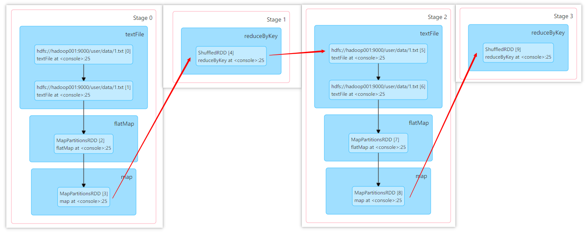
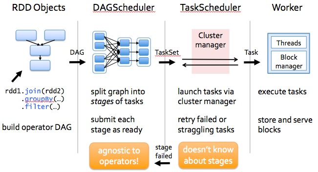

### 五、Spark核心编程

#### 5.5 RDD 依赖关系

1. RDD 血缘关系

RDD只支持粗粒度转换，即在大量记录上执行的单个操作。将创建RDD的一系列Lineage（血统）记录下来，以便恢复丢失的分区。RDD的Lineage会记录RDD的元数据信息和转换行为，当该RDD的部分分区数据丢失时，它可以根据这些信息来重新运算和恢复丢失的数据分区。

```scala
val lines: RDD[String] = sc.textFile("./hadoop-study-datas/spark/data/1.txt")
println(lines.toDebugString)
println("-----------------------------------------------")
val words: RDD[String] = lines.flatMap(_.split(" "))
println(words.toDebugString)
println("-----------------------------------------------")
val wordToOne = words.map(word => (word, 1))
println(wordToOne.toDebugString)
println("-----------------------------------------------")
val wordToSum: RDD[(String, Int)] = wordToOne.reduceByKey(_ + _)
println(wordToSum.toDebugString)
```

```scala
(1) ./hadoop-study-datas/spark/data/1.txt MapPartitionsRDD[1] at textFile at RDD_Dep.scala:13 []
 |  ./hadoop-study-datas/spark/data/1.txt HadoopRDD[0] at textFile at RDD_Dep.scala:13 []
-----------------------------------------------
(1) MapPartitionsRDD[2] at flatMap at RDD_Dep.scala:16 []
 |  ./hadoop-study-datas/spark/data/1.txt MapPartitionsRDD[1] at textFile at RDD_Dep.scala:13 []
 |  ./hadoop-study-datas/spark/data/1.txt HadoopRDD[0] at textFile at RDD_Dep.scala:13 []
-----------------------------------------------
(1) MapPartitionsRDD[3] at map at RDD_Dep.scala:19 []
 |  MapPartitionsRDD[2] at flatMap at RDD_Dep.scala:16 []
 |  ./hadoop-study-datas/spark/data/1.txt MapPartitionsRDD[1] at textFile at RDD_Dep.scala:13 []
 |  ./hadoop-study-datas/spark/data/1.txt HadoopRDD[0] at textFile at RDD_Dep.scala:13 []
-----------------------------------------------
(1) ShuffledRDD[4] at reduceByKey at RDD_Dep.scala:22 []
 +-(1) MapPartitionsRDD[3] at map at RDD_Dep.scala:19 []
    |  MapPartitionsRDD[2] at flatMap at RDD_Dep.scala:16 []
    |  ./hadoop-study-datas/spark/data/1.txt MapPartitionsRDD[1] at textFile at RDD_Dep.scala:13 []
    |  ./hadoop-study-datas/spark/data/1.txt HadoopRDD[0] at textFile at RDD_Dep.scala:13 []
```

2. RDD 依赖关系

这里所谓的依赖关系，其实就是两个相邻RDD之间的关系。

```scala
val lines: RDD[String] = sc.textFile("./hadoop-study-datas/spark/data/1.txt")
println(lines.dependencies)
println("-----------------------------------------------")
val words: RDD[String] = lines.flatMap(_.split(" "))
println(words.dependencies)
println("-----------------------------------------------")
val wordToOne = words.map(word => (word, 1))
println(wordToOne.dependencies)
println("-----------------------------------------------")
val wordToSum: RDD[(String, Int)] = wordToOne.reduceByKey(_ + _)
println(wordToSum.dependencies)
```

```scala
List(org.apache.spark.OneToOneDependency@2b53840a)
-----------------------------------------------
List(org.apache.spark.OneToOneDependency@577536e0)
-----------------------------------------------
List(org.apache.spark.OneToOneDependency@4f59a516)
-----------------------------------------------
List(org.apache.spark.ShuffleDependency@530ee28b)
```

3. RDD 窄依赖

窄依赖表示每一个父(上游)RDD的Partition最多被子（下游）RDD的一个Partition使用，窄依赖我们形象的比喻为独生子女。

```scala
class OneToOneDependency[T](rdd: RDD[T]) extends NarrowDependency [T](rdd)
```

4. RDD 宽依赖

宽依赖表示同一个父（上游）RDD的Partition被多个子（下游）RDD的Partition依赖，会引起Shuffle，总结：宽依赖我们形象的比喻为多生。

```scala
class ShuffleDependency [K: ClassTag, V: ClassTag, C: ClassTag](
@transient private val _rdd: RDD[_ <: Product2[K,
val partitioner: Partitioner,
val serializer: Serializer = SparkEnv.get.serializer,
val keyOrdering: Option[Ordering[K]] = None,
val aggregator: Option[Aggregator[K, V, C ]] =
val mapSideCombine: Boolean = false)
extends Dependency [Product2[K, V]]
```

5. RDD 阶段划分

DAG（Directed Acyclic Graph）有向无环图是由点和线组成的拓扑图形，该图形具有方向，不会闭环。例如，DAG记录了RDD的转换过程和任务的阶段。



6. RDD 任务划分

RDD任务切分中间分为：Application、Job、Stage和Task。

- **Application**：初始化一个SparkContext即生成一个Application。
- **Job**：一个Action算子就会生成一个Job。
- **Stage**：Stage等于宽依赖(ShuffleDependency)的个数加1。
- **Task**：一个Stage阶段中，最后一个RDD的分区个数就是Task的个数。

注意：Application -> Job -> Stage -> Task 每一层都是1对n的关系。




#### 5.6 RDD 持久化

1. RDD Cache缓存

RDD通过Cache或者Persist方法将前面的计算结果缓存，默认情况下会把数据以缓存在JVM的堆内存中。但是并不是这两个方法被调用时立即缓存，而是触发后面的action算子时，该RDD将会被缓存在计算节点的内存中，并供后面重用。

```scala
// cache默认持久化的操作，只能将数据保存到内存中，如果想要保存到磁盘文件，需要更改存储级别
// mapRDD.cache()

// 持久化操作必须在行动算子执行时完成的。
mapRDD.persist(StorageLevel.DISK_ONLY)
```

存储级别

```scala
object StorageLevel {
  val NONE = new StorageLevel(false, false, false, false)
  val DISK_ONLY = new StorageLevel(true, false, false, false)
  val DISK_ONLY_2 = new StorageLevel(true, false, false, false, 2)
  val DISK_ONLY_3 = new StorageLevel(true, false, false, false, 3)
  val MEMORY_ONLY = new StorageLevel(false, true, false, true)
  val MEMORY_ONLY_2 = new StorageLevel(false, true, false, true, 2)
  val MEMORY_ONLY_SER = new StorageLevel(false, true, false, false)
  val MEMORY_ONLY_SER_2 = new StorageLevel(false, true, false, false, 2)
  val MEMORY_AND_DISK = new StorageLevel(true, true, false, true)
  val MEMORY_AND_DISK_2 = new StorageLevel(true, true, false, true, 2)
  val MEMORY_AND_DISK_SER = new StorageLevel(true, true, false, false)
  val MEMORY_AND_DISK_SER_2 = new StorageLevel(true, true, false, false, 2)
  val OFF_HEAP = new StorageLevel(true, true, true, false, 1)
  
  // ......
  }

class StorageLevel private(
    private var _useDisk: Boolean,
    private var _useMemory: Boolean,
    private var _useOffHeap: Boolean,
    private var _deserialized: Boolean,
    private var _replication: Int = 1)
  extends Externalizable {
```

| 级别                | 使用的空间 | CPU时间 | 是否在内存中 | 是否在磁盘上 | 备注                                                         |
| ------------------- | ---------- | ------- | ------------ | ------------ | ------------------------------------------------------------ |
| MEMORY_ONLY         | 高         | 低      | 是           | 否           |                                                              |
| MEMORY_ONLY_SER     | 低         | 噶      | 是           | 否           |                                                              |
| MEMORY_AND_DISK     | 高         | 中等    | 部分         | 部分         | 如果数据在内存中放不下，则溢写到磁盘上                       |
| MEMORY_AND_DISK_SER | 低         | 高      | 部分         | 部分         | 如果数据在内存中放不下，则溢写到磁盘上。在内存中存放序列化后的数据 |
| DISK_ONLY           | 低         | 高      | 否           | 是           |                                                              |

缓存有可能丢失，或者存储于内存的数据由于内存不足而被删除，RDD的缓存容错机制保证了即使缓存丢失也能保证计算的正确执行。通过基于RDD的一系列转换，丢失的数据会被重算，由于RDD的各个Partition是相对独立的，因此只需要计算丢失的部分即可，并不需要重算全部Partition。

Spark会自动对一些Shuffle操作的中间数据做持久化操作(比如：reduceByKey)。这样做的目的是为了当一个节点Shuffle失败了避免重新计算整个输入。但是，在实际使用的时候，如果想重用数据，仍然建议调用persist或cache。

2. RDD CheckPoint检查点

所谓的检查点其实就是通过将RDD中间结果写入磁盘。

由于血缘依赖过长会造成容错成本过高，这样就不如在中间阶段做检查点容错，如果检查点之后有节点出现问题，可以从检查点开始重做血缘，减少了开销。

对RDD 进行 checkpoint 操作并不会马上被执行，必须执行 Action 操作才能触发。

```scala
// 设置检查点路径
sc. setCheckpointDir ("./cp")
// 创建一个 RDD ，读取指定位置文件 :hello atguigu atguigu
val lineRdd: RDD[String] = sc.textFile("input/1.txt")
// 业务逻辑
val wordRdd: RDD[String] = lineRdd.flatMap(line => line.split(" "))
val wordToOneRdd: RDD[(String, Long)] = wordRdd.map {
	word => {(word, System.currentTimeMillis())}
}
// 增加缓存 避免再重新跑一个 job 做 checkpoint
wordToOneRdd.cache()
// 数据检查点：针对 wordToOneRdd 做检查点计算
wordToOneRdd. checkpoint
// 触发执行逻辑
wordToOneRdd.collect().foreach(println)
```

3. 缓存和检查点区别

- Cache缓存只是将数据保存起来，不切断血缘依赖。Checkpoint检查点切断血缘依赖。
- Cache缓存的数据通常存储在磁盘、内存等地方，可靠性低。Checkpoint的数据通常存储在HDFS等容错、高可用的文件系统，可靠性高。
- 建议对checkpoint()的RDD使用Cache缓存，这样checkpoint的job只需从Cache缓存中读取数据即可，否则需要再从头计算一次RDD。

#### 5.6 RDD 分区器

Spark目前支持Hash分区和Range分区，和用户自定义分区。Hash分区为当前的默认分区。分区器直接决定了RDD中分区的个数、RDD中每条数据经过Shuffle后进入哪个分区，进而决定了Reduce的个数。

只有Key-Value类型的RDD才有分区器，非Key-Value类型的RDD分区的值是None

每个RDD的分区ID范围：0 ~ (numPartitions - 1)，决定这个值是属于那个分区的。

1. Hash分区

对于给定的key，计算其hashCode,并除以分区个数取余。

```scala
class HashPartitioner(partitions: Int) extends Partitioner {
  require(partitions >= 0, s"Number of partitions ($partitions) cannot be negative.")

  def numPartitions: Int = partitions

  def getPartition(key: Any): Int = key match {
    case null => 0
    case _ => Utils.nonNegativeMod(key.hashCode, numPartitions)
  }

  override def equals(other: Any): Boolean = other match {
    case h: HashPartitioner =>
      h.numPartitions == numPartitions
    case _ =>
      false
  }

  override def hashCode: Int = numPartitions
}
```

2. Range分区

将一定范围内的数据映射到一个分区中，尽量保证每个分区数据均匀，而且分区间有序。

```scala
class RangePartitioner[K : Ordering : ClassTag, V](
    partitions: Int,
    rdd: RDD[_ <: Product2[K, V]],
    private var ascending: Boolean = true,
    val samplePointsPerPartitionHint: Int = 20)
  extends Partitioner {

  // This is added to make sure from a bytecode point of view, there is still a 3-arg ctor.
  def this(partitions: Int, rdd: RDD[_ <: Product2[K, V]], ascending: Boolean) = {
    this(partitions, rdd, ascending, samplePointsPerPartitionHint = 20)
  }

      
  private var ordering = implicitly[Ordering[K]]

  // An array of upper bounds for the first (partitions - 1) partitions
  private var rangeBounds: Array[K] = {
    if (partitions <= 1) {
      Array.empty
    } else {
      // This is the sample size we need to have roughly balanced output partitions, capped at 1M.
      // Cast to double to avoid overflowing ints or longs
      val sampleSize = math.min(samplePointsPerPartitionHint.toDouble * partitions, 1e6)
      // Assume the input partitions are roughly balanced and over-sample a little bit.
      val sampleSizePerPartition = math.ceil(3.0 * sampleSize / rdd.partitions.length).toInt
      val (numItems, sketched) = RangePartitioner.sketch(rdd.map(_._1), sampleSizePerPartition)
      if (numItems == 0L) {
        Array.empty
      } else {
        // If a partition contains much more than the average number of items, we re-sample from it
        // to ensure that enough items are collected from that partition.
        val fraction = math.min(sampleSize / math.max(numItems, 1L), 1.0)
        val candidates = ArrayBuffer.empty[(K, Float)]
        val imbalancedPartitions = mutable.Set.empty[Int]
	    // ......
    }
  }

  def numPartitions: Int = rangeBounds.length + 1

  private var binarySearch: ((Array[K], K) => Int) = CollectionsUtils.makeBinarySearch[K]

  def getPartition(key: Any): Int = {
    val k = key.asInstanceOf[K]
    var partition = 0
    if (rangeBounds.length <= 128) {
      // If we have less than 128 partitions naive search
      while (partition < rangeBounds.length && ordering.gt(k, rangeBounds(partition))) {
        partition += 1
      }
    } else {
      // Determine which binary search method to use only once.
      partition = binarySearch(rangeBounds, k)
      // binarySearch either returns the match location or -[insertion point]-1
      if (partition < 0) {
        partition = -partition-1
      }
      if (partition > rangeBounds.length) {
        partition = rangeBounds.length
      }
    }
    if (ascending) {
      partition
    } else {
      rangeBounds.length - partition
    }
  }

  override def equals(other: Any): Boolean = other match {
  	// .......
  }

  override def hashCode(): Int = {
 	// ......
  }

  @throws(classOf[IOException])
  private def writeObject(out: ObjectOutputStream): Unit = Utils.tryOrIOException {
  	// ......
  }

  @throws(classOf[IOException])
  private def readObject(in: ObjectInputStream): Unit = Utils.tryOrIOException {
    // ......
  }
}
```

