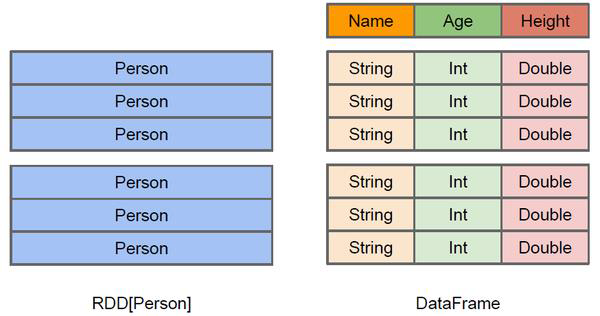
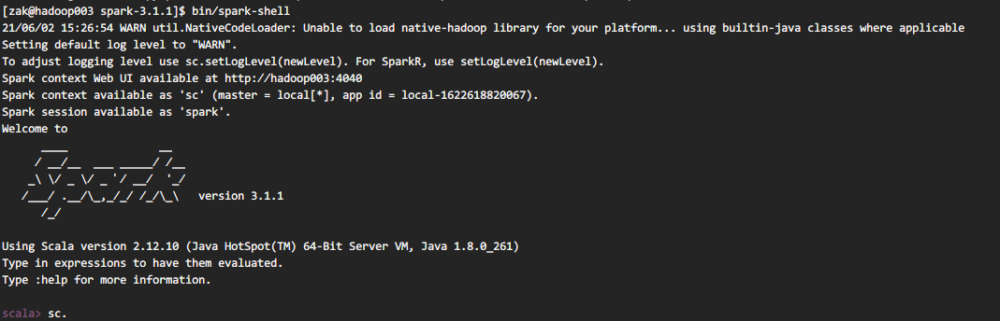
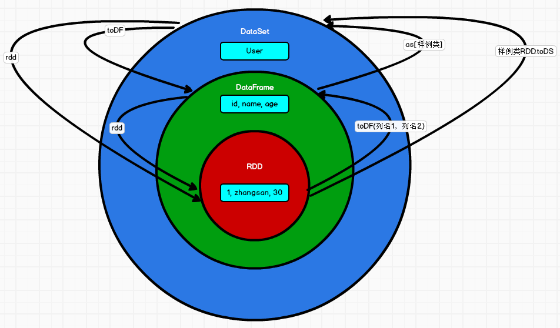

### 五、SparkSQL

#### 5.1 SparkSQL 概述

SparkSQL是Spark用于结构化数据(structured data)处理的Spark模块。

#### 5.2 SparkSQL 特点

1. 易整合：无缝的整合了 SQL 查询和 Spark 编程。
2. 统一的数据访问：使用相同的方式连接不同的数据源。
3. 兼容 Hive：在已有的仓库上直接运行 SQL 或者 HiveQL。
4. 标准数据连接： 通过 JDBC 或者 ODBC 来连接。

#### 5.3 DataFrame 是什么

在Spark中，DataFrame是一种以RDD为基础的分布式数据集，类似于传统数据库中的二维表格。DataFrame与RDD的主要区别在于，前者带有schema元信息，即DataFrame所表示的二维表数据集的每一列都带有名称和类型。



上图直观地体现了DataFrame和RDD的区别。左侧的RDD[Person]虽然以Person为类型参数，但Spark框架本身不了解Person类的内部结构。而右侧的DataFrame却提供了详细的结构信息，使得 Spark SQL 可以清楚地知道该数据集中包含哪些列，每列的名称和类型各是什么。

#### 5.4 DataSet 是什么

DataSet是分布式数据集合。DataSet是Spark 1.6中添加的一个新抽象，是DataFrame的一个扩展。它提供了RDD的优势（强类型，使用强大的lambda函数的能力）以及Spark SQL优化执行引擎的优点。DataSet也可以使用功能性的转换（操作map，flatMap，filter等等）。

1. DataSet是DataFrame API的一个扩展，是SparkSQL最新的数据抽象。
2. 用户友好的API风格，既具有类型安全检查也具有DataFrame的查询优化特性。
3. 用样例类来对DataSet中定义数据的结构信息，样例类中每个属性的名称直接映射到DataSet中的字段名称。
4. DataSet是强类型的。比如可以有DataSet[Car]，DataSet[Person]。
5. DataFrame是DataSet的特列，DataFrame=DataSet[Row]，所以可以通过as方法将DataFrame转换为DataSet。Row是一个类型，跟Car、Person这些的类型一样，所有的表结构信息都用Row来表示。获取数据时需要指定顺序。


### 六、SparkSQL 核心编程

#### 6.1 SparkSession

Spark Core中，如果想要执行应用程序，需要首先构建上下文环境对象SparkContext，Spark SQL其实可以理解为对Spark Core的一种封装，不仅仅在模型上进行了封装，上下文环境对象也进行了封装。

SparkSession是Spark最新的SQL查询起始点，实质上是SQLContext和HiveContext的组合。SparkSession内部封装了SparkContext，所以计算实际上是由SparkContext完成的。当我们使用 spark-shell 的时候, spark框架会自动的创建一个名称叫做spark的SparkSession对象, 就像我们以前可以自动获取到一个sc来表示SparkContext对象一样。



#### 6.2 基础编程

```scala
val conf = new SparkConf().setAppName("sparkSQL").setMaster("local[*]")
val spark = SparkSession.builder().config(conf).getOrCreate()
// 读取文件
val df = spark.read.json("./hadoop-study-datas/spark/sql/user.json")

// 1. 创建全局视图
df.createGlobalTempView("user")
spark.sql("select * from global_temp.user").show()

// 2. 创建Session的视图
df.createOrReplaceTempView("user")
spark.sql("select * from user").show()

// 3. 添加函數
spark.sql("select avg(age) from user").show()

// 4. DSL指定列
df.select("name", "age").show()

// 5. 結果运算
import spark.implicits._
df.select('age + 1).show()
df.select($"age" + 1).show()

// 6. DataSet
val seq = Seq(1, 2, 3, 4)
val ds: Dataset[Int] = seq.toDS()
ds.show()

// 7. RDD <=> DataFrame
val rdd = spark.sparkContext.makeRDD(List((1, "zhangsan", 30), (2, "lisi", 40)))
val df2 = rdd.toDF("id", "name", "age")
val rowRdd: RDD[Row] = df2.rdd
// [1,zhangsan,30]
// [2,lisi,40]
rowRdd.collect().foreach(println)

// 8. RDD <=> DataSet
val ds1: Dataset[User] = rdd.map {
    case (id, name, age) =>
    User(id, name, age)
}.toDS()

val userRdd: RDD[User] = ds1.rdd

// User(1,zhangsan,30)
// User(2,lisi,40)
userRdd.collect().foreach(println)


// User 样例类
case class User(id: Int, name: String, age: Int)
```

#### 6.3 RDD、DataFrame、DataSet 三者的关系

在SparkSQL中Spark为我们提供了两个新的抽象，分别是DataFrame和DataSet。他们和RDD有什么区别呢？首先从版本的产生上来看：

- Spark1.0 => RDD

- Spark1.3 => DataFrame

- Spark1.6 => Dataset

如果同样的数据都给到这三个数据结构，他们分别计算之后，都会给出相同的结果。不同是的他们的执行效率和执行方式。在后期的Spark版本中，DataSet有可能会逐步取代RDD和DataFrame成为唯一的API接口。

##### 三者的共性

1. RDD、DataFrame、DataSet全都是spark平台下的分布式弹性数据集，为处理超大型数据提供便利。
2. 三者都有惰性机制，在进行创建、转换，如map方法时，不会立即执行，只有在遇到Action如foreach时，三者才会开始遍历运算。
3. 三者有许多共同的函数，如filter，排序等。
4. 在对DataFrame和Dataset进行操作许多操作都需要这个包:import spark.implicits._（在创建好SparkSession对象后尽量直接导入）。
5. 三者都会根据 Spark 的内存情况自动缓存运算，这样即使数据量很大，也不用担心会内存溢出。
6. 三者都有partition的概念。
7. DataFrame和DataSet均可使用模式匹配获取各个字段的值和类型。

##### 三者的区别

1. RDD
    - RDD一般和Spark MLlib同时使用
    - RDD不支持SparkSQL操作
2. DataFrame
     - 与RDD和Dataset不同，DataFrame每一行的类型固定为Row，每一列的值没法直接访问，只有通过解析才能获取各个字段的值。
     - DataFrame与DataSet一般不与SparkMLlib 同时使用。
    - DataFrame与DataSet均支持SparkSQL 的操作，比如select，groupby之类，还能注册临时表/视窗，进行 sql 语句操作。
    - DataFrame与DataSet支持一些特别方便的保存方式，比如保存成csv，可以带上表头，这样每一列的字段名一目了然(后面专门讲解)。

3. DataSet
 - Dataset和DataFrame拥有完全相同的成员函数，区别只是每一行的数据类型不同。DataFrame其实就是DataSet的一个特例 type DataFrame = Dataset[Row]。
 - DataFrame也可以叫 Dataset[Row]，每一行的类型是Row，不解析，每一行究竟有哪些字段，各个字段又是什么类型都无从得知，只能用上面提到的getAS方法或者共性中的第七条提到的模式匹配拿出特定字段。而Dataset中，每一行是什么类型是不一定的，在自定义了case class之后可以很自由的获得每一行的信息。

##### 三者的互相转换



#### 6.4 用户自定义函数

用户可以通过spark.udf功能添加自定义函数，实现自定义功能。

1. UDF

```scala
// 读取文件
val df = spark.read.json("./hadoop-study-datas/spark/sql/user.json")

// 2. 创建Session的视图
df.createOrReplaceTempView("user")

// 3. 添加UDF函数
spark.udf.register("prefix", (name: String) => {
    "name: " + name
})

// 4. 查询
spark.sql("select age, prefix(name) from user").show
```

2. UDAF

强类型的Dataset和弱类型的DataFrame都提供了相关的聚合函数， 如 count()，countDistinct()，avg()，max()，min()。除此之外，用户可以设定自己的自定义聚合函数。通过继承UserDefinedAggregateFunction来实现用户自定义弱类型聚合函数。从Spark3.0版本后，UserDefinedAggregateFunction已经不推荐使用了。可以统一采用强类型聚合函数。

- UDAF-弱类型

```scala
def main(args: Array[String]): Unit = {

    // 创建SparkSQL的运行环境
    val sparkConf = new SparkConf().setMaster("local[*]").setAppName("SparkSQL_UDAF")
    val spark = SparkSession.builder().config(sparkConf).getOrCreate()

    // 读取文件
    val df = spark.read.json("./hadoop-study-datas/spark/sql/user.json")
    df.createOrReplaceTempView("user")

    // 2. 注册聚合函数
    spark.udf.register("avg", new AvgAggFunction())

    // 3. 使用聚合函数
    spark.sql("select avg(age) as avgValue from user").show

    // 4. 关闭环境
    spark.close()
}

/*
     自定义聚合函数类：计算年龄的平均值
     1. 继承 UserDefinedAggregateFunction
     2. 重写方法(8)
     */
class AvgAggFunction extends UserDefinedAggregateFunction {
    // 输入数据类型
    override def inputSchema: StructType = StructType {
        // 名称跟字段名称无关
        Array(StructField("age", LongType))
    }

    // 缓冲区类型
    override def bufferSchema: StructType = StructType {
        StructType(
            Array(
                StructField("total", LongType),
                StructField("count", LongType)
            )
        )
    }

    // 函数计算结果的数据类型：Out
    override def dataType: DataType = DoubleType

    // 函数的稳定性
    override def deterministic: Boolean = true

    // 初始化
    override def initialize(buffer: MutableAggregationBuffer): Unit = {
        buffer.update(0, 0L)
        buffer.update(1, 0L)
    }

    // 更新
    override def update(buffer: MutableAggregationBuffer, input: Row): Unit = {
        buffer.update(0, buffer.getLong(0) + input.getLong(0))
        buffer.update(1, buffer.getLong(1) + 1)
    }

    // 合并
    override def merge(buffer1: MutableAggregationBuffer, buffer2: Row): Unit = {
        buffer1.update(0, buffer1.getLong(0) + buffer2.getLong(0))
        buffer1.update(1, buffer1.getLong(1) + buffer2.getLong(1))
    }

    // 计算平均值
    override def evaluate(buffer: Row): Any = buffer.getLong(0).toDouble / buffer.getLong(1)
}
```

- UDAF-强类型

```scala
def main(args: Array[String]): Unit = {

    // 创建SparkSQL的运行环境
    val sparkConf = new SparkConf().setMaster("local[*]").setAppName("SparkSQL_UDAF")
    val spark = SparkSession.builder().config(sparkConf).getOrCreate()

    // 读取文件
    val df = spark.read.json("./hadoop-study-datas/spark/sql/user.json")
    df.createOrReplaceTempView("user")

    // 2. 注册聚合函数
    spark.udf.register("avg", functions.udaf(new AvgAggFunction))

    // 3. 使用聚合函数
    spark.sql("select avg(age) as avgValue from user").show

    // 4. 关闭环境
    spark.close()
}

case class Buffer(var total: Long, var count: Long)

/*
     自定义聚合函数类：计算年龄的平均值
     1. 继承 UserDefinedAggregateFunction
     2. 重写方法(8)
     */
class AvgAggFunction extends Aggregator[Long, Buffer, Double] {
    // z & zero : 初始值或零值
    // 缓冲区的初始化
    override def zero: Buffer = Buffer(0L, 0L)

    // 根据输入的数据更新缓冲区的数据
    override def reduce(buf: Buffer, age: Long): Buffer = {
        buf.total += age
        buf.count += 1
        buf
    }

    // 合并缓冲区
    override def merge(pre: Buffer, next: Buffer): Buffer = {
        pre.total += next.total
        pre.count += next.count
        pre
    }

    //计算结果
    override def finish(reduction: Buffer): Double = {
        reduction.total.toDouble / reduction.count
    }

    // 缓冲区的编码操作
    override def bufferEncoder: Encoder[Buffer] = Encoders.product

    // 输出的编码操作
    override def outputEncoder: Encoder[Double] = Encoders.scalaDouble
}
```

- UDAF-强类型-DSL

```scala
def main(args: Array[String]): Unit = {

    // 创建SparkSQL的运行环境
    val sparkConf = new SparkConf().setMaster("local[*]").setAppName("SparkSQL_UDAF")
    val spark = SparkSession.builder().config(sparkConf).getOrCreate()

    // 读取文件
    val df = spark.read.json("./hadoop-study-datas/spark/sql/user.json")
    df.createOrReplaceTempView("user")

    // 早期版本中，spark不能在sql中使用强类型UDAF操作
    // SQL & DSL
    // 早期的UDAF强类型聚合函数使用DSL语法操作
    import spark.implicits._
    val ds: Dataset[User] = df.as[User]

    // 将UDAF函数转换为查询的列对象
    val udafCol: TypedColumn[User, Double] = new AvgAggFunction().toColumn

    // 查询 DSL
    ds.select(udafCol).show

    // 4. 关闭环境
    spark.close()
}

/**
     * 用户对象
     *
     * @param name  名称
     * @param age   年龄
     * @param email 邮箱
     */
case class User(name: String, age: Long, email: String)

case class Buffer(var total: Long, var count: Long)

/*
     自定义聚合函数类：计算年龄的平均值
     1. 继承 UserDefinedAggregateFunction
     2. 重写方法(8)
     */
class AvgAggFunction extends Aggregator[User, Buffer, Double] {
    // z & zero : 初始值或零值
    // 缓冲区的初始化
    override def zero: Buffer = Buffer(0L, 0L)

    // 根据输入的数据更新缓冲区的数据
    override def reduce(buf: Buffer, user: User): Buffer = {
        buf.total += user.age
        buf.count += 1
        buf
    }

    // 合并缓冲区
    override def merge(pre: Buffer, next: Buffer): Buffer = {
        pre.total += next.total
        pre.count += next.count
        pre
    }

    //计算结果
    override def finish(reduction: Buffer): Double = {
        reduction.total.toDouble / reduction.count
    }

    // 缓冲区的编码操作
    override def bufferEncoder: Encoder[Buffer] = Encoders.product

    // 输出的编码操作
    override def outputEncoder: Encoder[Double] = Encoders.scalaDouble
}
```

#### 6.5 数据的加载和保存

##### 加载和保存方式

SparkSQL提供了通用的保存数据和数据加载的方式。这里的通用指的是使用相同的API，根据不同的参数读取和保存不同格式的数据，SparkSQL默认读取和保存的文件格式为parquet。

1. 加载数据

```
scala> spark.read.
csv   format   jdbc   json   load   option   options   orc   parquet   schema   table   text   textFile
```

如果读取不同格式的数据，可以对不同的数据格式进行设定

```shell
scala> spark.read.format("...")[option("...")].load("...")
```

- **format("…")**：指定加载的数据类型，包括csv、jdbc、json、orc、parquet和textFile。
- **load("…")**：在csv、jdbc、json、orc、parquet和textFile格式下需要传入加载数据的路径。
- **option("…")**：在jdbc格式下需要传入JDBC相应参数，url、user、password和dbtable。

我们前面都是使用read API 先把文件加载到 DataFrame然后再查询，其实，我们也可以直接在文件上进行查询: 文件格式.`文件路径`

```shell
scala>spark.sql("select * from json ..`/opt/module/data/user.json`").show
```

2. 保存数据

```shell
scala> df.write.
bucketBy   csv   format   insertInto   jdbc   json   mode   option   options   orc   parquet   partitionBy   save   saveAsTable   sortBy   text
```

如果保存不同格式的数据，可以对不同的数据格式进行设定。

```shell
scala> df.write.format("...")[option("...")].save("...")
```

- **format("…")**：指定保存的数据类型，包括csv、jdbc、json、orc、parquet和textFile。
- **save ("…")**：在csv、orc、parquet和textFile格式下需要传入保存数据的路径。
- **option("…")**：在jdbc格式下需要传入JDBC相应参数，url、user、password和dbtable。

保存操作可以使用 SaveMode, 用来指明如何处理数据，使用mode()方法来设置。有一点很重要: 这些 SaveMode 都是没有加锁的, 也不是原子操作。

SaveMode是一个枚举类，其中的常量包括：

| 模式                            | 含义                       | 备注 |
| ------------------------------- | -------------------------- | ---- |
| SaveMode.ErrorIfExists(default) | 如果文件已经存在则抛出异常 | 默认 |
| SaveMode.Append                 | 如果文件已经存在则追加     | -    |
| SaveMode.Overwrite              | 如果文件已经存在则覆盖     | -    |
| SaveMode.Ignore                 | 如果文件已经存在则忽略     | -    |

##### 案例实操

1. mysql

- 查询操作

```scala
val conf = new SparkConf().setMaster("local[*]").setAppName("SparkSQL_JDBC")
val spark = SparkSession.builder().config(conf).getOrCreate()

// 连接数据库
val properties = new Properties()
properties.setProperty("driver", "com.mysql.cj.jdbc.Driver")
properties.setProperty("user", "root")
properties.setProperty("password", "123456")
val df = spark.read.jdbc("jdbc:mysql://localhost:3306/metastore", "columns_v2", properties)

// 1. 显示结果
df.show()

// 2. 查询 DSL
df.createOrReplaceTempView("columns")
df.select("CD_ID", "COLUMN_NAME", "TYPE_NAME", "INTEGER_IDX").show()

// 3. SQL
spark.sql("select * from columns where CD_ID = 22").show()

// 关闭
spark.stop()
```

- 写入操作

```scala
val conf = new SparkConf().setMaster("local[*]").setAppName("SparkSQL_UDF")
val spark = SparkSession.builder().config(conf).getOrCreate()

// 读取文件
val df = spark.read.json("./hadoop-study-datas/spark/sql/user.json")

// 1. 写入数据库
df.write.format("jdbc")
.option("url", "jdbc:mysql://localhost:3306/spark-sql")
.option("driver", "com.mysql.cj.jdbc.Driver")
.option("user", "root")
.option("password", "123456")
.option("dbtable", "user")
.mode(SaveMode.Append)
.save()

// 关闭
spark.stop()
```

1. hive

- 内嵌的HIVE

如果使用 Spark 内嵌的 Hive, 则什么都不用做, 直接使用即可。Hive 的元数据存储在 derby 中, 默认仓库地址:$SPARK_HOME/spark-warehouse

```shell
scala> spark.sql("show tables").show
+--------+---------+-----------+
|database|tableName|isTemporary|
+--------+---------+-----------+
+--------+---------+-----------+

scala> spark.sql("create table user(id int, name string)")

scala> spark.sql("show tables").show
+--------+---------+-----------+
|database|tableName|isTemporary|
+--------+---------+-----------+
| default|     user|      false|
+--------+---------+-----------+

scala> spark.sql("load data local inpath './data/user.txt' into table user")

scala> spark.sql("select * from user").show
+--------------------+----+                                                     
|            username| age|
+--------------------+----+
|zak                 |18  |
+--------------------+----+
```

- 外部的HIVE

如果想连接外部已经部署好的Hive，需要通过以下几个步骤：

1. Spark要接管Hive需要把hive-site.xml拷贝到conf/目录下
2. 把Mysql的驱动copy到jars/目录下
3. 如果访问不到hdfs，则需要把core-site.xml和hdfs-site.xml拷贝到conf/目录下
4. 重启spark-shell

- 代码操作Hive

```scala
//  创建SparkSQL的运行环境
val sparkConf = new SparkConf().setMaster("local[*]").setAppName("SparkSQL_Hive1")
val spark = SparkSession.builder().enableHiveSupport().config(sparkConf).getOrCreate()

spark.sql("use spark_sql")

// 准备数据
spark.sql(
    """
    |CREATE TABLE IF NOT EXISTS `user_visit_action` (
    |  `date` string,
    |  `user_id` bigint,
    |  `session_id` string,
    |  `page_id` bigint,
    |  `action_time` string,
    |  `search_keyword` string,
    |  `click_category_id` bigint,
    |  `click_product_id` bigint,
    |  `order_category_ids` string,
    |  `order_product_ids` string,
    |  `pay_category_ids` string,
    |  `pay_product_ids` string,
    |  `city_id` bigint)
    |row format delimited fields terminated by '\t'
    """.stripMargin)

spark.sql(
    """
    |load data local inpath './hadoop-study-datas/spark/sql/user_visit_action.txt' into table spark_sql
    |.user_visit_action
    """.stripMargin)

spark.sql(
    """
    |CREATE TABLE IF NOT EXISTS  `product_info` (
    |  `product_id` bigint,
    |  `product_name` string,
    |  `extend_info` string)
    |row format delimited fields terminated by '\t'
    """.stripMargin)

spark.sql(
    """
    |load data local inpath './hadoop-study-datas/spark/sql/product_info.txt' into table spark_sql.product_info
    """.stripMargin)

spark.sql(
    """
    |CREATE TABLE IF NOT EXISTS  `city_info` (
    |  `city_id` bigint,
    |  `city_name` string,
    |  `area` string)
    |row format delimited fields terminated by '\t'
    """.stripMargin)

spark.sql(
    """
    |load data local inpath './hadoop-study-datas/spark/sql/city_info.txt' into table spark_sql.city_info
    """.stripMargin)

spark.sql("""select * from city_info""").show

// 2. 关闭环境
spark.close()
```

