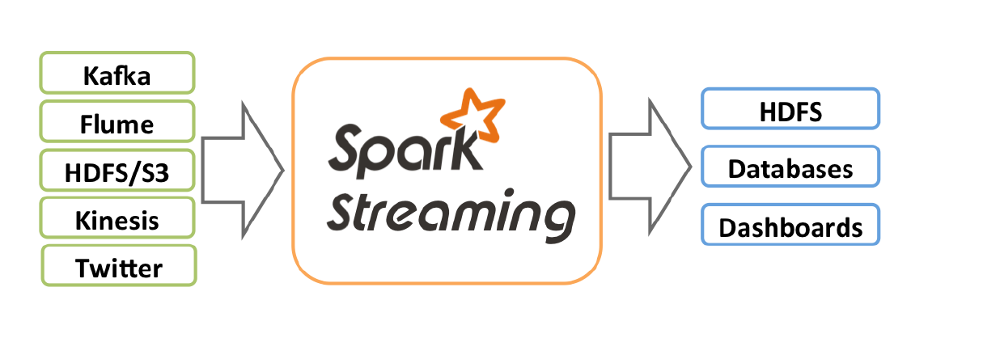
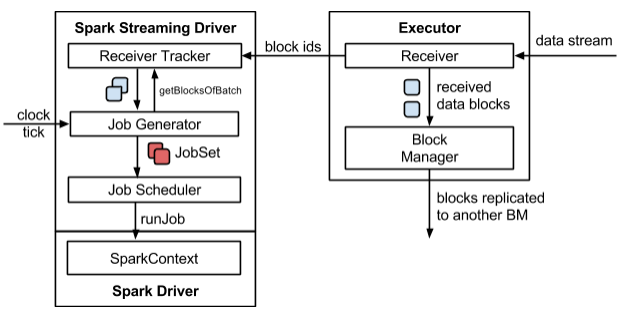
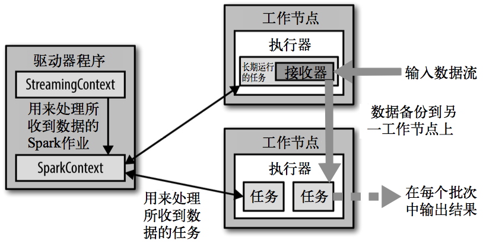
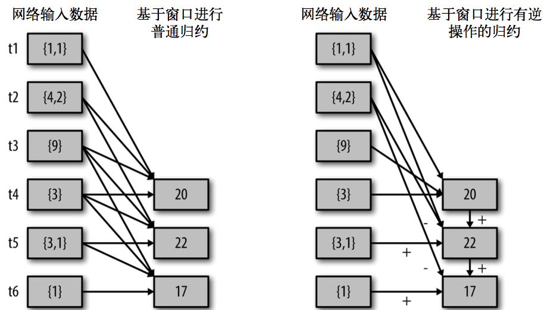

### 七、Spark Streaming

#### 7.1 Spark Streaming概述

Spark Streaming用于流式数据的处理。Spark Streaming支持的数据输入源很多，例如：Kafka、Flume、Twitter、ZeroMQ和简单的TCP套接字等。数据输入后可以用 Spark的高度抽象原语如：map、reduce、join、window等进行运算。而结果也能保存在很多地方，如 HDFS，数据库等。



和Spark基于RDD的概念很相似， Spark Streaming 使用离散化流(discretized stream)作为抽象表示，叫作DStream。DStream是随时间推移而收到的数据的序列。在内部，每个时间区间收到的数据都作为RDD存在，而DStream是由这些RDD所组成的序列 (因此得名"离散化")。所以简单来将，DStream就是对RDD在实时数据处理场景的一种封装。

#### 7.2 Spark Streaming的特点
1. 易用
2. 容错
3. 易整合到Spark体系

#### 7.3 Spark Streaming架构

1. 整体架构图



2. SparkStreaming架构图



3. 背压机制

Spark 1.5以前版本，用户如果要限制 Receiver的数据接收速率，可以通过设置静态配制参数 **spark.streaming.receiver.maxRate** 的值来实现，此举虽然可以通过限制接收速率，来适配当前的处理能力，防止内存溢出，但也会引入其它问题。比如：Producer数据生产高于maxRate，当前集群处理能力也高于maxRate，这就会造成资源利用率下降等问题。

为了更好的协调数据接收速率与资源处理能力，1.5版本开始 Spark Streaming可以动态控制数据接收速率来适配集群数据处理能力。 

背压机制（即Spark Streaming Backpressure）: 根据JobScheduler反馈作业的执行信息来动态调整 Receiver数据接收率。通过属性 **spark.streaming.backpressure.enabled** 来控制是否启用 backpressure机制，默认值false，即不启用。

#### 7.4 Dstream 入门

##### 1.Hello World

```scala
// 第一个参数表示环境配置
val conf = new SparkConf().setMaster("local[*]").setAppName("WordCount")
// 第二个参数表示批量处理的周期（采集周期）
val ssc = new StreamingContext(conf, Seconds(3))

// 获取端口数据
val lines = ssc.socketTextStream("hadoop002", 9999)
// 切分字符串
val words = lines.flatMap(_.split(" "))

val wordToOne = words.map((_, 1))

val wordToCount = wordToOne.reduceByKey(_ + _)
// 打印
wordToCount.print()

// 1. 启动采集器
ssc.start()
// 2. 等待采集器的关闭
ssc.awaitTermination()
```

启动程序并通过 netcat发送数据：

```shell
[zak@hadoop002 module]$ nc -l -p 9999
```

##### 2.自定义数据源

需要继承Receiver，并实现onStart、onStop方法来自定义数据源采集。

```scala
/*
  自定义数据采集器
  1. 继承Receiver，定义泛型, 传递参数
  2. 重写方法
 */
class CustomReceiver extends Receiver[String](StorageLevel.MEMORY_ONLY) {

    private var flg = true

    override def onStart(): Unit = {
        new Thread(() => {
            while (flg) {
                val message = "采集的数据为：" + new Random().nextInt(10).toString
                store(message)
                Thread.sleep(500)
            }
        }).start()
    }

    override def onStop(): Unit = {
        flg = false
    }
}
```

使用自定义的数据采集器采集数据。

```scala
// 第一个参数表示环境配置
val conf = new SparkConf().setMaster("local[*]").setAppName("SparkStreaming03_DIY")

// 第二个参数表示批量处理的周期（采集周期）
val ssc = new StreamingContext(conf, Seconds(3))
val messageDStream: ReceiverInputDStream[String] = ssc.receiverStream(new CustomReceiver())

// 打印数据
messageDStream.print()
// 1. 启动采集器
ssc.start()
// 2. 等待采集器的关闭
ssc.awaitTermination()
```

##### 3.Kafka数据源

**ReceiverAPI**：需要一个专门的Executor去接收数据，然后发送给其他的Executor做计算。存在的问题，接收数据的Executor和计算的Executor速度会有所不同，特别在接收数据的Executor速度大于计算的Executor速度，会导致计算数据的节点内存溢出。早期版本中提供此方式，当前版本不适用。

**DirectAPI**：是由计算的Executor来主动消费Kafka的数据，速度由自身控制。

```scala
// 第一个参数表示环境配置
val conf = new SparkConf().setMaster("local[*]").setAppName("SparkStreaming04_Kafka")
val ssc = new StreamingContext(conf, Seconds(3))

val kafkaParam = Map[String, Object](
    ConsumerConfig.BOOTSTRAP_SERVERS_CONFIG -> "hadoop002:9092",
    ConsumerConfig.GROUP_ID_CONFIG -> "sparkStreaming",
    ConsumerConfig.KEY_DESERIALIZER_CLASS_CONFIG -> "org.apache.kafka.common.serialization.StringDeserializer",
    ConsumerConfig.VALUE_DESERIALIZER_CLASS_CONFIG -> "org.apache.kafka.common.serialization.StringDeserializer"
)

val kafkaDataDS = KafkaUtils.createDirectStream[String, String](
    ssc,
    LocationStrategies.PreferConsistent,
    ConsumerStrategies.Subscribe[String, String](Set("topic_streaming"), kafkaParam)
)

//打印数据
kafkaDataDS.map(_.value()).print()

// 1. 启动采集器
ssc.start()
// 2. 等待采集器的关闭
ssc.awaitTermination()
```

#### 7.5 DStream 转换

DStream上的操作与RDD的类似，分为Transform Operations（转换）和Output Operations（输出）两种，此外转换操作中还有一些比较特殊的原语，如：updateStateByKey()、transform() 以及各种 Window 相关的原语。

##### 无状态转化操作

无状态转化操作就是把简单的RDD转化操作应用到每个批次上，也就是转化DStream中的每一个RDD。部分无状态转化操作列在了下表中。

注意：针对键值对的 DStream 转化操作(比如 reduceByKey())要添加 **import StreamingContext._** 才能在Scala中使用。

| 函数名称      | 目的                                                         | 示例                            | 用户自定义函数的签名 |
| ------------- | ------------------------------------------------------------ | ------------------------------- | -------------------- |
| map()         | 对DStream中的每个元素应用给定函数，返回由各元素输出的元素组成的DStream。 | ds.map(x=>x+1)                  | f: (T) -> U          |
| flatMap()     | 对DStream中的每个元素应用给定函数，返回由各元素输出的迭代器组成的DStream。 | ds.flatMap(x=>x.split(" "))     | f: T -> Iterable[U]  |
| filter()      | 返回由给定DStream中通过筛选的元素组成的DStream。             | ds.filter(x=>x != 1)            | f: T -> Boolean      |
| repartition() | 改变DStream的分区数。                                        | ds.repartition(10)              | N/A                  |
| reduceByKey() | 将每个批次中键相同的记录规约。                               | ds.reduceByKey((x, y) => x + y) | f: T, T -> T         |
| groupByKey()  | 将每个批次中的记录根据键分组。                               | ds.groupByKey()                 | N/A                  |

1. transform

Transform允许DStream上执行任意的RDD-to-RDD函数。即使这些函数并没有在DStream的API中暴露出来，通过该函数可以方便的扩展Spark API。该函数每一批次调度一次。其实也就是对DStream中的RDD应用转换。

```scala
// 第一个参数表示环境配置
val conf = new SparkConf().setMaster("local[*]").setAppName("SparkStreaming06_Transform")

val ssc = new StreamingContext(conf, Seconds(3))

val lines = ssc.socketTextStream("hadoop002", 9999)

// transform方法可以将底层RDD获取到后进行操作
// 1. DStream功能不完善
// 2. 需要代码周期性的执行

// Code : Driver端
val newDS: DStream[String] = lines.transform(
    rdd => {
        // Code : Driver端，（周期性执行）
        rdd.map(
            str => {
                // Code : Executor端
                str
            }
        )
    }
)
// Code : Driver端
val newDS1: DStream[String] = lines.map(
    data => {
        // Code : Executor端
        data
    }
)
// 打印
newDS.print()
```

2. join

两个流之间的join需要两个流的批次大小一致，这样才能做到同时触发计算。计算过程就是对当前批次的两个流中各自的 RDD进行join，与两个RDD的join效果相同。

```scala
// 第一个参数表示环境配置
val conf = new SparkConf().setMaster("local[*]").setAppName("SparkStreaming06_Join")

val ssc = new StreamingContext(conf, Seconds(5))

val data9999 = ssc.socketTextStream("hadoop002", 9999)
val data8888 = ssc.socketTextStream("hadoop002", 8888)

val map9999: DStream[(String, Int)] = data9999.map((_, 9))
val map8888: DStream[(String, Int)] = data8888.map((_, 8))

// 所谓的DStream的Join操作，其实就是两个RDD的join
val joinDS: DStream[(String, (Int, Int))] = map9999.join(map8888)

// 打印
joinDS.print()
```

##### 有状态转化操作

1. updateStateByKey

updateStateByKey原语用于记录历史记录，有时，我们需要在DStream中跨批次维护状态。针对这种情况，updateStateByKey()为我们提供了对一个状态变量的访问，用于键值对形式的DStream。给定一个由(键，事件)对构成的 DStream，并传递一个指定如何根据新的事件更新每个键对应状态的函数，它可以构建出一个新的 DStream，其内部数据为(键，状态) 对。

updateStateByKey() 的结果会是一个新的DStream，其内部的RDD 序列是由每个时间区间对应的(键，状态)对组成的。

updateStateByKey操作使得我们可以在用新信息进行更新时保持任意的状态。为使用这个功能，需要做下面两步：

- 定义状态，状态可以是一个任意的数据类型。

- 定义状态更新函数，用此函数阐明如何使用之前的状态和来自输入流的新值对状态进行更新。使用updateStateByKey需要对检查点目录进行配置，会使用检查点来保存状态。

```scala
// StreamingContext创建时，需要传递两个参数
// 第一个参数表示环境配置
val conf = new SparkConf().setMaster("local[*]").setAppName("SparkStreaming05_State")

val ssc = new StreamingContext(conf, Seconds(3))
// 设置检查点
// 3. 异常处理
// 如果出现： boolean org.apache.hadoop.io.nativeio.NativeIO$Windows.access0(java.lang.String, int)
// 本地Hadoop_Home/bin 目录下的 hadoop.dll 文件缺失
ssc.checkpoint("hdfs://hadoop001:9000/user/spark/streaming/cp")

// 无状态数据操作，只对当前的采集周期内的数据进行处理
// 在某些场合下，需要保留数据统计结果（状态），实现数据的汇总
// 使用有状态操作时，需要设定检查点路径
val lines = ssc.socketTextStream("hadoop002", 9999)

// 切分字符串
val words = lines.flatMap(_.split(" "))

val wordToOne = words.map((_, 1))

//val wordToCount = wordToOne.reduceByKey(_+_)
// updateStateByKey：根据key对数据的状态进行更新
// 传递的参数中含有两个值
// 第一个值表示相同的key的value数据
// 第二个值表示缓存区相同key的value数据
val state = wordToOne.updateStateByKey((seq: Seq[Int], buff: Option[Int]) => {
    val newCount = buff.getOrElse(0) + seq.sum
    Option(newCount)
})
// 打印
state.print()

```

2. Window Operations

Window Operations可以设置窗口的大小和滑动窗口的间隔来动态的获取当前Steaming的允许状态。所有基于窗口的操作都需要两个参数，分别为窗口时长以及滑动步长。

- 窗口时长：计算内容的时间范围。
- 滑动步长：隔多久触发一次计算。

**注意：这两者都必须为采集周期大小的整数倍。**

```scala
val conf = new SparkConf().setMaster("local[*]").setAppName("SparkStreaming06_Window1")
val ssc = new StreamingContext(conf, Seconds(3))
// 设置检查点
ssc.checkpoint("hdfs://hadoop001:9000/user/spark/streaming/cp")

val lines = ssc.socketTextStream("hadoop002", 9999)
val wordToOne = lines.map((_,1))

// reduceByKeyAndWindow : 当窗口范围比较大，但是滑动幅度比较小，那么可以采用增加数据和删除数据的方式
// 无需重复计算，提升性能。
val windowDS: DStream[(String, Int)] =wordToOne.reduceByKeyAndWindow(
    (x:Int, y:Int) => { x + y},
    (x:Int, y:Int) => {x - y},
    Seconds(9), Seconds(3))

windowDS.print()
```

关于Window的操作还有如下方法：

- window(windowLength, slideInterval): 基于对源DStream窗化的批次进行计算返回一个新的Dstream。
- countByWindow(windowLength, slideInterval): 返回一个滑动窗口计数流中的元素个数。
- reduceByWindow(func, windowLength, slideInterval): 通过使用自定义函数整合滑动区间流元素来创建一个新的单元素流。
- reduceByKeyAndWindow(func, windowLength, slideInterval, [numTasks]): 当在一个(K,V)对的DStream上调用此函数，会返回一个新(K,V)对的DStream，此处通过对滑动窗口中批次数据使用reduce函数来整合每个key的value值。
- reduceByKeyAndWindow(func, invFunc, windowLength, slideInterval, [numTasks]): 这个函数是上述函数的变化版本，每个窗口的reduce值都是通过用前一个窗的reduce值来递增计算。通过reduce进入到滑动窗口数据并 "反向reduce" 离开窗口的旧数据来实现这个操作。一个例子是随着窗口滑动对keys的“加”“减”计数。通过前边介绍可以想到，这个函数只适用于 "可逆的reduce函数"，也就是这些reduce函数有相应的 "反reduce" 函数(以参数invFunc形式传入)。如前述函数，reduce任务的数量通过可选参数来配置。




countByWindow()和countByValueAndWindow()作为对数据进行计数操作的简写。countByWindow()返回一个表示每个窗口中元素个数的DStream，而

countByValueAndWindow()返回的DStream则包含窗口中每个值的个数。

#### 7.6 DStream 输出

输出操作指定了对流数据经转化操作得到的数据所要执行的操作(例如把结果推入外部数据库或输出到屏幕上)。与RDD中的惰性求值类似，如果一个DStream及其派生出的DStream都没有被执行输出操作，那么这些DStream就都不会被求值。如果StreamingContext中没有设定输出操作，整个context就都不会启动。输出操作如下：

1. **print()**：在运行流程序的驱动结点上打印DStream中每一批次数据的最开始10个元素。这用于开发和调试。
2. **saveAsTextFiles(prefix, [suffix])**：以text文件形式存储这个DStream的内容。每一批次的存储文件名基于参数中的prefix和suffix。"prefix-Time_IN_MS[.suffix]"。
3. **saveAsObjectFiles(prefix, [suffix])**：以Java对象序列化的方式将Stream中的数据保存为 SequenceFiles 每一批次的存储文件名基于参数中的为"prefix-TIME_IN_MS[.suffix]"。
4. **saveAsHadoopFiles(prefix, [suffix])**：将Stream中的数据保存为 Hadoop files. 每一批次的存储文件名基于参数中的为"prefix-TIME_IN_MS[.suffix]"。
5. **foreachRDD(func)**：这是最通用的输出操作，即将函数 func 用于产生于 stream的每一个RDD。其中参数传入的函数func应该实现将每一个RDD中数据推送到外部系统，如将RDD存入文件或者通过网络将其写入数据库。

通用的输出操作foreachRDD()，它用来对DStream中的RDD运行任意计算。这和transform() 有些类似，都可以让我们访问任意RDD。在foreachRDD()中，可以重用我们在Spark中实现的所有行动操作。比如，常见的用例之一是把数据写到诸如MySQL的外部数据库中。

注意：

- 连接不能写在driver层面（序列化）
- 如果写在foreach则每个RDD中的每一条数据都创建，得不偿失；
- 加foreachPartition，在分区创建（获取）。