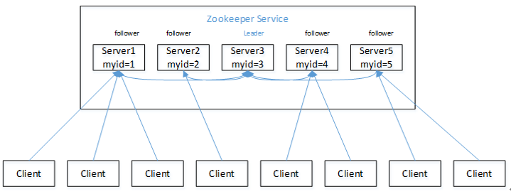
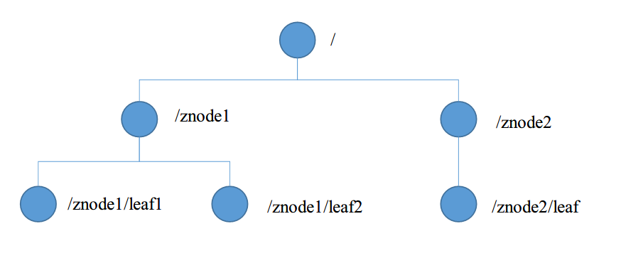
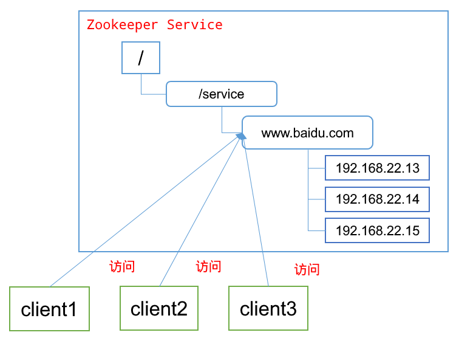
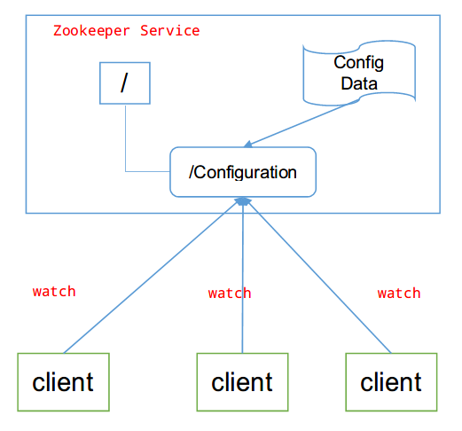
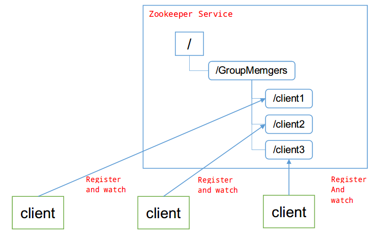
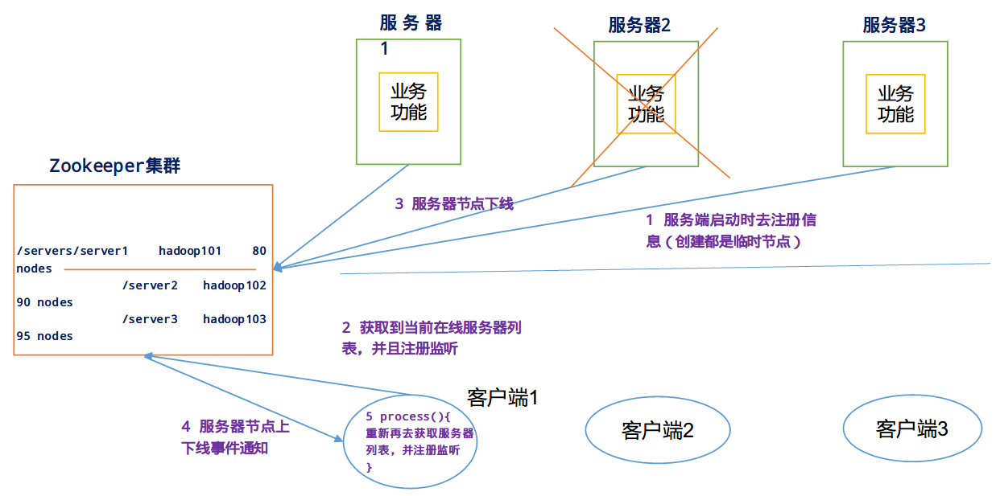
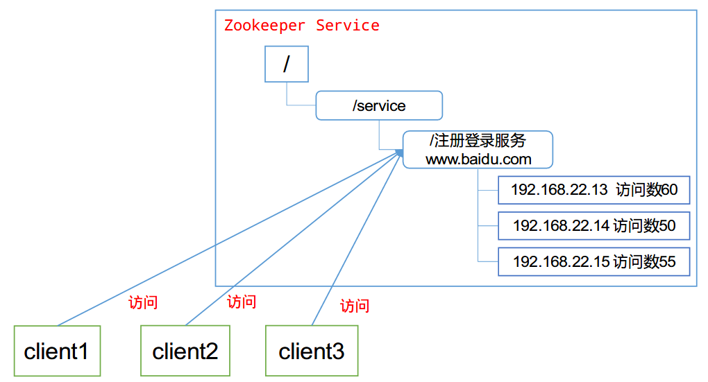
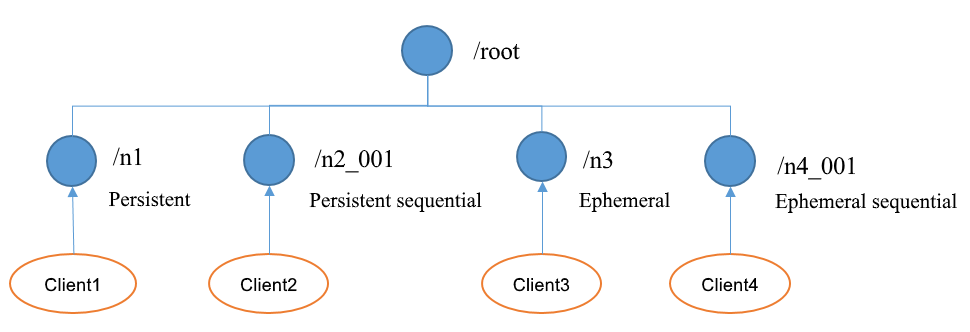
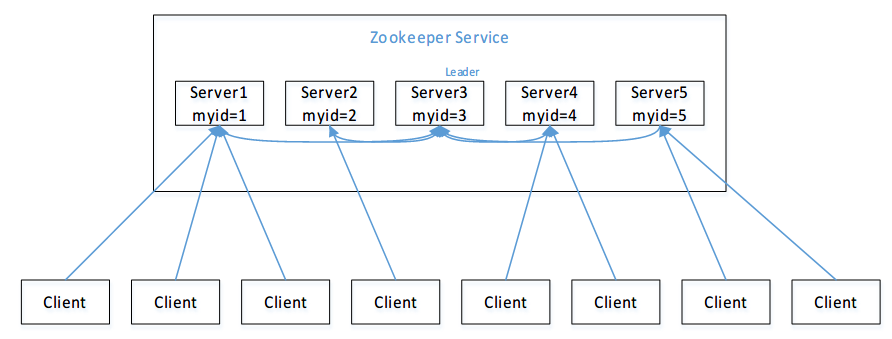
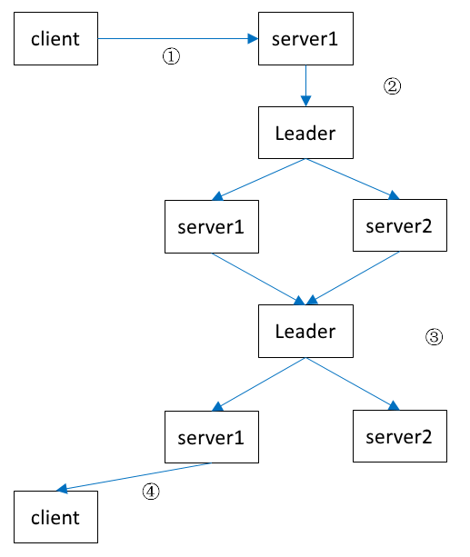

### 概述

Zookeeper是一个开源的分布式的，为分布式应用提供协调服务的Apache项目。

从设计模式角度来理解它是一个基于观察者模式设计的分布式服务管理框架，它负责存储和管理大家都关心的数据，然后接受观察者的注册，一旦这些数据的状态发生变化，Zookeeper就将负责通知已经在Zookeeper上注册的那些观察者做出相应的反应。

### 特点

- 一个领导者（Leader），多个跟随者（Follower）组成的集群。

- 集群中只要有半数以上节点存活，Zookeeper集群就能正常服务。

- 全局数据一致：每个Server保存一份相同的数据副本，Client无论连接到哪个Server，数据都是一致的。

- 更新请求顺序进行，来自同一个Client的更新请求按其发送顺序依次执行。

- 数据更新原子性，一次数据更新要么成功，要么失败。

- 实时性，在一定时间范围内，Client能读到最新数据。

### 数据结构

ZooKeeper数据模型的结构与Unix文件系统很类似，整体上可以看作是一棵树，每个节点称做一个ZNode。每一个ZNode默认能够存储1MB的数据，每个ZNode都可以通过其路径唯一标识。

### 应用场景

提供的服务包括：统一命名服务、统一配置管理、统一集群管理、服务器节点动态上下线、软负载均衡等。

1. 统一命名服务

在分布式环境下，经常需要对应用/服务进行统一命名，便于识别。例如：IP不容易记住，而域名容易记住。

2. 统一配置管理

分布式环境下，配置文件同步非常常见。一般要求一个集群中，所有节点的配置信息是一致的，比如 Kafka 集群。对配置文件修改后，希望能够快速同步到各个节点上。

配置管理可交由ZooKeeper实现。可将配置信息写入ZooKeeper上的一个Znode。各个客户端服务器监听这个Znode。一旦Znode中的数据被修改，ZooKeeper将通知各个客户端服务器。

3. 统一集群管理

分布式环境中，实时掌握每个节点的状态是必要的。ZooKeeper可以实现实时监控节点状态变化。

- 可将节点信息写入ZooKeeper上的一个ZNode。

- 监听这个ZNode可获取它的实时状态变化。

4. 服务器节点动态上下线

客户端能实时洞察到服务器上下线的变化。

1. 负载均衡

在Zookeeper中记录每台服务器的访问数，让访问数最少的服务器去处理最新的客户端请求。

### 内部原理

#### 节点类型

持久（Persistent）：客户端和服务器端断开连接后，创建的节点不删除。

短暂（Ephemeral）：客户端和服务器端断开连接后，创建的节点自己删除。

- 持久化目录节点：客户端与Zookeeper断开连接后，该节点依旧存在。
- 持久化顺序编号目录节点：客户端与Zookeeper断开连接后，该节点依旧存在，只是Zookeeper给该节点名称进行顺序编号。
- 临时目录节点：客户端与Zookeeper断开连接后，该节点被删除。
- 临时顺序编号目录节点：客户端与Zookeeper断开连接后，该节点被删除，只是Zookeeper给该节点名称进行顺序编号。

#### 选举机制

集群中半数以上机器存活，集群可用。所以Zookeeper适合安装奇数台服务器。Zookeeper虽然在配置文件中并没有指定Master和Slave。但是，Zookeeper工作时，是有一个节点为Leader，其他则为Follower，Leader是通过内部的选举机制临时产生的。

以一个简单的例子来说明整个选举的过程。

假设有五台服务器组成的Zookeeper集群，它们的id从1-5，同时它们都是最新启动的，也就是没有历史数据，在存放数据量这一点上，都是一样的。假设这些服务器依序启动，来看看会发生什么

1. server1 启动，发起一次选举。server1 投自己一票。此时服务器1票数一票，不够半数以上（3票），选举无法完成，server1 状态保持为LOOKING；

2. server2 启动，再发起一次选举。server1 和 server2 分别投自己一票并交换选票信息：此时 server1 发现 server2 的ID比自己目前投票推举的（server1）大，更改选票为推举 server2。此时 server1 票数0票，server2 票数2票，没有半数以上结果，选举无法完成，服务器1，2状态保持LOOKING

3. server3 启动，发起一次选举。此时 server1 和 server2 都会更改选票为 server3。此次投票结果：server1 为0票，server2 为0票，server3 为3票。此时server3 的票数已经超过半数，server3 当选Leader。server1，server2 更改状态为FOLLOWING，server3 更改状态为LEADING；

4. server4 启动，发起一次选举。此时server1，server2，server3已经不是LOOKING状态，不会更改选票信息。交换选票信息结果：server3 为3票，server4 为1票。此时 server4 服从多数，更改选票信息为 server3，并更改状态为FOLLOWING；

5. server5 启动，同 server4 一样当小弟。

#### 写数据流程

1. Client 向 ZooKeeper 的 Server1 上写数据，发送一个写请求。
2. 如果 Server1 不是Leader，那么 Server1 会把接受到的请求进一步转发给Leader，因为每个ZooKeeper的Server里面有一个是Leader。这个Leader 会将写请求广播给各个Server，比如 Server1 和 Server2，各个Server写成功后就会通知Leader。
3. 当Leader收到大多数 Server 数据写成功了，那么就说明数据写成功了。如果这里三个节点的话，只要有两个节点数据写成功了，那么就认为数据写成功了。写成功之后，Leader会告诉 Server1 数据写成功了。
4. Server1 会进一步通知 Client 数据写成功了，这时就认为整个写操作成功。ZooKeeper 整个写数据流程就是这样的。